```python
!poetry add pyarrow
!poetry add seaborn
```

    The following packages are already present in the pyproject.toml and will be skipped:
    
      - pyarrow
    
    If you want to update it to the latest compatible version, you can use `poetry update package`.
    If you prefer to upgrade it to the latest available version, you can use `poetry add package@latest`.
    
    Nothing to add.
    The following packages are already present in the pyproject.toml and will be skipped:
    
      - seaborn
    
    If you want to update it to the latest compatible version, you can use `poetry update package`.
    If you prefer to upgrade it to the latest available version, you can use `poetry add package@latest`.
    
    Nothing to add.


```python
import pandas as pd
import matplotlib.pyplot as plt
import numpy as np
import seaborn as nsn

plt.style.use("ggplot")
```

# Understanding the problem

Ejercicio


```python
data_path = "/home/hasierza/datos/"
```

contenido de los diferentes parquet.


```python
orders = pd.read_parquet(f"{data_path}/orders.parquet")
orders.info()
```

    <class 'pandas.core.frame.DataFrame'>
    Index: 8773 entries, 10 to 64538
    Data columns (total 6 columns):
     #   Column          Non-Null Count  Dtype         
    ---  ------          --------------  -----         
     0   id              8773 non-null   int64         
     1   user_id         8773 non-null   object        
     2   created_at      8773 non-null   datetime64[us]
     3   order_date      8773 non-null   datetime64[us]
     4   user_order_seq  8773 non-null   int64         
     5   ordered_items   8773 non-null   object        
    dtypes: datetime64[us](2), int64(2), object(2)
    memory usage: 479.8+ KB


user order seq es para ver q orden es. 


```python
orders.head()
```


<div>
<style scoped>
    .dataframe tbody tr th:only-of-type {
        vertical-align: middle;
    }

    .dataframe tbody tr th {
        vertical-align: top;
    }

    .dataframe thead th {
        text-align: right;
    }
</style>
<table border="1" class="dataframe">
  <thead>
    <tr style="text-align: right;">
      <th></th>
      <th>id</th>
      <th>user_id</th>
      <th>created_at</th>
      <th>order_date</th>
      <th>user_order_seq</th>
      <th>ordered_items</th>
    </tr>
  </thead>
  <tbody>
    <tr>
      <th>10</th>
      <td>2204073066628</td>
      <td>62e271062eb827e411bd73941178d29b022f5f2de9d37f...</td>
      <td>2020-04-30 14:32:19</td>
      <td>2020-04-30</td>
      <td>1</td>
      <td>[33618849693828, 33618860179588, 3361887404045...</td>
    </tr>
    <tr>
      <th>20</th>
      <td>2204707520644</td>
      <td>bf591c887c46d5d3513142b6a855dd7ffb9cc00697f6f5...</td>
      <td>2020-04-30 17:39:00</td>
      <td>2020-04-30</td>
      <td>1</td>
      <td>[33618835243140, 33618835964036, 3361886244058...</td>
    </tr>
    <tr>
      <th>21</th>
      <td>2204838822020</td>
      <td>329f08c66abb51f8c0b8a9526670da2d94c0c6eef06700...</td>
      <td>2020-04-30 18:12:30</td>
      <td>2020-04-30</td>
      <td>1</td>
      <td>[33618891145348, 33618893570180, 3361889766618...</td>
    </tr>
    <tr>
      <th>34</th>
      <td>2208967852164</td>
      <td>f6451fce7b1c58d0effbe37fcb4e67b718193562766470...</td>
      <td>2020-05-01 19:44:11</td>
      <td>2020-05-01</td>
      <td>1</td>
      <td>[33618830196868, 33618846580868, 3361891234624...</td>
    </tr>
    <tr>
      <th>49</th>
      <td>2215889436804</td>
      <td>68e872ff888303bff58ec56a3a986f77ddebdbe5c279e7...</td>
      <td>2020-05-03 21:56:14</td>
      <td>2020-05-03</td>
      <td>1</td>
      <td>[33667166699652, 33667166699652, 3366717122163...</td>
    </tr>
  </tbody>
</table>
</div>


```python
users = pd.read_parquet(f"{data_path}/users.parquet")
users.info()
```

    <class 'pandas.core.frame.DataFrame'>
    Index: 4983 entries, 2160 to 3360
    Data columns (total 10 columns):
     #   Column                 Non-Null Count  Dtype  
    ---  ------                 --------------  -----  
     0   user_id                4983 non-null   object 
     1   user_segment           4983 non-null   object 
     2   user_nuts1             4932 non-null   object 
     3   first_ordered_at       4983 non-null   object 
     4   customer_cohort_month  4983 non-null   object 
     5   count_people           325 non-null    float64
     6   count_adults           325 non-null    float64
     7   count_children         325 non-null    float64
     8   count_babies           325 non-null    float64
     9   count_pets             325 non-null    float64
    dtypes: float64(5), object(5)
    memory usage: 428.2+ KB


```python
users.dropna().head() #liminar las filas que contienen valores NaN 
```


<div>
<style scoped>
    .dataframe tbody tr th:only-of-type {
        vertical-align: middle;
    }

    .dataframe tbody tr th {
        vertical-align: top;
    }

    .dataframe thead th {
        text-align: right;
    }
</style>
<table border="1" class="dataframe">
  <thead>
    <tr style="text-align: right;">
      <th></th>
      <th>user_id</th>
      <th>user_segment</th>
      <th>user_nuts1</th>
      <th>first_ordered_at</th>
      <th>customer_cohort_month</th>
      <th>count_people</th>
      <th>count_adults</th>
      <th>count_children</th>
      <th>count_babies</th>
      <th>count_pets</th>
    </tr>
  </thead>
  <tbody>
    <tr>
      <th>4751</th>
      <td>09d70e0b0778117aec5550c08032d56f8e06f992741680...</td>
      <td>Proposition</td>
      <td>UKI</td>
      <td>2021-06-28 12:07:04</td>
      <td>2021-06-01 00:00:00</td>
      <td>1.0</td>
      <td>1.0</td>
      <td>0.0</td>
      <td>0.0</td>
      <td>0.0</td>
    </tr>
    <tr>
      <th>3154</th>
      <td>4f5ff38ce5ed48096ba80dff80e167db1ad24b9ebdb00c...</td>
      <td>Top Up</td>
      <td>UKD</td>
      <td>2020-06-12 12:07:35</td>
      <td>2020-06-01 00:00:00</td>
      <td>3.0</td>
      <td>2.0</td>
      <td>0.0</td>
      <td>1.0</td>
      <td>0.0</td>
    </tr>
    <tr>
      <th>736</th>
      <td>7b2ae50bb11646436fa613394fc3e71e1a0cdc3ba30cdb...</td>
      <td>Proposition</td>
      <td>UKF</td>
      <td>2020-10-03 09:53:57</td>
      <td>2020-10-01 00:00:00</td>
      <td>2.0</td>
      <td>2.0</td>
      <td>0.0</td>
      <td>0.0</td>
      <td>2.0</td>
    </tr>
    <tr>
      <th>4792</th>
      <td>5e977a4aa2c57f306b8a22f92eaaa177f7dc31a52df82c...</td>
      <td>Proposition</td>
      <td>UKI</td>
      <td>2021-10-14 10:41:13</td>
      <td>2021-10-01 00:00:00</td>
      <td>2.0</td>
      <td>1.0</td>
      <td>1.0</td>
      <td>0.0</td>
      <td>1.0</td>
    </tr>
    <tr>
      <th>2217</th>
      <td>eafb89ad33eb377adb98a915b6a5a65f1284c2db517d07...</td>
      <td>Proposition</td>
      <td>UKH</td>
      <td>2022-01-20 15:53:09</td>
      <td>2022-01-01 00:00:00</td>
      <td>2.0</td>
      <td>2.0</td>
      <td>0.0</td>
      <td>0.0</td>
      <td>0.0</td>
    </tr>
  </tbody>
</table>
</div>


```python
regulars = pd.read_parquet(f"{data_path}/regulars.parquet")
regulars.info()
```

    <class 'pandas.core.frame.DataFrame'>
    Index: 18105 entries, 3 to 37720
    Data columns (total 3 columns):
     #   Column      Non-Null Count  Dtype         
    ---  ------      --------------  -----         
     0   user_id     18105 non-null  object        
     1   variant_id  18105 non-null  int64         
     2   created_at  18105 non-null  datetime64[us]
    dtypes: datetime64[us](1), int64(1), object(1)
    memory usage: 565.8+ KB


```python
regulars.head()
```


<div>
<style scoped>
    .dataframe tbody tr th:only-of-type {
        vertical-align: middle;
    }

    .dataframe tbody tr th {
        vertical-align: top;
    }

    .dataframe thead th {
        text-align: right;
    }
</style>
<table border="1" class="dataframe">
  <thead>
    <tr style="text-align: right;">
      <th></th>
      <th>user_id</th>
      <th>variant_id</th>
      <th>created_at</th>
    </tr>
  </thead>
  <tbody>
    <tr>
      <th>3</th>
      <td>68e872ff888303bff58ec56a3a986f77ddebdbe5c279e7...</td>
      <td>33618848088196</td>
      <td>2020-04-30 15:07:03</td>
    </tr>
    <tr>
      <th>11</th>
      <td>aed88fc0b004270a62ff1fe4b94141f6b1db1496dbb0c0...</td>
      <td>33667178659972</td>
      <td>2020-05-05 23:34:35</td>
    </tr>
    <tr>
      <th>18</th>
      <td>68e872ff888303bff58ec56a3a986f77ddebdbe5c279e7...</td>
      <td>33619009208452</td>
      <td>2020-04-30 15:07:03</td>
    </tr>
    <tr>
      <th>46</th>
      <td>aed88fc0b004270a62ff1fe4b94141f6b1db1496dbb0c0...</td>
      <td>33667305373828</td>
      <td>2020-05-05 23:34:35</td>
    </tr>
    <tr>
      <th>47</th>
      <td>4594e99557113d5a1c5b59bf31b8704aafe5c7bd180b32...</td>
      <td>33667247341700</td>
      <td>2020-05-06 14:42:11</td>
    </tr>
  </tbody>
</table>
</div>


```python
inventory = pd.read_parquet(f"{data_path}/inventory.parquet")
inventory.info()
```

    <class 'pandas.core.frame.DataFrame'>
    RangeIndex: 1733 entries, 0 to 1732
    Data columns (total 6 columns):
     #   Column            Non-Null Count  Dtype  
    ---  ------            --------------  -----  
     0   variant_id        1733 non-null   int64  
     1   price             1733 non-null   float64
     2   compare_at_price  1733 non-null   float64
     3   vendor            1733 non-null   object 
     4   product_type      1733 non-null   object 
     5   tags              1733 non-null   object 
    dtypes: float64(2), int64(1), object(3)
    memory usage: 81.4+ KB


```python
inventory.head()
```


<div>
<style scoped>
    .dataframe tbody tr th:only-of-type {
        vertical-align: middle;
    }

    .dataframe tbody tr th {
        vertical-align: top;
    }

    .dataframe thead th {
        text-align: right;
    }
</style>
<table border="1" class="dataframe">
  <thead>
    <tr style="text-align: right;">
      <th></th>
      <th>variant_id</th>
      <th>price</th>
      <th>compare_at_price</th>
      <th>vendor</th>
      <th>product_type</th>
      <th>tags</th>
    </tr>
  </thead>
  <tbody>
    <tr>
      <th>0</th>
      <td>39587297165444</td>
      <td>3.09</td>
      <td>3.15</td>
      <td>heinz</td>
      <td>condiments-dressings</td>
      <td>[table-sauces, vegan]</td>
    </tr>
    <tr>
      <th>1</th>
      <td>34370361229444</td>
      <td>4.99</td>
      <td>5.50</td>
      <td>whogivesacrap</td>
      <td>toilet-roll-kitchen-roll-tissue</td>
      <td>[b-corp, eco, toilet-rolls]</td>
    </tr>
    <tr>
      <th>2</th>
      <td>34284951863428</td>
      <td>3.69</td>
      <td>3.99</td>
      <td>plenty</td>
      <td>toilet-roll-kitchen-roll-tissue</td>
      <td>[kitchen-roll]</td>
    </tr>
    <tr>
      <th>3</th>
      <td>33667283583108</td>
      <td>1.79</td>
      <td>1.99</td>
      <td>thecheekypanda</td>
      <td>toilet-roll-kitchen-roll-tissue</td>
      <td>[b-corp, cruelty-free, eco, tissue, vegan]</td>
    </tr>
    <tr>
      <th>4</th>
      <td>33803537973380</td>
      <td>1.99</td>
      <td>2.09</td>
      <td>colgate</td>
      <td>dental</td>
      <td>[dental-accessories]</td>
    </tr>
  </tbody>
</table>
</div>


```python
abandoned_carts = pd.read_parquet(f"{data_path}/abandoned_carts.parquet")
abandoned_carts.info()
```

    <class 'pandas.core.frame.DataFrame'>
    Index: 5457 entries, 0 to 70050
    Data columns (total 4 columns):
     #   Column      Non-Null Count  Dtype         
    ---  ------      --------------  -----         
     0   id          5457 non-null   int64         
     1   user_id     5457 non-null   object        
     2   created_at  5457 non-null   datetime64[us]
     3   variant_id  5457 non-null   object        
    dtypes: datetime64[us](1), int64(1), object(2)
    memory usage: 213.2+ KB


```python
abandoned_carts.head()
```


<div>
<style scoped>
    .dataframe tbody tr th:only-of-type {
        vertical-align: middle;
    }

    .dataframe tbody tr th {
        vertical-align: top;
    }

    .dataframe thead th {
        text-align: right;
    }
</style>
<table border="1" class="dataframe">
  <thead>
    <tr style="text-align: right;">
      <th></th>
      <th>id</th>
      <th>user_id</th>
      <th>created_at</th>
      <th>variant_id</th>
    </tr>
  </thead>
  <tbody>
    <tr>
      <th>0</th>
      <td>12858560217220</td>
      <td>5c4e5953f13ddc3bc9659a3453356155e5efe4739d7a2b...</td>
      <td>2020-05-20 13:53:24</td>
      <td>[33826459287684, 33826457616516, 3366719212762...</td>
    </tr>
    <tr>
      <th>13</th>
      <td>20352449839236</td>
      <td>9d6187545c005d39e44d0456d87790db18611d7c7379bd...</td>
      <td>2021-06-27 05:24:13</td>
      <td>[34415988179076, 34037940158596, 3450282236326...</td>
    </tr>
    <tr>
      <th>45</th>
      <td>20478401413252</td>
      <td>e83fb0273d70c37a2968fee107113698fd4f389c442c0b...</td>
      <td>2021-07-18 08:23:49</td>
      <td>[34543001337988, 34037939372164, 3411360609088...</td>
    </tr>
    <tr>
      <th>50</th>
      <td>20481783103620</td>
      <td>10c42e10e530284b7c7c50f3a23a98726d5747b8128084...</td>
      <td>2021-07-18 21:29:36</td>
      <td>[33667268116612, 34037940224132, 3443605520397...</td>
    </tr>
    <tr>
      <th>52</th>
      <td>20485321687172</td>
      <td>d9989439524b3f6fc4f41686d043f315fb408b954d6153...</td>
      <td>2021-07-19 12:17:05</td>
      <td>[33667268083844, 34284950454404, 33973246886020]</td>
    </tr>
  </tbody>
</table>
</div>


Se han visualizado las diferentes tablas, la tabla  users contiene NaN

# Analisis  

### 1. Compradores
### 2. Stock // productos
### 3. Reconstruir


## 1. Compradores


```python
## Add  n_regulars to ussers profile. n_regulars is the number of different products saved by the user.
n_regulars = regulars.groupby('user_id')['variant_id'].nunique().reset_index().rename(columns={'variant_id': 'n_regulars'}) #nunique() devuelve el número de valores únicos. 
users = users.merge(n_regulars, on='user_id', how='left').fillna({'n_regulars':0}) #rellenar los valores NaN con 0. #merge() combina dos dataframes. #on='user_id' indica la columna por la que se va a hacer el merge. #how='left' indica que se va a hacer un left join.
#left join: Devuelve todos los registros de la tabla de la izquierda y los registros coincidentes de la tabla de la derecha. Los registros de la tabla de la izquierda que no tienen correspondencia en la tabla de la derecha, se rellenan con valores nulos.
```


```python
users.info()
```

    <class 'pandas.core.frame.DataFrame'>
    RangeIndex: 4983 entries, 0 to 4982
    Data columns (total 11 columns):
     #   Column                 Non-Null Count  Dtype  
    ---  ------                 --------------  -----  
     0   user_id                4983 non-null   object 
     1   user_segment           4983 non-null   object 
     2   user_nuts1             4932 non-null   object 
     3   first_ordered_at       4983 non-null   object 
     4   customer_cohort_month  4983 non-null   object 
     5   count_people           325 non-null    float64
     6   count_adults           325 non-null    float64
     7   count_children         325 non-null    float64
     8   count_babies           325 non-null    float64
     9   count_pets             325 non-null    float64
     10  n_regulars             4983 non-null   float64
    dtypes: float64(6), object(5)
    memory usage: 428.4+ KB


```python
users.head()
```


<div>
<style scoped>
    .dataframe tbody tr th:only-of-type {
        vertical-align: middle;
    }

    .dataframe tbody tr th {
        vertical-align: top;
    }

    .dataframe thead th {
        text-align: right;
    }
</style>
<table border="1" class="dataframe">
  <thead>
    <tr style="text-align: right;">
      <th></th>
      <th>user_id</th>
      <th>user_segment</th>
      <th>user_nuts1</th>
      <th>first_ordered_at</th>
      <th>customer_cohort_month</th>
      <th>count_people</th>
      <th>count_adults</th>
      <th>count_children</th>
      <th>count_babies</th>
      <th>count_pets</th>
      <th>n_regulars</th>
    </tr>
  </thead>
  <tbody>
    <tr>
      <th>0</th>
      <td>0e823a42e107461379e5b5613b7aa00537a72e1b0eaa7a...</td>
      <td>Top Up</td>
      <td>UKH</td>
      <td>2021-05-08 13:33:49</td>
      <td>2021-05-01 00:00:00</td>
      <td>NaN</td>
      <td>NaN</td>
      <td>NaN</td>
      <td>NaN</td>
      <td>NaN</td>
      <td>0.0</td>
    </tr>
    <tr>
      <th>1</th>
      <td>15768ced9bed648f745a7aa566a8895f7a73b9a47c1d4f...</td>
      <td>Top Up</td>
      <td>UKJ</td>
      <td>2021-11-17 16:30:20</td>
      <td>2021-11-01 00:00:00</td>
      <td>NaN</td>
      <td>NaN</td>
      <td>NaN</td>
      <td>NaN</td>
      <td>NaN</td>
      <td>0.0</td>
    </tr>
    <tr>
      <th>2</th>
      <td>33e0cb6eacea0775e34adbaa2c1dec16b9d6484e6b9324...</td>
      <td>Top Up</td>
      <td>UKD</td>
      <td>2022-03-09 23:12:25</td>
      <td>2022-03-01 00:00:00</td>
      <td>NaN</td>
      <td>NaN</td>
      <td>NaN</td>
      <td>NaN</td>
      <td>NaN</td>
      <td>0.0</td>
    </tr>
    <tr>
      <th>3</th>
      <td>57ca7591dc79825df0cecc4836a58e6062454555c86c35...</td>
      <td>Top Up</td>
      <td>UKI</td>
      <td>2021-04-23 16:29:02</td>
      <td>2021-04-01 00:00:00</td>
      <td>NaN</td>
      <td>NaN</td>
      <td>NaN</td>
      <td>NaN</td>
      <td>NaN</td>
      <td>0.0</td>
    </tr>
    <tr>
      <th>4</th>
      <td>085d8e598139ce6fc9f75d9de97960fa9e1457b409ec00...</td>
      <td>Top Up</td>
      <td>UKJ</td>
      <td>2021-11-02 13:50:06</td>
      <td>2021-11-01 00:00:00</td>
      <td>NaN</td>
      <td>NaN</td>
      <td>NaN</td>
      <td>NaN</td>
      <td>NaN</td>
      <td>0.0</td>
    </tr>
  </tbody>
</table>
</div>


```python
users.dropna().head()
```


<div>
<style scoped>
    .dataframe tbody tr th:only-of-type {
        vertical-align: middle;
    }

    .dataframe tbody tr th {
        vertical-align: top;
    }

    .dataframe thead th {
        text-align: right;
    }
</style>
<table border="1" class="dataframe">
  <thead>
    <tr style="text-align: right;">
      <th></th>
      <th>user_id</th>
      <th>user_segment</th>
      <th>user_nuts1</th>
      <th>first_ordered_at</th>
      <th>customer_cohort_month</th>
      <th>count_people</th>
      <th>count_adults</th>
      <th>count_children</th>
      <th>count_babies</th>
      <th>count_pets</th>
      <th>n_regulars</th>
    </tr>
  </thead>
  <tbody>
    <tr>
      <th>23</th>
      <td>09d70e0b0778117aec5550c08032d56f8e06f992741680...</td>
      <td>Proposition</td>
      <td>UKI</td>
      <td>2021-06-28 12:07:04</td>
      <td>2021-06-01 00:00:00</td>
      <td>1.0</td>
      <td>1.0</td>
      <td>0.0</td>
      <td>0.0</td>
      <td>0.0</td>
      <td>0.0</td>
    </tr>
    <tr>
      <th>27</th>
      <td>4f5ff38ce5ed48096ba80dff80e167db1ad24b9ebdb00c...</td>
      <td>Top Up</td>
      <td>UKD</td>
      <td>2020-06-12 12:07:35</td>
      <td>2020-06-01 00:00:00</td>
      <td>3.0</td>
      <td>2.0</td>
      <td>0.0</td>
      <td>1.0</td>
      <td>0.0</td>
      <td>1.0</td>
    </tr>
    <tr>
      <th>28</th>
      <td>7b2ae50bb11646436fa613394fc3e71e1a0cdc3ba30cdb...</td>
      <td>Proposition</td>
      <td>UKF</td>
      <td>2020-10-03 09:53:57</td>
      <td>2020-10-01 00:00:00</td>
      <td>2.0</td>
      <td>2.0</td>
      <td>0.0</td>
      <td>0.0</td>
      <td>2.0</td>
      <td>25.0</td>
    </tr>
    <tr>
      <th>35</th>
      <td>5e977a4aa2c57f306b8a22f92eaaa177f7dc31a52df82c...</td>
      <td>Proposition</td>
      <td>UKI</td>
      <td>2021-10-14 10:41:13</td>
      <td>2021-10-01 00:00:00</td>
      <td>2.0</td>
      <td>1.0</td>
      <td>1.0</td>
      <td>0.0</td>
      <td>1.0</td>
      <td>72.0</td>
    </tr>
    <tr>
      <th>66</th>
      <td>eafb89ad33eb377adb98a915b6a5a65f1284c2db517d07...</td>
      <td>Proposition</td>
      <td>UKH</td>
      <td>2022-01-20 15:53:09</td>
      <td>2022-01-01 00:00:00</td>
      <td>2.0</td>
      <td>2.0</td>
      <td>0.0</td>
      <td>0.0</td>
      <td>0.0</td>
      <td>3.0</td>
    </tr>
  </tbody>
</table>
</div>


```python
users.describe()
```


<div>
<style scoped>
    .dataframe tbody tr th:only-of-type {
        vertical-align: middle;
    }

    .dataframe tbody tr th {
        vertical-align: top;
    }

    .dataframe thead th {
        text-align: right;
    }
</style>
<table border="1" class="dataframe">
  <thead>
    <tr style="text-align: right;">
      <th></th>
      <th>count_people</th>
      <th>count_adults</th>
      <th>count_children</th>
      <th>count_babies</th>
      <th>count_pets</th>
      <th>n_regulars</th>
    </tr>
  </thead>
  <tbody>
    <tr>
      <th>count</th>
      <td>325.000000</td>
      <td>325.000000</td>
      <td>325.000000</td>
      <td>325.000000</td>
      <td>325.000000</td>
      <td>4983.000000</td>
    </tr>
    <tr>
      <th>mean</th>
      <td>2.787692</td>
      <td>2.003077</td>
      <td>0.707692</td>
      <td>0.076923</td>
      <td>0.636923</td>
      <td>2.481437</td>
    </tr>
    <tr>
      <th>std</th>
      <td>1.365753</td>
      <td>0.869577</td>
      <td>1.026246</td>
      <td>0.289086</td>
      <td>0.995603</td>
      <td>8.890588</td>
    </tr>
    <tr>
      <th>min</th>
      <td>0.000000</td>
      <td>0.000000</td>
      <td>0.000000</td>
      <td>0.000000</td>
      <td>0.000000</td>
      <td>0.000000</td>
    </tr>
    <tr>
      <th>25%</th>
      <td>2.000000</td>
      <td>2.000000</td>
      <td>0.000000</td>
      <td>0.000000</td>
      <td>0.000000</td>
      <td>0.000000</td>
    </tr>
    <tr>
      <th>50%</th>
      <td>3.000000</td>
      <td>2.000000</td>
      <td>0.000000</td>
      <td>0.000000</td>
      <td>0.000000</td>
      <td>0.000000</td>
    </tr>
    <tr>
      <th>75%</th>
      <td>4.000000</td>
      <td>2.000000</td>
      <td>1.000000</td>
      <td>0.000000</td>
      <td>1.000000</td>
      <td>1.000000</td>
    </tr>
    <tr>
      <th>max</th>
      <td>8.000000</td>
      <td>7.000000</td>
      <td>6.000000</td>
      <td>2.000000</td>
      <td>6.000000</td>
      <td>320.000000</td>
    </tr>
  </tbody>
</table>
</div>


```python
#histogram of n_regulars, logaritmic to view better
users['n_regulars'].hist(bins=100, log=True) 
```


    <Axes: >


    
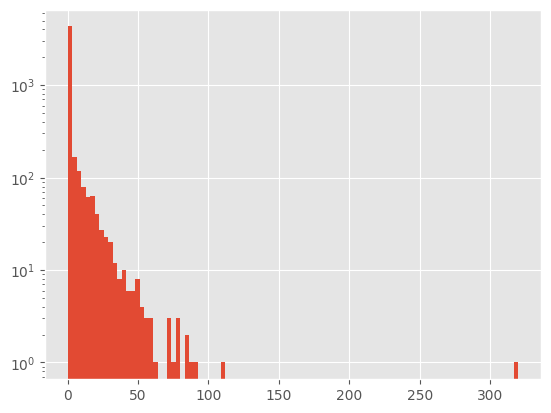
    


```python
users.loc[lambda x: x.n_regulars < 100].n_regulars.describe()
```


    count    4981.000000
    mean        2.396105
    std         7.516721
    min         0.000000
    25%         0.000000
    50%         0.000000
    75%         1.000000
    max        90.000000
    Name: n_regulars, dtype: float64


```python
(users['n_regulars']> 10).sum() / len(users) #porcentaje de usuarios que han guardado más de 10 productos
```


    0.07264699979931769


```python
users.loc[lambda x: x.n_regulars < 100].groupby('user_segment')['n_regulars'].mean().plot(kind='bar') #groupby() agrupa los datos por la columna indicada. #mean() calcula la media de los valores agrupados. #plot() crea un gráfico. #kind='bar' indica que el gráfico es de barras.
plt.title('Average number of regulars per user segment') 
```


    Text(0.5, 1.0, 'Average number of regulars per user segment')


    
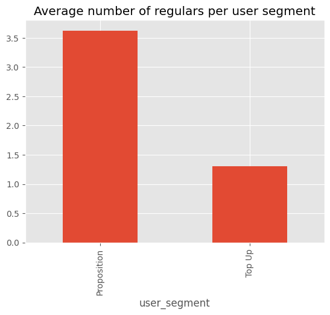
    


```python
family_cols = [col for col in users.columns if col.startswith('count_')] #
family_inputs = users.count_people.dropna().count() #count_people es el número de personas en la familia. #dropna() elimina los valores NaN. #count() cuenta el número de valores no NaN.

d={f"any_{col}":(users[col]> 0).sum()/family_inputs for col in family_cols} 
```


```python
#Household with either pets, children or babies
(users[['count_pets','count_children','count_babies']].sum(axis=1)>0).sum()/ family_inputs #porcentaje de hogares con mascotas, niños o bebés
```


    0.6123076923076923


```python
print(users.columns)

```

    Index(['user_id', 'user_segment', 'user_nuts1', 'first_ordered_at',
           'customer_cohort_month', 'count_people', 'count_adults',
           'count_children', 'count_babies', 'count_pets', 'n_regulars'],
          dtype='object')


```python
pd.crosstab(users['user_nuts1'],users['user_segment']).plot(kind='bar')
```


    <Axes: xlabel='user_nuts1'>


    
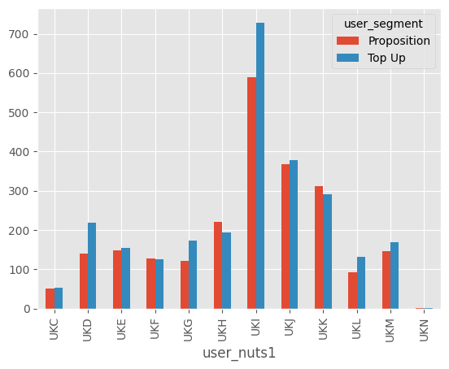
    


### Insigths:


## Understanding regulars products


```python
regulars_df = regulars.merge(inventory, on='variant_id', how= 'left') #merge() combina dos dataframes. #on='variant_id' indica la columna por la que se va a hacer el merge. #how='left' indica que se va a hacer un left join.

```


```python
regulars_df.head()
```


<div>
<style scoped>
    .dataframe tbody tr th:only-of-type {
        vertical-align: middle;
    }

    .dataframe tbody tr th {
        vertical-align: top;
    }

    .dataframe thead th {
        text-align: right;
    }
</style>
<table border="1" class="dataframe">
  <thead>
    <tr style="text-align: right;">
      <th></th>
      <th>user_id</th>
      <th>variant_id</th>
      <th>created_at</th>
      <th>price</th>
      <th>compare_at_price</th>
      <th>vendor</th>
      <th>product_type</th>
      <th>tags</th>
    </tr>
  </thead>
  <tbody>
    <tr>
      <th>0</th>
      <td>68e872ff888303bff58ec56a3a986f77ddebdbe5c279e7...</td>
      <td>33618848088196</td>
      <td>2020-04-30 15:07:03</td>
      <td>NaN</td>
      <td>NaN</td>
      <td>NaN</td>
      <td>NaN</td>
      <td>NaN</td>
    </tr>
    <tr>
      <th>1</th>
      <td>aed88fc0b004270a62ff1fe4b94141f6b1db1496dbb0c0...</td>
      <td>33667178659972</td>
      <td>2020-05-05 23:34:35</td>
      <td>NaN</td>
      <td>NaN</td>
      <td>NaN</td>
      <td>NaN</td>
      <td>NaN</td>
    </tr>
    <tr>
      <th>2</th>
      <td>68e872ff888303bff58ec56a3a986f77ddebdbe5c279e7...</td>
      <td>33619009208452</td>
      <td>2020-04-30 15:07:03</td>
      <td>NaN</td>
      <td>NaN</td>
      <td>NaN</td>
      <td>NaN</td>
      <td>NaN</td>
    </tr>
    <tr>
      <th>3</th>
      <td>aed88fc0b004270a62ff1fe4b94141f6b1db1496dbb0c0...</td>
      <td>33667305373828</td>
      <td>2020-05-05 23:34:35</td>
      <td>NaN</td>
      <td>NaN</td>
      <td>NaN</td>
      <td>NaN</td>
      <td>NaN</td>
    </tr>
    <tr>
      <th>4</th>
      <td>4594e99557113d5a1c5b59bf31b8704aafe5c7bd180b32...</td>
      <td>33667247341700</td>
      <td>2020-05-06 14:42:11</td>
      <td>3.49</td>
      <td>3.5</td>
      <td>method</td>
      <td>cleaning-products</td>
      <td>[cruelty-free, eco, vegan, window-glass-cleaner]</td>
    </tr>
  </tbody>
</table>
</div>


No todos los regulars products estan en el inventario


```python
regulars_df.isna().sum()
```


    user_id                0
    variant_id             0
    created_at             0
    price               3071
    compare_at_price    3071
    vendor              3071
    product_type        3071
    tags                3071
    dtype: int64


```python
clean_regulars = regulars_df.dropna() #eliminar las filas que contienen valores NaN.  q son las q no estan en el inventario.
```


```python
clean_regulars.groupby(['variant_id'])['user_id'].nunique().sort_values(ascending=False).head(50).plot(kind='bar', figsize=(15,5))
#cuantos usuarios han guardado cada producto.
```


    <Axes: xlabel='variant_id'>


    
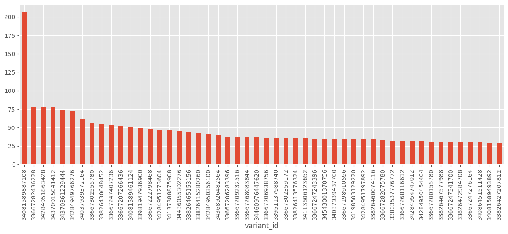
    


```python
top_product = clean_regulars.groupby(['variant_id'])['user_id'].nunique().sort_values(ascending=False).head(1).index[0] #producto más guardado

```


```python
# Imprimir las columnas del DataFrame
print(clean_regulars.columns)

```

    Index(['user_id', 'variant_id', 'created_at', 'price', 'compare_at_price',
           'vendor', 'product_type', 'tags'],
          dtype='object')


```python
clean_regulars.loc[lambda x: x.variant_id == top_product][['variant_id', 'price','product_type','vendor'  ]].drop_duplicates()
```


<div>
<style scoped>
    .dataframe tbody tr th:only-of-type {
        vertical-align: middle;
    }

    .dataframe tbody tr th {
        vertical-align: top;
    }

    .dataframe thead th {
        text-align: right;
    }
</style>
<table border="1" class="dataframe">
  <thead>
    <tr style="text-align: right;">
      <th></th>
      <th>variant_id</th>
      <th>price</th>
      <th>product_type</th>
      <th>vendor</th>
    </tr>
  </thead>
  <tbody>
    <tr>
      <th>95</th>
      <td>34081589887108</td>
      <td>10.79</td>
      <td>long-life-milk-substitutes</td>
      <td>oatly</td>
    </tr>
  </tbody>
</table>
</div>


```python

nsn.kdeplot(clean_regulars.price, label = 'regulars_price')
nsn.kdeplot(inventory.price, label = 'inventory_price')
plt.legend()
```


    <matplotlib.legend.Legend at 0x7faf82744410>


    
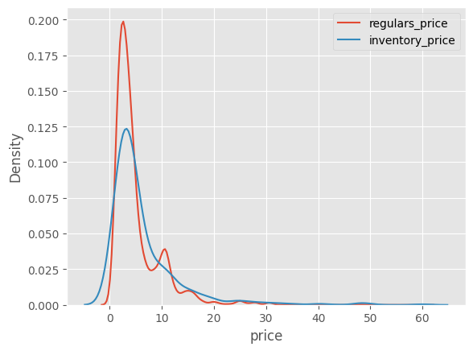
    


```python
clean_regulars['vendor'].value_counts().head(100).plot(kind= 'bar', figsize=(15,5))
plt.title(f"Top 100 vendors by regular number of regulars (out of{clean_regulars.vendor.nunique()}vendors)")
```


    Text(0.5, 1.0, 'Top 100 vendors by regular number of regulars (out of367vendors)')


    
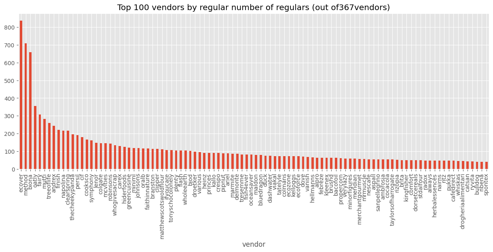
    


```python
clean_regulars['product_type'].value_counts().head(50).plot(kind='bar',figsize=(15,5))
plt.title(f'Top 50 product_type by number of regulars (out of{clean_regulars.product_type.nunique()}) product types')
```


    Text(0.5, 1.0, 'Top 50 product_type by number of regulars (out of58) product types')


    
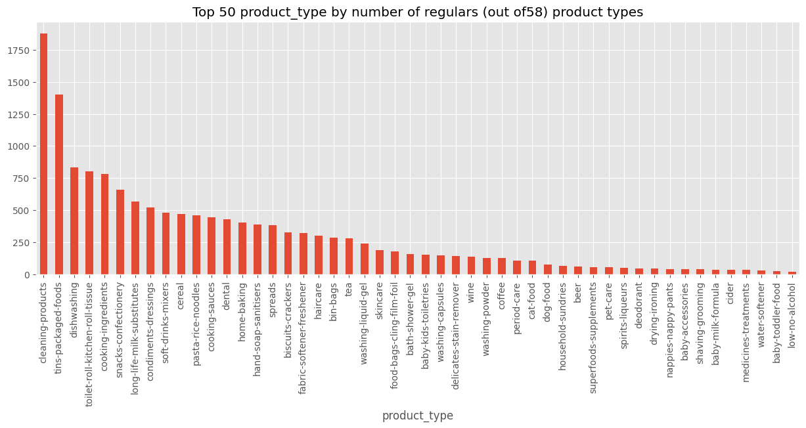
    


```python
inventory['product_type'].value_counts().head(30).plot(kind='bar',figsize=(15,5))
plt.title(f'Top 50 product_type by number of products (out of {inventory.product_type.nunique()}product_types)')
```


    Text(0.5, 1.0, 'Top 50 product_type by number of products (out of 59product_types)')


    
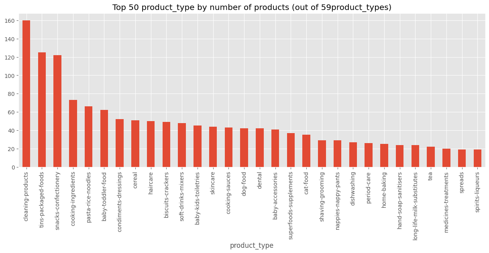
    


```python
diff_prevalance = (
    inventory['product_type'].value_counts(normalize=True).rename('inventory_count').reset_index().merge(
        clean_regulars['product_type'].value_counts(normalize=True).rename('regulars_count').reset_index()
    )
    .assign(inventory_rank=lambda x: x.inventory_count.rank(ascending=False))
    .assign(regulars_rank=lambda x: x.regulars_count.rank(ascending=False))
    .assign(diff=lambda x: x.inventory_count - x.regulars_count)

)
```


```python
diff_prevalance.sort_values('regulars_count', ascending=False).head()
```


<div>
<style scoped>
    .dataframe tbody tr th:only-of-type {
        vertical-align: middle;
    }

    .dataframe tbody tr th {
        vertical-align: top;
    }

    .dataframe thead th {
        text-align: right;
    }
</style>
<table border="1" class="dataframe">
  <thead>
    <tr style="text-align: right;">
      <th></th>
      <th>product_type</th>
      <th>inventory_count</th>
      <th>regulars_count</th>
      <th>inventory_rank</th>
      <th>regulars_rank</th>
      <th>diff</th>
    </tr>
  </thead>
  <tbody>
    <tr>
      <th>0</th>
      <td>cleaning-products</td>
      <td>0.092325</td>
      <td>0.124850</td>
      <td>1.0</td>
      <td>1.0</td>
      <td>-0.032525</td>
    </tr>
    <tr>
      <th>1</th>
      <td>tins-packaged-foods</td>
      <td>0.072129</td>
      <td>0.093255</td>
      <td>2.0</td>
      <td>2.0</td>
      <td>-0.021126</td>
    </tr>
    <tr>
      <th>21</th>
      <td>dishwashing</td>
      <td>0.015580</td>
      <td>0.055474</td>
      <td>22.0</td>
      <td>3.0</td>
      <td>-0.039894</td>
    </tr>
    <tr>
      <th>31</th>
      <td>toilet-roll-kitchen-roll-tissue</td>
      <td>0.010387</td>
      <td>0.053346</td>
      <td>32.5</td>
      <td>4.0</td>
      <td>-0.042959</td>
    </tr>
    <tr>
      <th>3</th>
      <td>cooking-ingredients</td>
      <td>0.042123</td>
      <td>0.052148</td>
      <td>4.0</td>
      <td>5.0</td>
      <td>-0.010025</td>
    </tr>
  </tbody>
</table>
</div>


con esto vemos los rankin de categorias de productos mas guardados y  q mas tipos de esas tenemos  en el inventario.

## Orders


```python
orders.head()
```


<div>
<style scoped>
    .dataframe tbody tr th:only-of-type {
        vertical-align: middle;
    }

    .dataframe tbody tr th {
        vertical-align: top;
    }

    .dataframe thead th {
        text-align: right;
    }
</style>
<table border="1" class="dataframe">
  <thead>
    <tr style="text-align: right;">
      <th></th>
      <th>id</th>
      <th>user_id</th>
      <th>created_at</th>
      <th>order_date</th>
      <th>user_order_seq</th>
      <th>ordered_items</th>
    </tr>
  </thead>
  <tbody>
    <tr>
      <th>10</th>
      <td>2204073066628</td>
      <td>62e271062eb827e411bd73941178d29b022f5f2de9d37f...</td>
      <td>2020-04-30 14:32:19</td>
      <td>2020-04-30</td>
      <td>1</td>
      <td>[33618849693828, 33618860179588, 3361887404045...</td>
    </tr>
    <tr>
      <th>20</th>
      <td>2204707520644</td>
      <td>bf591c887c46d5d3513142b6a855dd7ffb9cc00697f6f5...</td>
      <td>2020-04-30 17:39:00</td>
      <td>2020-04-30</td>
      <td>1</td>
      <td>[33618835243140, 33618835964036, 3361886244058...</td>
    </tr>
    <tr>
      <th>21</th>
      <td>2204838822020</td>
      <td>329f08c66abb51f8c0b8a9526670da2d94c0c6eef06700...</td>
      <td>2020-04-30 18:12:30</td>
      <td>2020-04-30</td>
      <td>1</td>
      <td>[33618891145348, 33618893570180, 3361889766618...</td>
    </tr>
    <tr>
      <th>34</th>
      <td>2208967852164</td>
      <td>f6451fce7b1c58d0effbe37fcb4e67b718193562766470...</td>
      <td>2020-05-01 19:44:11</td>
      <td>2020-05-01</td>
      <td>1</td>
      <td>[33618830196868, 33618846580868, 3361891234624...</td>
    </tr>
    <tr>
      <th>49</th>
      <td>2215889436804</td>
      <td>68e872ff888303bff58ec56a3a986f77ddebdbe5c279e7...</td>
      <td>2020-05-03 21:56:14</td>
      <td>2020-05-03</td>
      <td>1</td>
      <td>[33667166699652, 33667166699652, 3366717122163...</td>
    </tr>
  </tbody>
</table>
</div>


```python
orders.order_date.min(), orders.order_date.max()

```


    (Timestamp('2020-04-30 00:00:00'), Timestamp('2022-03-14 00:00:00'))


```python
orders.user_id.nunique()
```


    4983


```python
orders.loc[lambda x: x.user_order_seq > 1].user_id.nunique() #to use how many users have made more than one order
```


    1411


```python
orders['user_order_seq'].value_counts().plot(kind='bar')
```


    <Axes: xlabel='user_order_seq'>


    
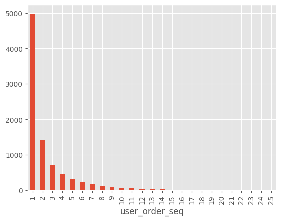
    


```python
orders['user_order_seq'].value_counts().plot(kind='bar',logy=True)
```


    <Axes: xlabel='user_order_seq'>


    
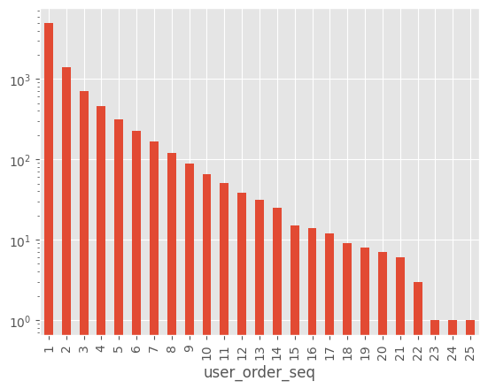
    


```python
#explode ordered_items so i get a row per item ordered.
order_items = orders.explode('ordered_items').rename({'ordered_items': 'variant_id'}, axis=1) #explode() convierte una columna que contiene listas en filas. #en ordered items teniamos mas de un item y ahora lo hemos separado en filas.

```


```python
order_items = order_items.merge(inventory, on='variant_id', how='left')

```


```python
print(f"pct pf missing bought products on inventory: {100*order_items.price.isna().sum() / order_items.shape[0] : .2f}%") #porcentaje de productos comprados que no están en el inventario.


```

    pct pf missing bought products on inventory:  14.45%


```python
order_items.dropna().head()
```


<div>
<style scoped>
    .dataframe tbody tr th:only-of-type {
        vertical-align: middle;
    }

    .dataframe tbody tr th {
        vertical-align: top;
    }

    .dataframe thead th {
        text-align: right;
    }
</style>
<table border="1" class="dataframe">
  <thead>
    <tr style="text-align: right;">
      <th></th>
      <th>id</th>
      <th>user_id</th>
      <th>created_at</th>
      <th>order_date</th>
      <th>user_order_seq</th>
      <th>variant_id</th>
      <th>price</th>
      <th>compare_at_price</th>
      <th>vendor</th>
      <th>product_type</th>
      <th>tags</th>
    </tr>
  </thead>
  <tbody>
    <tr>
      <th>70</th>
      <td>2215889436804</td>
      <td>68e872ff888303bff58ec56a3a986f77ddebdbe5c279e7...</td>
      <td>2020-05-03 21:56:14</td>
      <td>2020-05-03</td>
      <td>1</td>
      <td>33667238658180</td>
      <td>4.19</td>
      <td>5.10</td>
      <td>listerine</td>
      <td>dental</td>
      <td>[mouthwash]</td>
    </tr>
    <tr>
      <th>71</th>
      <td>2215889436804</td>
      <td>68e872ff888303bff58ec56a3a986f77ddebdbe5c279e7...</td>
      <td>2020-05-03 21:56:14</td>
      <td>2020-05-03</td>
      <td>1</td>
      <td>33667238658180</td>
      <td>4.19</td>
      <td>5.10</td>
      <td>listerine</td>
      <td>dental</td>
      <td>[mouthwash]</td>
    </tr>
    <tr>
      <th>76</th>
      <td>2217346236548</td>
      <td>66a7b6a77952abc3ef3246da56fb148814704a3c2b420c...</td>
      <td>2020-05-04 11:25:26</td>
      <td>2020-05-04</td>
      <td>1</td>
      <td>33667206054020</td>
      <td>17.99</td>
      <td>20.65</td>
      <td>ecover</td>
      <td>delicates-stain-remover</td>
      <td>[cruelty-free, delicates-stain-remover, eco, v...</td>
    </tr>
    <tr>
      <th>77</th>
      <td>2217346236548</td>
      <td>66a7b6a77952abc3ef3246da56fb148814704a3c2b420c...</td>
      <td>2020-05-04 11:25:26</td>
      <td>2020-05-04</td>
      <td>1</td>
      <td>33667206283396</td>
      <td>9.99</td>
      <td>12.00</td>
      <td>ecover</td>
      <td>fabric-softener-freshener</td>
      <td>[cruelty-free, eco, fabric-softener-freshener,...</td>
    </tr>
    <tr>
      <th>81</th>
      <td>2217346236548</td>
      <td>66a7b6a77952abc3ef3246da56fb148814704a3c2b420c...</td>
      <td>2020-05-04 11:25:26</td>
      <td>2020-05-04</td>
      <td>1</td>
      <td>39459277602948</td>
      <td>5.79</td>
      <td>5.98</td>
      <td>ecloth</td>
      <td>cleaning-products</td>
      <td>[eco, sponges-cloths-gloves]</td>
    </tr>
  </tbody>
</table>
</div>


```python
def compute_basquet(df: pd.DataFrame, level: str) -> pd.DataFrame:
    return(
        df
        .dropna(subset=[level])
        .drop_duplicates(subset=['id', level])
        .groupby([level])['id'].nunique().reset_index().rename(columns={'id': 'n_baskets'})
        .assign(top_basquets= lambda x: x.n_baskets / orders.id.nunique())
    )
```


```python
product_type_composition = compute_basquet(order_items, 'product_type')
```


```python
product_type_composition.sort_values(ascending=False, by= 'n_baskets').head(10)
```


<div>
<style scoped>
    .dataframe tbody tr th:only-of-type {
        vertical-align: middle;
    }

    .dataframe tbody tr th {
        vertical-align: top;
    }

    .dataframe thead th {
        text-align: right;
    }
</style>
<table border="1" class="dataframe">
  <thead>
    <tr style="text-align: right;">
      <th></th>
      <th>product_type</th>
      <th>n_baskets</th>
      <th>top_basquets</th>
    </tr>
  </thead>
  <tbody>
    <tr>
      <th>12</th>
      <td>cleaning-products</td>
      <td>3500</td>
      <td>0.398951</td>
    </tr>
    <tr>
      <th>51</th>
      <td>tins-packaged-foods</td>
      <td>3281</td>
      <td>0.373988</td>
    </tr>
    <tr>
      <th>52</th>
      <td>toilet-roll-kitchen-roll-tissue</td>
      <td>3131</td>
      <td>0.356890</td>
    </tr>
    <tr>
      <th>29</th>
      <td>long-life-milk-substitutes</td>
      <td>2657</td>
      <td>0.302861</td>
    </tr>
    <tr>
      <th>20</th>
      <td>dishwashing</td>
      <td>2632</td>
      <td>0.300011</td>
    </tr>
    <tr>
      <th>44</th>
      <td>snacks-confectionery</td>
      <td>1920</td>
      <td>0.218853</td>
    </tr>
    <tr>
      <th>15</th>
      <td>cooking-ingredients</td>
      <td>1817</td>
      <td>0.207113</td>
    </tr>
    <tr>
      <th>45</th>
      <td>soft-drinks-mixers</td>
      <td>1793</td>
      <td>0.204377</td>
    </tr>
    <tr>
      <th>14</th>
      <td>condiments-dressings</td>
      <td>1732</td>
      <td>0.197424</td>
    </tr>
    <tr>
      <th>10</th>
      <td>cereal</td>
      <td>1653</td>
      <td>0.188419</td>
    </tr>
  </tbody>
</table>
</div>


```python
print(product_type_composition.columns)
```

    Index(['product_type', 'n_baskets', 'top_basquets'], dtype='object')


```python
product_type_composition.sort_values(ascending=False, by='n_baskets').head(50).plot(x='product_type', y='top_basquets', kind='bar', figsize=(15,5))
```


    <Axes: xlabel='product_type'>


    
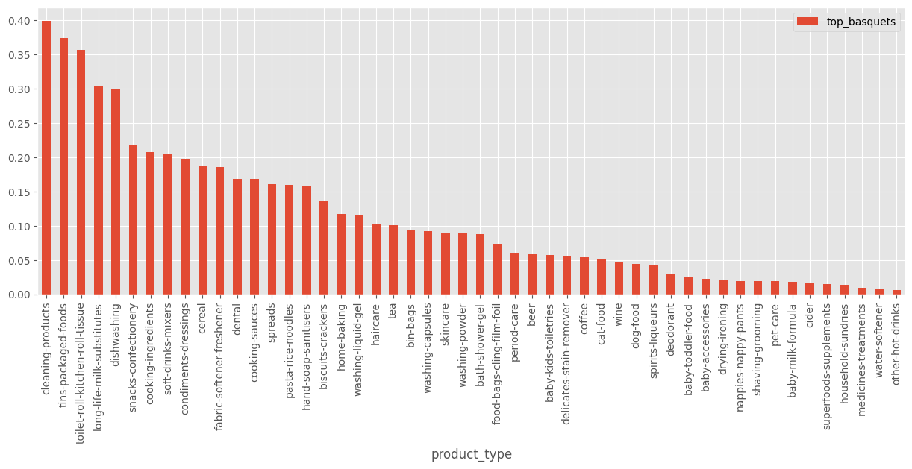
    


```python
variant_id_composition = compute_basquet(order_items, 'variant_id')
```


```python
variant_id_composition.sort_values(ascending=False, by='n_baskets').head(10)
```


<div>
<style scoped>
    .dataframe tbody tr th:only-of-type {
        vertical-align: middle;
    }

    .dataframe tbody tr th {
        vertical-align: top;
    }

    .dataframe thead th {
        text-align: right;
    }
</style>
<table border="1" class="dataframe">
  <thead>
    <tr style="text-align: right;">
      <th></th>
      <th>variant_id</th>
      <th>n_baskets</th>
      <th>top_basquets</th>
    </tr>
  </thead>
  <tbody>
    <tr>
      <th>1324</th>
      <td>39284117930116</td>
      <td>2658</td>
      <td>0.302975</td>
    </tr>
    <tr>
      <th>675</th>
      <td>34081589887108</td>
      <td>1616</td>
      <td>0.184202</td>
    </tr>
    <tr>
      <th>726</th>
      <td>34137590366340</td>
      <td>1459</td>
      <td>0.166306</td>
    </tr>
    <tr>
      <th>656</th>
      <td>34081331970180</td>
      <td>1170</td>
      <td>0.133364</td>
    </tr>
    <tr>
      <th>853</th>
      <td>34284951863428</td>
      <td>862</td>
      <td>0.098256</td>
    </tr>
    <tr>
      <th>829</th>
      <td>34284949766276</td>
      <td>617</td>
      <td>0.070329</td>
    </tr>
    <tr>
      <th>983</th>
      <td>34370361229444</td>
      <td>587</td>
      <td>0.066910</td>
    </tr>
    <tr>
      <th>835</th>
      <td>34284950356100</td>
      <td>561</td>
      <td>0.063946</td>
    </tr>
    <tr>
      <th>632</th>
      <td>34037939372164</td>
      <td>520</td>
      <td>0.059273</td>
    </tr>
    <tr>
      <th>993</th>
      <td>34370915041412</td>
      <td>504</td>
      <td>0.057449</td>
    </tr>
  </tbody>
</table>
</div>


```python
variant_id_composition.sort_values(ascending=False, by='n_baskets').head(50).plot(x='variant_id', y='top_basquets', kind='bar', figsize=(15,5))
```


    <Axes: xlabel='variant_id'>


    
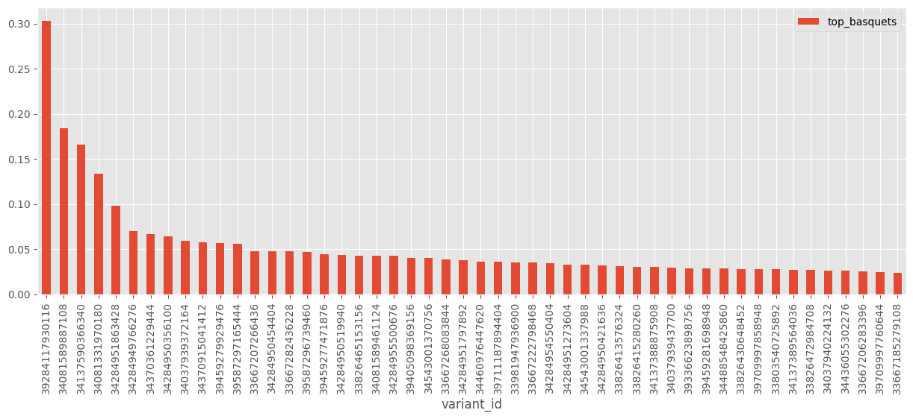
    


```python
#we only have inventory for 2 of the top5 most sold products history
top_5_product = variant_id_composition.sort_values(ascending=False, by= 'n_baskets').head(5).variant_id.values
inventory.loc[lambda x: x.variant_id.isin(top_5_product)]
```


<div>
<style scoped>
    .dataframe tbody tr th:only-of-type {
        vertical-align: middle;
    }

    .dataframe tbody tr th {
        vertical-align: top;
    }

    .dataframe thead th {
        text-align: right;
    }
</style>
<table border="1" class="dataframe">
  <thead>
    <tr style="text-align: right;">
      <th></th>
      <th>variant_id</th>
      <th>price</th>
      <th>compare_at_price</th>
      <th>vendor</th>
      <th>product_type</th>
      <th>tags</th>
    </tr>
  </thead>
  <tbody>
    <tr>
      <th>2</th>
      <td>34284951863428</td>
      <td>3.69</td>
      <td>3.99</td>
      <td>plenty</td>
      <td>toilet-roll-kitchen-roll-tissue</td>
      <td>[kitchen-roll]</td>
    </tr>
    <tr>
      <th>63</th>
      <td>34081589887108</td>
      <td>10.79</td>
      <td>11.94</td>
      <td>oatly</td>
      <td>long-life-milk-substitutes</td>
      <td>[oat-milk, vegan]</td>
    </tr>
  </tbody>
</table>
</div>


```python
def compute_orders_size_and_value(x):
    return pd.Series({
        'order_size': len(x),
        'n_unique_products': x.variant_id.nunique(),
        'order_value': x.price.sum(),
        'ratio_missing_prod_data': x.price.isna().sum()/len(x)
    }

    )

orders_size = order_items.groupby(['id', 'order_date']).apply(compute_orders_size_and_value).reset_index()
```


```python
orders_size.head()
```


<div>
<style scoped>
    .dataframe tbody tr th:only-of-type {
        vertical-align: middle;
    }

    .dataframe tbody tr th {
        vertical-align: top;
    }

    .dataframe thead th {
        text-align: right;
    }
</style>
<table border="1" class="dataframe">
  <thead>
    <tr style="text-align: right;">
      <th></th>
      <th>id</th>
      <th>order_date</th>
      <th>order_size</th>
      <th>n_unique_products</th>
      <th>order_value</th>
      <th>ratio_missing_prod_data</th>
    </tr>
  </thead>
  <tbody>
    <tr>
      <th>0</th>
      <td>2204073066628</td>
      <td>2020-04-30</td>
      <td>14.0</td>
      <td>12.0</td>
      <td>0.00</td>
      <td>1.0</td>
    </tr>
    <tr>
      <th>1</th>
      <td>2204707520644</td>
      <td>2020-04-30</td>
      <td>25.0</td>
      <td>23.0</td>
      <td>0.00</td>
      <td>1.0</td>
    </tr>
    <tr>
      <th>2</th>
      <td>2204838822020</td>
      <td>2020-04-30</td>
      <td>15.0</td>
      <td>13.0</td>
      <td>0.00</td>
      <td>1.0</td>
    </tr>
    <tr>
      <th>3</th>
      <td>2208967852164</td>
      <td>2020-05-01</td>
      <td>10.0</td>
      <td>9.0</td>
      <td>0.00</td>
      <td>1.0</td>
    </tr>
    <tr>
      <th>4</th>
      <td>2215889436804</td>
      <td>2020-05-03</td>
      <td>10.0</td>
      <td>8.0</td>
      <td>8.38</td>
      <td>0.8</td>
    </tr>
  </tbody>
</table>
</div>


```python
orders_size.drop(['id','order_date'], axis= 1).describe()
```


<div>
<style scoped>
    .dataframe tbody tr th:only-of-type {
        vertical-align: middle;
    }

    .dataframe tbody tr th {
        vertical-align: top;
    }

    .dataframe thead th {
        text-align: right;
    }
</style>
<table border="1" class="dataframe">
  <thead>
    <tr style="text-align: right;">
      <th></th>
      <th>order_size</th>
      <th>n_unique_products</th>
      <th>order_value</th>
      <th>ratio_missing_prod_data</th>
    </tr>
  </thead>
  <tbody>
    <tr>
      <th>count</th>
      <td>8773.000000</td>
      <td>8773.000000</td>
      <td>8773.000000</td>
      <td>8773.000000</td>
    </tr>
    <tr>
      <th>mean</th>
      <td>12.305711</td>
      <td>9.553402</td>
      <td>55.832173</td>
      <td>0.143926</td>
    </tr>
    <tr>
      <th>std</th>
      <td>6.839507</td>
      <td>6.338529</td>
      <td>24.316070</td>
      <td>0.150902</td>
    </tr>
    <tr>
      <th>min</th>
      <td>1.000000</td>
      <td>1.000000</td>
      <td>0.000000</td>
      <td>0.000000</td>
    </tr>
    <tr>
      <th>25%</th>
      <td>8.000000</td>
      <td>5.000000</td>
      <td>44.250000</td>
      <td>0.047619</td>
    </tr>
    <tr>
      <th>50%</th>
      <td>11.000000</td>
      <td>9.000000</td>
      <td>51.860000</td>
      <td>0.111111</td>
    </tr>
    <tr>
      <th>75%</th>
      <td>15.000000</td>
      <td>13.000000</td>
      <td>60.590000</td>
      <td>0.200000</td>
    </tr>
    <tr>
      <th>max</th>
      <td>114.000000</td>
      <td>70.000000</td>
      <td>319.800000</td>
      <td>1.000000</td>
    </tr>
  </tbody>
</table>
</div>


```python
fig, ax = plt.subplots(3, 1, figsize=(15,15))
#plot order_value over tume on a weekly basis

orders_size.groupby(pd.Grouper(key= 'order_date', freq= 'w'))['order_value'].mean().plot(ax=ax[0])
ax[0].set_ylabel('average order value [$]')
ax[0].set_title('weekly average order  value over time')

orders_size.groupby(pd.Grouper(key= 'order_date', freq= 'w'))['order_value'].mean().plot(ax=ax[1], color='C1')
ax[1].set_title('weekly average order  size over time')

orders_size.groupby(pd.Grouper(key= 'order_date', freq= 'w'))['id'].nunique().plot(ax=ax[2], color='C2')
ax[2].set_title('Numbers of order per week')

plt.tight_layout()
```


    
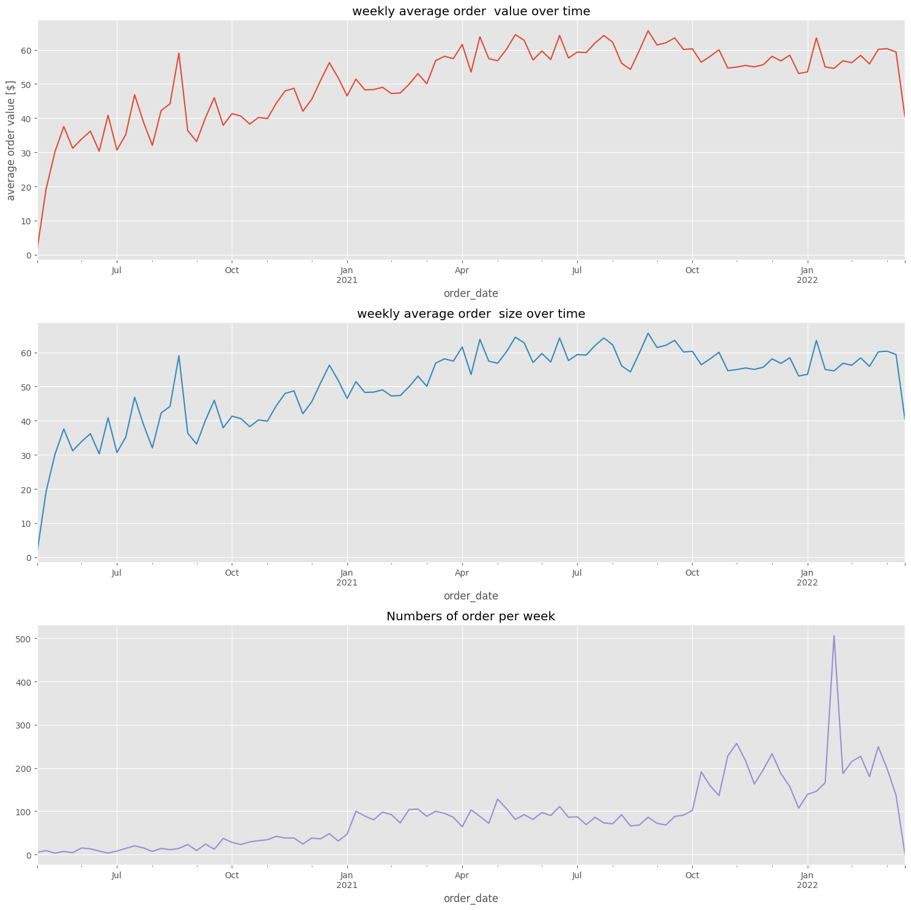
    


```python
#Retention curve cohort

def compute_cohort_stats(x):
    cohort_size = x.loc[lambda x: x.order_month_diff == 0, 'user_id'].nunique()
    return(x.groupby('order_month_diff')['user_id'].nunique() / cohort_size).rename('retention_rate')

fig, ax = plt.subplots(figsize=(15,5))

retention_curves = (
    orders.assign(first_order_month=lambda x: x.groupby('user_id')['order_date'].transform('min').dt.to_period('M'))
    .assign(order_month=lambda x: x.order_date.dt.to_period('M'))
    .assign(order_month_diff=lambda x: (x.order_month - x.first_order_month).apply(lambda x: x.n))
    .groupby('first_order_month').apply(compute_cohort_stats)
    .reset_index()
)

colors =  plt.cm.Blues(np.linspace(0.1, 0.9, retention_curves.first_order_month.nunique()))
count = 0

for label, df in retention_curves.groupby('first_order_month'):
    df.loc[lambda x: x.order_month_diff < 12].plot(x='order_month_diff', y= 'retention_rate', ax=ax, label=label, color= colors[count])
    count += 1

#legend outside of the box

plt.legend(bbox_to_anchor=(1,1), loc = 'upper left')
plt.title('one  year return curves by monthly cohort')
plt.ylabel('Retention rate')

```


    Text(0, 0.5, 'Retention rate')


    
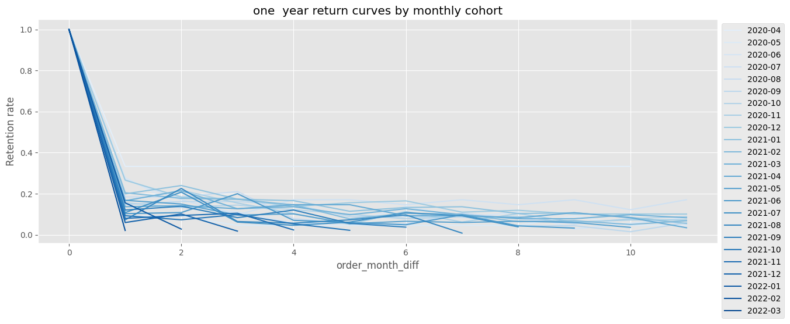
    


# EDA


```python
box_builder_sample_data = "/home/hasierza/datos/feature_frame.csv"

bb_df = pd.read_csv(box_builder_sample_data)

bb_df.head()


```


<div>
<style scoped>
    .dataframe tbody tr th:only-of-type {
        vertical-align: middle;
    }

    .dataframe tbody tr th {
        vertical-align: top;
    }

    .dataframe thead th {
        text-align: right;
    }
</style>
<table border="1" class="dataframe">
  <thead>
    <tr style="text-align: right;">
      <th></th>
      <th>variant_id</th>
      <th>product_type</th>
      <th>order_id</th>
      <th>user_id</th>
      <th>created_at</th>
      <th>order_date</th>
      <th>user_order_seq</th>
      <th>outcome</th>
      <th>ordered_before</th>
      <th>abandoned_before</th>
      <th>...</th>
      <th>count_children</th>
      <th>count_babies</th>
      <th>count_pets</th>
      <th>people_ex_baby</th>
      <th>days_since_purchase_variant_id</th>
      <th>avg_days_to_buy_variant_id</th>
      <th>std_days_to_buy_variant_id</th>
      <th>days_since_purchase_product_type</th>
      <th>avg_days_to_buy_product_type</th>
      <th>std_days_to_buy_product_type</th>
    </tr>
  </thead>
  <tbody>
    <tr>
      <th>0</th>
      <td>33826472919172</td>
      <td>ricepastapulses</td>
      <td>2807985930372</td>
      <td>3482464092292</td>
      <td>2020-10-05 16:46:19</td>
      <td>2020-10-05 00:00:00</td>
      <td>3</td>
      <td>0.0</td>
      <td>0.0</td>
      <td>0.0</td>
      <td>...</td>
      <td>0.0</td>
      <td>0.0</td>
      <td>0.0</td>
      <td>2.0</td>
      <td>33.0</td>
      <td>42.0</td>
      <td>31.134053</td>
      <td>30.0</td>
      <td>30.0</td>
      <td>24.27618</td>
    </tr>
    <tr>
      <th>1</th>
      <td>33826472919172</td>
      <td>ricepastapulses</td>
      <td>2808027644036</td>
      <td>3466586718340</td>
      <td>2020-10-05 17:59:51</td>
      <td>2020-10-05 00:00:00</td>
      <td>2</td>
      <td>0.0</td>
      <td>0.0</td>
      <td>0.0</td>
      <td>...</td>
      <td>0.0</td>
      <td>0.0</td>
      <td>0.0</td>
      <td>2.0</td>
      <td>33.0</td>
      <td>42.0</td>
      <td>31.134053</td>
      <td>30.0</td>
      <td>30.0</td>
      <td>24.27618</td>
    </tr>
    <tr>
      <th>2</th>
      <td>33826472919172</td>
      <td>ricepastapulses</td>
      <td>2808099078276</td>
      <td>3481384026244</td>
      <td>2020-10-05 20:08:53</td>
      <td>2020-10-05 00:00:00</td>
      <td>4</td>
      <td>0.0</td>
      <td>0.0</td>
      <td>0.0</td>
      <td>...</td>
      <td>0.0</td>
      <td>0.0</td>
      <td>0.0</td>
      <td>2.0</td>
      <td>33.0</td>
      <td>42.0</td>
      <td>31.134053</td>
      <td>30.0</td>
      <td>30.0</td>
      <td>24.27618</td>
    </tr>
    <tr>
      <th>3</th>
      <td>33826472919172</td>
      <td>ricepastapulses</td>
      <td>2808393957508</td>
      <td>3291363377284</td>
      <td>2020-10-06 08:57:59</td>
      <td>2020-10-06 00:00:00</td>
      <td>2</td>
      <td>0.0</td>
      <td>0.0</td>
      <td>0.0</td>
      <td>...</td>
      <td>0.0</td>
      <td>0.0</td>
      <td>0.0</td>
      <td>2.0</td>
      <td>33.0</td>
      <td>42.0</td>
      <td>31.134053</td>
      <td>30.0</td>
      <td>30.0</td>
      <td>24.27618</td>
    </tr>
    <tr>
      <th>4</th>
      <td>33826472919172</td>
      <td>ricepastapulses</td>
      <td>2808429314180</td>
      <td>3537167515780</td>
      <td>2020-10-06 10:37:05</td>
      <td>2020-10-06 00:00:00</td>
      <td>3</td>
      <td>0.0</td>
      <td>0.0</td>
      <td>0.0</td>
      <td>...</td>
      <td>0.0</td>
      <td>0.0</td>
      <td>0.0</td>
      <td>2.0</td>
      <td>33.0</td>
      <td>42.0</td>
      <td>31.134053</td>
      <td>30.0</td>
      <td>30.0</td>
      <td>24.27618</td>
    </tr>
  </tbody>
</table>
<p>5 rows × 27 columns</p>
</div>


```python
bb_df.columns
```


    Index(['variant_id', 'product_type', 'order_id', 'user_id', 'created_at',
           'order_date', 'user_order_seq', 'outcome', 'ordered_before',
           'abandoned_before', 'active_snoozed', 'set_as_regular',
           'normalised_price', 'discount_pct', 'vendor', 'global_popularity',
           'count_adults', 'count_children', 'count_babies', 'count_pets',
           'people_ex_baby', 'days_since_purchase_variant_id',
           'avg_days_to_buy_variant_id', 'std_days_to_buy_variant_id',
           'days_since_purchase_product_type', 'avg_days_to_buy_product_type',
           'std_days_to_buy_product_type'],
          dtype='object')


```python
bb_df.info()
```

    <class 'pandas.core.frame.DataFrame'>
    RangeIndex: 2880549 entries, 0 to 2880548
    Data columns (total 27 columns):
     #   Column                            Dtype  
    ---  ------                            -----  
     0   variant_id                        int64  
     1   product_type                      object 
     2   order_id                          int64  
     3   user_id                           int64  
     4   created_at                        object 
     5   order_date                        object 
     6   user_order_seq                    int64  
     7   outcome                           float64
     8   ordered_before                    float64
     9   abandoned_before                  float64
     10  active_snoozed                    float64
     11  set_as_regular                    float64
     12  normalised_price                  float64
     13  discount_pct                      float64
     14  vendor                            object 
     15  global_popularity                 float64
     16  count_adults                      float64
     17  count_children                    float64
     18  count_babies                      float64
     19  count_pets                        float64
     20  people_ex_baby                    float64
     21  days_since_purchase_variant_id    float64
     22  avg_days_to_buy_variant_id        float64
     23  std_days_to_buy_variant_id        float64
     24  days_since_purchase_product_type  float64
     25  avg_days_to_buy_product_type      float64
     26  std_days_to_buy_product_type      float64
    dtypes: float64(19), int64(4), object(4)
    memory usage: 593.4+ MB


```python
info_cols = ['variant_id', 'order_id', 'user_id', 'created_at', 'order_date']

label_col ='outcome'
features_cols = [col for col in bb_df.columns if col not in info_cols + [label_col]]

categorical_cols = ['product_type', 'vendor']
binary_cols = ['ordered_before', 'abandoned_before', 'active_snoozed', 'set_as_regular']
numerical_cols =[col for col in features_cols if col not in categorical_cols + binary_cols]
```


```python
bb_df[label_col].value_counts()

```


    outcome
    0.0    2847317
    1.0      33232
    Name: count, dtype: int64


```python
for col in binary_cols:
    print(f"value counts {col}: {bb_df[col].value_counts().to_dict()}")
    print(f"Mean outcome by {col} value{bb_df.groupby(col)['outcome'].mean().to_dict()}")
    print("---------")

```

    value counts ordered_before: {0.0: 2819658, 1.0: 60891}
    Mean outcome by ordered_before value{0.0: 0.008223337723936732, 1.0: 0.1649669080816541}
    ---------
    value counts abandoned_before: {0.0: 2878794, 1.0: 1755}
    Mean outcome by abandoned_before value{0.0: 0.011106039542947498, 1.0: 0.717948717948718}
    ---------
    value counts active_snoozed: {0.0: 2873952, 1.0: 6597}
    Mean outcome by active_snoozed value{0.0: 0.011302554809544488, 1.0: 0.1135364559648325}
    ---------
    value counts set_as_regular: {0.0: 2870093, 1.0: 10456}
    Mean outcome by set_as_regular value{0.0: 0.010668992259135854, 1.0: 0.24971308339709258}
    ---------


```python
# Calcular la matriz de correlación
corr = bb_df[numerical_cols + [label_col]].corr()

# Generar una máscara para el triángulo superior
mask = np.triu(np.ones_like(corr, dtype=bool))

# Configurar la figura de matplotlib
fig, ax = plt.subplots(figsize=(11, 9))

# Generar un mapa de colores divergente personalizado
cmap = nsn.diverging_palette(230, 20, as_cmap=True)

# Dibujar el mapa de calor con la máscara y la proporción de aspecto correcta
nsn.heatmap(corr, mask=mask, cmap=cmap, vmax=.3, center=0, square=True, linewidths=.5, cbar_kws={"shrink": .5})

```


    <Axes: >


    
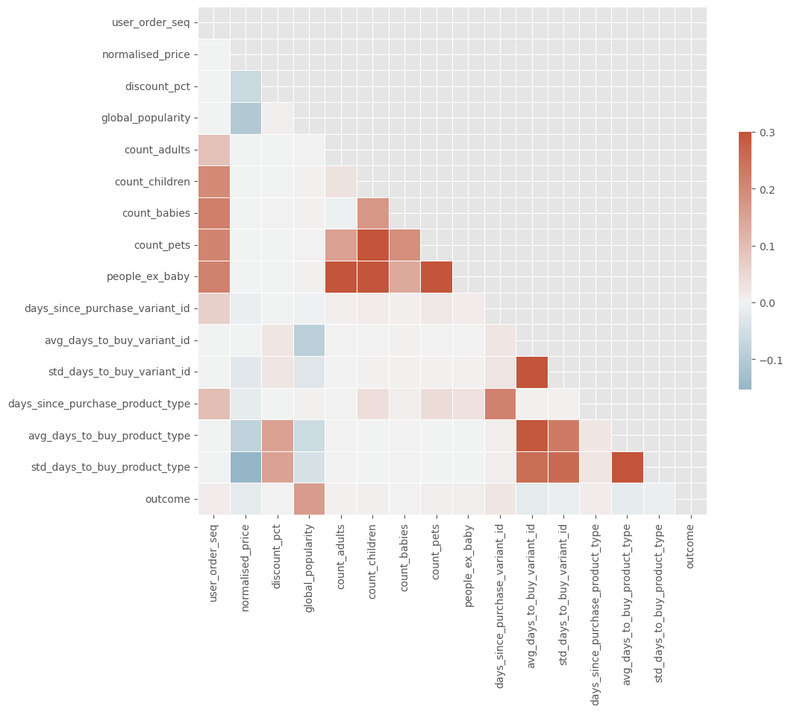
    


```python
#esto no me funciona

cols = 3
rows = int(np.ceil(len(numerical_cols) / cols))
fig, ax =plt.subplots(rows, cols, figsize= (20, 5*rows))

ax= ax.flatten()

for i, col in enumerate(numerical_cols):
    nsn.kdeplot(bb_df.loc[lambda x : x.outcome == 0], label = '0',ax= ax[i])
    nsn.kdeplot(bb_df.loc[lambda x : x.outcome == 1], label = '1',ax= ax[i])
    ax[i].set_title(col)

ax[0].legend()

plt.tight_layout()
```


    The Kernel crashed while executing code in the current cell or a previous cell. 


    Please review the code in the cell(s) to identify a possible cause of the failure. 


    Click <a href='https://aka.ms/vscodeJupyterKernelCrash'>here</a> for more info. 


    View Jupyter <a href='command:jupyter.viewOutput'>log</a> for further details.


```python
cols = 3
rows = int(np.ceil(len(numerical_cols) / cols))
fig, ax = plt.subplots(rows, cols, figsize=(20, 5 * rows))

ax = ax.flatten()

for i, col in enumerate(numerical_cols):
    nsn.kdeplot(bb_df.loc[bb_df['outcome'] == 0, col], label='0', ax=ax[i])
    nsn.kdeplot(bb_df.loc[bb_df['outcome'] == 1, col], label='1', ax=ax[i])
    ax[i].set_title(col)

ax[0].legend()

plt.tight_layout()

```


    
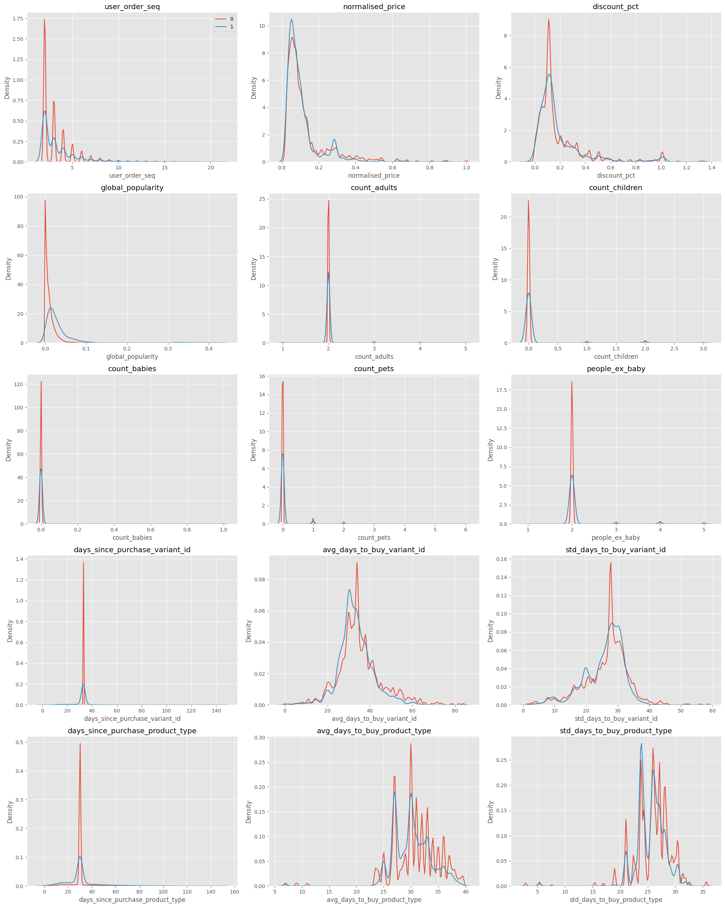
    


```python
bb_df[categorical_cols].describe()
```


<div>
<style scoped>
    .dataframe tbody tr th:only-of-type {
        vertical-align: middle;
    }

    .dataframe tbody tr th {
        vertical-align: top;
    }

    .dataframe thead th {
        text-align: right;
    }
</style>
<table border="1" class="dataframe">
  <thead>
    <tr style="text-align: right;">
      <th></th>
      <th>product_type</th>
      <th>vendor</th>
    </tr>
  </thead>
  <tbody>
    <tr>
      <th>count</th>
      <td>2880549</td>
      <td>2880549</td>
    </tr>
    <tr>
      <th>unique</th>
      <td>62</td>
      <td>264</td>
    </tr>
    <tr>
      <th>top</th>
      <td>tinspackagedfoods</td>
      <td>biona</td>
    </tr>
    <tr>
      <th>freq</th>
      <td>226474</td>
      <td>146828</td>
    </tr>
  </tbody>
</table>
</div>


