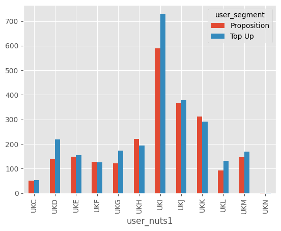
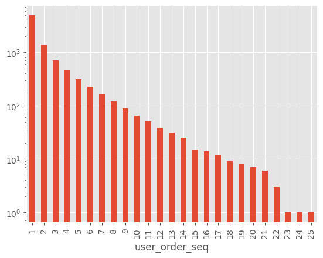
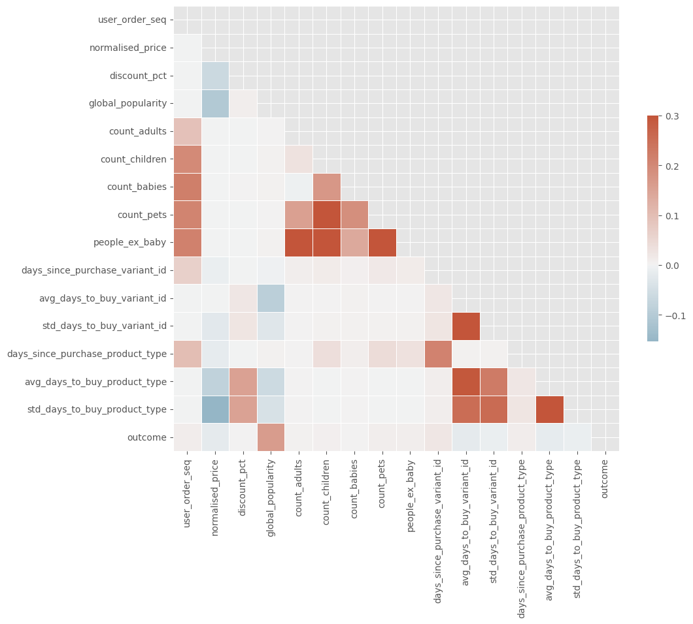

```python
!poetry add pyarrow
!poetry add seaborn
```

    The following packages are already present in the pyproject.toml and will be skipped:
    
      - pyarrow
    
    If you want to update it to the latest compatible version, you can use `poetry update package`.
    If you prefer to upgrade it to the latest available version, you can use `poetry add package@latest`.
    
    Nothing to add.
    The following packages are already present in the pyproject.toml and will be skipped:
    
      - seaborn
    
    If you want to update it to the latest compatible version, you can use `poetry update package`.
    If you prefer to upgrade it to the latest available version, you can use `poetry add package@latest`.
    
    Nothing to add.


```python
import pandas as pd
import matplotlib.pyplot as plt
import numpy as np
import seaborn as nsn

plt.style.use("ggplot")
```

## Problema


```python
data_path = "/home/hasierza/datos_originales/"
```

Visualizar todos los .parquet


```python
orders = pd.read_parquet(f"{data_path}/orders.parquet")
orders.info()
```

    <class 'pandas.core.frame.DataFrame'>
    Index: 8773 entries, 10 to 64538
    Data columns (total 6 columns):
     #   Column          Non-Null Count  Dtype         
    ---  ------          --------------  -----         
     0   id              8773 non-null   int64         
     1   user_id         8773 non-null   object        
     2   created_at      8773 non-null   datetime64[us]
     3   order_date      8773 non-null   datetime64[us]
     4   user_order_seq  8773 non-null   int64         
     5   ordered_items   8773 non-null   object        
    dtypes: datetime64[us](2), int64(2), object(2)
    memory usage: 479.8+ KB


```python
orders.head()
```


<div>
<style scoped>
    .dataframe tbody tr th:only-of-type {
        vertical-align: middle;
    }

    .dataframe tbody tr th {
        vertical-align: top;
    }

    .dataframe thead th {
        text-align: right;
    }
</style>
<table border="1" class="dataframe">
  <thead>
    <tr style="text-align: right;">
      <th></th>
      <th>id</th>
      <th>user_id</th>
      <th>created_at</th>
      <th>order_date</th>
      <th>user_order_seq</th>
      <th>ordered_items</th>
    </tr>
  </thead>
  <tbody>
    <tr>
      <th>10</th>
      <td>2204073066628</td>
      <td>62e271062eb827e411bd73941178d29b022f5f2de9d37f...</td>
      <td>2020-04-30 14:32:19</td>
      <td>2020-04-30</td>
      <td>1</td>
      <td>[33618849693828, 33618860179588, 3361887404045...</td>
    </tr>
    <tr>
      <th>20</th>
      <td>2204707520644</td>
      <td>bf591c887c46d5d3513142b6a855dd7ffb9cc00697f6f5...</td>
      <td>2020-04-30 17:39:00</td>
      <td>2020-04-30</td>
      <td>1</td>
      <td>[33618835243140, 33618835964036, 3361886244058...</td>
    </tr>
    <tr>
      <th>21</th>
      <td>2204838822020</td>
      <td>329f08c66abb51f8c0b8a9526670da2d94c0c6eef06700...</td>
      <td>2020-04-30 18:12:30</td>
      <td>2020-04-30</td>
      <td>1</td>
      <td>[33618891145348, 33618893570180, 3361889766618...</td>
    </tr>
    <tr>
      <th>34</th>
      <td>2208967852164</td>
      <td>f6451fce7b1c58d0effbe37fcb4e67b718193562766470...</td>
      <td>2020-05-01 19:44:11</td>
      <td>2020-05-01</td>
      <td>1</td>
      <td>[33618830196868, 33618846580868, 3361891234624...</td>
    </tr>
    <tr>
      <th>49</th>
      <td>2215889436804</td>
      <td>68e872ff888303bff58ec56a3a986f77ddebdbe5c279e7...</td>
      <td>2020-05-03 21:56:14</td>
      <td>2020-05-03</td>
      <td>1</td>
      <td>[33667166699652, 33667166699652, 3366717122163...</td>
    </tr>
  </tbody>
</table>
</div>


```python
users = pd.read_parquet(f"{data_path}/users.parquet")
users.info()
```

    <class 'pandas.core.frame.DataFrame'>
    Index: 4983 entries, 2160 to 3360
    Data columns (total 10 columns):
     #   Column                 Non-Null Count  Dtype  
    ---  ------                 --------------  -----  
     0   user_id                4983 non-null   object 
     1   user_segment           4983 non-null   object 
     2   user_nuts1             4932 non-null   object 
     3   first_ordered_at       4983 non-null   object 
     4   customer_cohort_month  4983 non-null   object 
     5   count_people           325 non-null    float64
     6   count_adults           325 non-null    float64
     7   count_children         325 non-null    float64
     8   count_babies           325 non-null    float64
     9   count_pets             325 non-null    float64
    dtypes: float64(5), object(5)
    memory usage: 428.2+ KB


```python
users.dropna().head() #usamos el dropna para quitar los valores nulos
```


<div>
<style scoped>
    .dataframe tbody tr th:only-of-type {
        vertical-align: middle;
    }

    .dataframe tbody tr th {
        vertical-align: top;
    }

    .dataframe thead th {
        text-align: right;
    }
</style>
<table border="1" class="dataframe">
  <thead>
    <tr style="text-align: right;">
      <th></th>
      <th>user_id</th>
      <th>user_segment</th>
      <th>user_nuts1</th>
      <th>first_ordered_at</th>
      <th>customer_cohort_month</th>
      <th>count_people</th>
      <th>count_adults</th>
      <th>count_children</th>
      <th>count_babies</th>
      <th>count_pets</th>
    </tr>
  </thead>
  <tbody>
    <tr>
      <th>4751</th>
      <td>09d70e0b0778117aec5550c08032d56f8e06f992741680...</td>
      <td>Proposition</td>
      <td>UKI</td>
      <td>2021-06-28 12:07:04</td>
      <td>2021-06-01 00:00:00</td>
      <td>1.0</td>
      <td>1.0</td>
      <td>0.0</td>
      <td>0.0</td>
      <td>0.0</td>
    </tr>
    <tr>
      <th>3154</th>
      <td>4f5ff38ce5ed48096ba80dff80e167db1ad24b9ebdb00c...</td>
      <td>Top Up</td>
      <td>UKD</td>
      <td>2020-06-12 12:07:35</td>
      <td>2020-06-01 00:00:00</td>
      <td>3.0</td>
      <td>2.0</td>
      <td>0.0</td>
      <td>1.0</td>
      <td>0.0</td>
    </tr>
    <tr>
      <th>736</th>
      <td>7b2ae50bb11646436fa613394fc3e71e1a0cdc3ba30cdb...</td>
      <td>Proposition</td>
      <td>UKF</td>
      <td>2020-10-03 09:53:57</td>
      <td>2020-10-01 00:00:00</td>
      <td>2.0</td>
      <td>2.0</td>
      <td>0.0</td>
      <td>0.0</td>
      <td>2.0</td>
    </tr>
    <tr>
      <th>4792</th>
      <td>5e977a4aa2c57f306b8a22f92eaaa177f7dc31a52df82c...</td>
      <td>Proposition</td>
      <td>UKI</td>
      <td>2021-10-14 10:41:13</td>
      <td>2021-10-01 00:00:00</td>
      <td>2.0</td>
      <td>1.0</td>
      <td>1.0</td>
      <td>0.0</td>
      <td>1.0</td>
    </tr>
    <tr>
      <th>2217</th>
      <td>eafb89ad33eb377adb98a915b6a5a65f1284c2db517d07...</td>
      <td>Proposition</td>
      <td>UKH</td>
      <td>2022-01-20 15:53:09</td>
      <td>2022-01-01 00:00:00</td>
      <td>2.0</td>
      <td>2.0</td>
      <td>0.0</td>
      <td>0.0</td>
      <td>0.0</td>
    </tr>
  </tbody>
</table>
</div>


```python
regulars = pd.read_parquet(f"{data_path}/regulars.parquet")
regulars.info()
```

    <class 'pandas.core.frame.DataFrame'>
    Index: 18105 entries, 3 to 37720
    Data columns (total 3 columns):
     #   Column      Non-Null Count  Dtype         
    ---  ------      --------------  -----         
     0   user_id     18105 non-null  object        
     1   variant_id  18105 non-null  int64         
     2   created_at  18105 non-null  datetime64[us]
    dtypes: datetime64[us](1), int64(1), object(1)
    memory usage: 565.8+ KB


```python
regulars.head()
```


<div>
<style scoped>
    .dataframe tbody tr th:only-of-type {
        vertical-align: middle;
    }

    .dataframe tbody tr th {
        vertical-align: top;
    }

    .dataframe thead th {
        text-align: right;
    }
</style>
<table border="1" class="dataframe">
  <thead>
    <tr style="text-align: right;">
      <th></th>
      <th>user_id</th>
      <th>variant_id</th>
      <th>created_at</th>
    </tr>
  </thead>
  <tbody>
    <tr>
      <th>3</th>
      <td>68e872ff888303bff58ec56a3a986f77ddebdbe5c279e7...</td>
      <td>33618848088196</td>
      <td>2020-04-30 15:07:03</td>
    </tr>
    <tr>
      <th>11</th>
      <td>aed88fc0b004270a62ff1fe4b94141f6b1db1496dbb0c0...</td>
      <td>33667178659972</td>
      <td>2020-05-05 23:34:35</td>
    </tr>
    <tr>
      <th>18</th>
      <td>68e872ff888303bff58ec56a3a986f77ddebdbe5c279e7...</td>
      <td>33619009208452</td>
      <td>2020-04-30 15:07:03</td>
    </tr>
    <tr>
      <th>46</th>
      <td>aed88fc0b004270a62ff1fe4b94141f6b1db1496dbb0c0...</td>
      <td>33667305373828</td>
      <td>2020-05-05 23:34:35</td>
    </tr>
    <tr>
      <th>47</th>
      <td>4594e99557113d5a1c5b59bf31b8704aafe5c7bd180b32...</td>
      <td>33667247341700</td>
      <td>2020-05-06 14:42:11</td>
    </tr>
  </tbody>
</table>
</div>


```python
inventory = pd.read_parquet(f"{data_path}/inventory.parquet")
inventory.info()
```

    <class 'pandas.core.frame.DataFrame'>
    RangeIndex: 1733 entries, 0 to 1732
    Data columns (total 6 columns):
     #   Column            Non-Null Count  Dtype  
    ---  ------            --------------  -----  
     0   variant_id        1733 non-null   int64  
     1   price             1733 non-null   float64
     2   compare_at_price  1733 non-null   float64
     3   vendor            1733 non-null   object 
     4   product_type      1733 non-null   object 
     5   tags              1733 non-null   object 
    dtypes: float64(2), int64(1), object(3)
    memory usage: 81.4+ KB


```python
inventory.head()
```


<div>
<style scoped>
    .dataframe tbody tr th:only-of-type {
        vertical-align: middle;
    }

    .dataframe tbody tr th {
        vertical-align: top;
    }

    .dataframe thead th {
        text-align: right;
    }
</style>
<table border="1" class="dataframe">
  <thead>
    <tr style="text-align: right;">
      <th></th>
      <th>variant_id</th>
      <th>price</th>
      <th>compare_at_price</th>
      <th>vendor</th>
      <th>product_type</th>
      <th>tags</th>
    </tr>
  </thead>
  <tbody>
    <tr>
      <th>0</th>
      <td>39587297165444</td>
      <td>3.09</td>
      <td>3.15</td>
      <td>heinz</td>
      <td>condiments-dressings</td>
      <td>[table-sauces, vegan]</td>
    </tr>
    <tr>
      <th>1</th>
      <td>34370361229444</td>
      <td>4.99</td>
      <td>5.50</td>
      <td>whogivesacrap</td>
      <td>toilet-roll-kitchen-roll-tissue</td>
      <td>[b-corp, eco, toilet-rolls]</td>
    </tr>
    <tr>
      <th>2</th>
      <td>34284951863428</td>
      <td>3.69</td>
      <td>3.99</td>
      <td>plenty</td>
      <td>toilet-roll-kitchen-roll-tissue</td>
      <td>[kitchen-roll]</td>
    </tr>
    <tr>
      <th>3</th>
      <td>33667283583108</td>
      <td>1.79</td>
      <td>1.99</td>
      <td>thecheekypanda</td>
      <td>toilet-roll-kitchen-roll-tissue</td>
      <td>[b-corp, cruelty-free, eco, tissue, vegan]</td>
    </tr>
    <tr>
      <th>4</th>
      <td>33803537973380</td>
      <td>1.99</td>
      <td>2.09</td>
      <td>colgate</td>
      <td>dental</td>
      <td>[dental-accessories]</td>
    </tr>
  </tbody>
</table>
</div>


```python
abandoned_carts = pd.read_parquet(f"{data_path}/abandoned_carts.parquet")
abandoned_carts.info()
```

    <class 'pandas.core.frame.DataFrame'>
    Index: 5457 entries, 0 to 70050
    Data columns (total 4 columns):
     #   Column      Non-Null Count  Dtype         
    ---  ------      --------------  -----         
     0   id          5457 non-null   int64         
     1   user_id     5457 non-null   object        
     2   created_at  5457 non-null   datetime64[us]
     3   variant_id  5457 non-null   object        
    dtypes: datetime64[us](1), int64(1), object(2)
    memory usage: 213.2+ KB


```python
abandoned_carts.head()
```


<div>
<style scoped>
    .dataframe tbody tr th:only-of-type {
        vertical-align: middle;
    }

    .dataframe tbody tr th {
        vertical-align: top;
    }

    .dataframe thead th {
        text-align: right;
    }
</style>
<table border="1" class="dataframe">
  <thead>
    <tr style="text-align: right;">
      <th></th>
      <th>id</th>
      <th>user_id</th>
      <th>created_at</th>
      <th>variant_id</th>
    </tr>
  </thead>
  <tbody>
    <tr>
      <th>0</th>
      <td>12858560217220</td>
      <td>5c4e5953f13ddc3bc9659a3453356155e5efe4739d7a2b...</td>
      <td>2020-05-20 13:53:24</td>
      <td>[33826459287684, 33826457616516, 3366719212762...</td>
    </tr>
    <tr>
      <th>13</th>
      <td>20352449839236</td>
      <td>9d6187545c005d39e44d0456d87790db18611d7c7379bd...</td>
      <td>2021-06-27 05:24:13</td>
      <td>[34415988179076, 34037940158596, 3450282236326...</td>
    </tr>
    <tr>
      <th>45</th>
      <td>20478401413252</td>
      <td>e83fb0273d70c37a2968fee107113698fd4f389c442c0b...</td>
      <td>2021-07-18 08:23:49</td>
      <td>[34543001337988, 34037939372164, 3411360609088...</td>
    </tr>
    <tr>
      <th>50</th>
      <td>20481783103620</td>
      <td>10c42e10e530284b7c7c50f3a23a98726d5747b8128084...</td>
      <td>2021-07-18 21:29:36</td>
      <td>[33667268116612, 34037940224132, 3443605520397...</td>
    </tr>
    <tr>
      <th>52</th>
      <td>20485321687172</td>
      <td>d9989439524b3f6fc4f41686d043f315fb408b954d6153...</td>
      <td>2021-07-19 12:17:05</td>
      <td>[33667268083844, 34284950454404, 33973246886020]</td>
    </tr>
  </tbody>
</table>
</div>


### Compradores


```python
users.describe()
```


<div>
<style scoped>
    .dataframe tbody tr th:only-of-type {
        vertical-align: middle;
    }

    .dataframe tbody tr th {
        vertical-align: top;
    }

    .dataframe thead th {
        text-align: right;
    }
</style>
<table border="1" class="dataframe">
  <thead>
    <tr style="text-align: right;">
      <th></th>
      <th>count_people</th>
      <th>count_adults</th>
      <th>count_children</th>
      <th>count_babies</th>
      <th>count_pets</th>
    </tr>
  </thead>
  <tbody>
    <tr>
      <th>count</th>
      <td>325.000000</td>
      <td>325.000000</td>
      <td>325.000000</td>
      <td>325.000000</td>
      <td>325.000000</td>
    </tr>
    <tr>
      <th>mean</th>
      <td>2.787692</td>
      <td>2.003077</td>
      <td>0.707692</td>
      <td>0.076923</td>
      <td>0.636923</td>
    </tr>
    <tr>
      <th>std</th>
      <td>1.365753</td>
      <td>0.869577</td>
      <td>1.026246</td>
      <td>0.289086</td>
      <td>0.995603</td>
    </tr>
    <tr>
      <th>min</th>
      <td>0.000000</td>
      <td>0.000000</td>
      <td>0.000000</td>
      <td>0.000000</td>
      <td>0.000000</td>
    </tr>
    <tr>
      <th>25%</th>
      <td>2.000000</td>
      <td>2.000000</td>
      <td>0.000000</td>
      <td>0.000000</td>
      <td>0.000000</td>
    </tr>
    <tr>
      <th>50%</th>
      <td>3.000000</td>
      <td>2.000000</td>
      <td>0.000000</td>
      <td>0.000000</td>
      <td>0.000000</td>
    </tr>
    <tr>
      <th>75%</th>
      <td>4.000000</td>
      <td>2.000000</td>
      <td>1.000000</td>
      <td>0.000000</td>
      <td>1.000000</td>
    </tr>
    <tr>
      <th>max</th>
      <td>8.000000</td>
      <td>7.000000</td>
      <td>6.000000</td>
      <td>2.000000</td>
      <td>6.000000</td>
    </tr>
  </tbody>
</table>
</div>


```python
user_nuts_counts = users['user_nuts1'].value_counts()
user_nuts_percentage = (user_nuts_counts / len(users)) * 100

print(user_nuts_percentage) #de donde son los usuarios
```

    user_nuts1
    UKI    26.449930
    UKJ    14.950833
    UKK    12.081076
    UKH     8.308248
    UKD     7.184427
    UKM     6.321493
    UKE     6.080674
    UKG     5.920128
    UKF     5.057194
    UKL     4.495284
    UKC     2.046960
    UKN     0.080273
    Name: count, dtype: float64


```python
plt.figure(figsize=(10, 6))  # Ajustar el tamaño de la gráfica según sea necesario
user_nuts_percentage.plot(kind='bar')

plt.title('Porcentaje de Usuarios por Valor de user_nuts')
plt.xlabel('Valor de user_nuts')
plt.ylabel('Porcentaje de Usuarios')

# Mostrar la gráfica
plt.tight_layout()
plt.show()
```


    

    


```python
user_segment_counts = users['user_segment'].value_counts()
user_segment_percentage = (user_segment_counts / len(users)) * 100

print(user_segment_percentage) # Porcentaje de usuarios por segmento


```

    user_segment
    Top Up         53.040337
    Proposition    46.959663
    Name: count, dtype: float64


```python
plt.figure(figsize=(10, 6))  # Ajustar el tamaño de la gráfica según sea necesario
user_segment_percentage.plot(kind='bar')

plt.title('Porcentaje de Usuarios por Segmento')
plt.xlabel('Segmento de Usuario')
plt.ylabel('Porcentaje de Usuarios')

# Mostrar la gráfica
plt.tight_layout()
plt.show()

```


    

    


```python
column_cleaned = users['count_pets'].dropna()

mascostas_no = (column_cleaned == 0).sum()
mascotas_si = (column_cleaned != 0).sum()

# Calcular el total de valores después de eliminar los valores NaN
total_values = column_cleaned.size

# Calcular el porcentaje de ocurrencia de cada valor
mascostas_no = (mascostas_no / total_values) * 100
mascotas_si = (mascotas_si / total_values) * 100

print(f'Porcentaje de usuarios q no tienen mascota: {mascostas_no:.2f}%')
print(f'Porcentaje de usuarios q si tiene mascota: {mascotas_si: .2f}%')


```

    Porcentaje de usuarios q no tienen mascota: 59.38%
    Porcentaje de usuarios q si tiene mascota:  40.62%


```python
count_mascotas = column_cleaned.value_counts().sort_index()

# Crear la gráfica de barras
plt.bar(count_mascotas.index, count_mascotas.values)

# Configurar el título y las etiquetas de los ejes
plt.title('Cantidad de Usuarios por Cantidad de Mascotas')
plt.xlabel('Cantidad de Mascotas')
plt.ylabel('Cantidad de Usuarios')

# Mostrar la gráfica
plt.show()
```


    

    


hay q tener cuidado porque la muestra no es total solo se han tenido en cuenta valores n != nan


```python
# Contar la cantidad de usuarios para cada cantidad de mascotas, incluyendo NaN
count_mascotas = users['count_pets'].value_counts(dropna=False).sort_index()

# Calcular el total de usuarios (incluyendo NaN)
total_users = count_mascotas.sum()

# Imprimir los resultados para cada cantidad de mascotas
for mascotas, count in count_mascotas.items():
    if pd.isna(mascotas):
        print(f'Porcentaje de usuarios que han puesto NaN: {(count / total_users) * 100:.2f}%')
    else:
        print(f'Porcentaje de usuarios que han puesto {int(mascotas)} mascotas: {(count / total_users) * 100:.2f}%')
```

    Porcentaje de usuarios que han puesto 0 mascotas: 3.87%
    Porcentaje de usuarios que han puesto 1 mascotas: 1.75%
    Porcentaje de usuarios que han puesto 2 mascotas: 0.56%
    Porcentaje de usuarios que han puesto 3 mascotas: 0.16%
    Porcentaje de usuarios que han puesto 4 mascotas: 0.12%
    Porcentaje de usuarios que han puesto 5 mascotas: 0.04%
    Porcentaje de usuarios que han puesto 6 mascotas: 0.02%
    Porcentaje de usuarios que han puesto NaN: 93.48%


como se puede ver la mayoria no han expecificado la respuesta y habria q entender el porque y si la muestra de sin nan es representativa o no.


```python

data_cleaned = users.dropna(subset=['count_children', 'count_babies'])

no_children_or_babies = (data_cleaned['count_children'] == 0) & (data_cleaned['count_babies'] == 0)
count_no_children_or_babies = no_children_or_babies.sum()

print(f"Número de filas sin hijos ni bebés: {count_no_children_or_babies}")
num_rows_data_cleaned = data_cleaned.shape[0]
print(f"El DataFrame 'data_cleaned' tiene {num_rows_data_cleaned} filas.")
porcentaje= (count_no_children_or_babies / num_rows_data_cleaned) * 100
print(f"De la muestrad de 325 el {porcentaje:.2f} % no tienen hijos ni bebes")


```

    Número de filas sin hijos ni bebés: 181
    El DataFrame 'data_cleaned' tiene 325 filas.
    De la muestrad de 325 el 55.69 % no tienen hijos ni bebes


```python
users.dropna().head()


```


<div>
<style scoped>
    .dataframe tbody tr th:only-of-type {
        vertical-align: middle;
    }

    .dataframe tbody tr th {
        vertical-align: top;
    }

    .dataframe thead th {
        text-align: right;
    }
</style>
<table border="1" class="dataframe">
  <thead>
    <tr style="text-align: right;">
      <th></th>
      <th>user_id</th>
      <th>user_segment</th>
      <th>user_nuts1</th>
      <th>first_ordered_at</th>
      <th>customer_cohort_month</th>
      <th>count_people</th>
      <th>count_adults</th>
      <th>count_children</th>
      <th>count_babies</th>
      <th>count_pets</th>
    </tr>
  </thead>
  <tbody>
    <tr>
      <th>4751</th>
      <td>09d70e0b0778117aec5550c08032d56f8e06f992741680...</td>
      <td>Proposition</td>
      <td>UKI</td>
      <td>2021-06-28 12:07:04</td>
      <td>2021-06-01 00:00:00</td>
      <td>1.0</td>
      <td>1.0</td>
      <td>0.0</td>
      <td>0.0</td>
      <td>0.0</td>
    </tr>
    <tr>
      <th>3154</th>
      <td>4f5ff38ce5ed48096ba80dff80e167db1ad24b9ebdb00c...</td>
      <td>Top Up</td>
      <td>UKD</td>
      <td>2020-06-12 12:07:35</td>
      <td>2020-06-01 00:00:00</td>
      <td>3.0</td>
      <td>2.0</td>
      <td>0.0</td>
      <td>1.0</td>
      <td>0.0</td>
    </tr>
    <tr>
      <th>736</th>
      <td>7b2ae50bb11646436fa613394fc3e71e1a0cdc3ba30cdb...</td>
      <td>Proposition</td>
      <td>UKF</td>
      <td>2020-10-03 09:53:57</td>
      <td>2020-10-01 00:00:00</td>
      <td>2.0</td>
      <td>2.0</td>
      <td>0.0</td>
      <td>0.0</td>
      <td>2.0</td>
    </tr>
    <tr>
      <th>4792</th>
      <td>5e977a4aa2c57f306b8a22f92eaaa177f7dc31a52df82c...</td>
      <td>Proposition</td>
      <td>UKI</td>
      <td>2021-10-14 10:41:13</td>
      <td>2021-10-01 00:00:00</td>
      <td>2.0</td>
      <td>1.0</td>
      <td>1.0</td>
      <td>0.0</td>
      <td>1.0</td>
    </tr>
    <tr>
      <th>2217</th>
      <td>eafb89ad33eb377adb98a915b6a5a65f1284c2db517d07...</td>
      <td>Proposition</td>
      <td>UKH</td>
      <td>2022-01-20 15:53:09</td>
      <td>2022-01-01 00:00:00</td>
      <td>2.0</td>
      <td>2.0</td>
      <td>0.0</td>
      <td>0.0</td>
      <td>0.0</td>
    </tr>
  </tbody>
</table>
</div>


```python
users.describe()
```


<div>
<style scoped>
    .dataframe tbody tr th:only-of-type {
        vertical-align: middle;
    }

    .dataframe tbody tr th {
        vertical-align: top;
    }

    .dataframe thead th {
        text-align: right;
    }
</style>
<table border="1" class="dataframe">
  <thead>
    <tr style="text-align: right;">
      <th></th>
      <th>count_people</th>
      <th>count_adults</th>
      <th>count_children</th>
      <th>count_babies</th>
      <th>count_pets</th>
    </tr>
  </thead>
  <tbody>
    <tr>
      <th>count</th>
      <td>325.000000</td>
      <td>325.000000</td>
      <td>325.000000</td>
      <td>325.000000</td>
      <td>325.000000</td>
    </tr>
    <tr>
      <th>mean</th>
      <td>2.787692</td>
      <td>2.003077</td>
      <td>0.707692</td>
      <td>0.076923</td>
      <td>0.636923</td>
    </tr>
    <tr>
      <th>std</th>
      <td>1.365753</td>
      <td>0.869577</td>
      <td>1.026246</td>
      <td>0.289086</td>
      <td>0.995603</td>
    </tr>
    <tr>
      <th>min</th>
      <td>0.000000</td>
      <td>0.000000</td>
      <td>0.000000</td>
      <td>0.000000</td>
      <td>0.000000</td>
    </tr>
    <tr>
      <th>25%</th>
      <td>2.000000</td>
      <td>2.000000</td>
      <td>0.000000</td>
      <td>0.000000</td>
      <td>0.000000</td>
    </tr>
    <tr>
      <th>50%</th>
      <td>3.000000</td>
      <td>2.000000</td>
      <td>0.000000</td>
      <td>0.000000</td>
      <td>0.000000</td>
    </tr>
    <tr>
      <th>75%</th>
      <td>4.000000</td>
      <td>2.000000</td>
      <td>1.000000</td>
      <td>0.000000</td>
      <td>1.000000</td>
    </tr>
    <tr>
      <th>max</th>
      <td>8.000000</td>
      <td>7.000000</td>
      <td>6.000000</td>
      <td>2.000000</td>
      <td>6.000000</td>
    </tr>
  </tbody>
</table>
</div>


hasta aqui lo he hecho por mi cuenta, lo siguinte mirando la explicacion de Guille


```python
n_regulars = regulars.groupby('user_id')['variant_id'].nunique().reset_index().rename(columns={'variant_id': 'n_regulars'}) #nunique() devuelve el número de valores únicos. 
users = users.merge(n_regulars, on='user_id', how='left').fillna({'n_regulars':0})
```


```python
users.info()
```

    <class 'pandas.core.frame.DataFrame'>
    RangeIndex: 4983 entries, 0 to 4982
    Data columns (total 11 columns):
     #   Column                 Non-Null Count  Dtype  
    ---  ------                 --------------  -----  
     0   user_id                4983 non-null   object 
     1   user_segment           4983 non-null   object 
     2   user_nuts1             4932 non-null   object 
     3   first_ordered_at       4983 non-null   object 
     4   customer_cohort_month  4983 non-null   object 
     5   count_people           325 non-null    float64
     6   count_adults           325 non-null    float64
     7   count_children         325 non-null    float64
     8   count_babies           325 non-null    float64
     9   count_pets             325 non-null    float64
     10  n_regulars             4983 non-null   float64
    dtypes: float64(6), object(5)
    memory usage: 428.4+ KB


```python
users.dropna().head()
```


<div>
<style scoped>
    .dataframe tbody tr th:only-of-type {
        vertical-align: middle;
    }

    .dataframe tbody tr th {
        vertical-align: top;
    }

    .dataframe thead th {
        text-align: right;
    }
</style>
<table border="1" class="dataframe">
  <thead>
    <tr style="text-align: right;">
      <th></th>
      <th>user_id</th>
      <th>user_segment</th>
      <th>user_nuts1</th>
      <th>first_ordered_at</th>
      <th>customer_cohort_month</th>
      <th>count_people</th>
      <th>count_adults</th>
      <th>count_children</th>
      <th>count_babies</th>
      <th>count_pets</th>
      <th>n_regulars</th>
    </tr>
  </thead>
  <tbody>
    <tr>
      <th>23</th>
      <td>09d70e0b0778117aec5550c08032d56f8e06f992741680...</td>
      <td>Proposition</td>
      <td>UKI</td>
      <td>2021-06-28 12:07:04</td>
      <td>2021-06-01 00:00:00</td>
      <td>1.0</td>
      <td>1.0</td>
      <td>0.0</td>
      <td>0.0</td>
      <td>0.0</td>
      <td>0.0</td>
    </tr>
    <tr>
      <th>27</th>
      <td>4f5ff38ce5ed48096ba80dff80e167db1ad24b9ebdb00c...</td>
      <td>Top Up</td>
      <td>UKD</td>
      <td>2020-06-12 12:07:35</td>
      <td>2020-06-01 00:00:00</td>
      <td>3.0</td>
      <td>2.0</td>
      <td>0.0</td>
      <td>1.0</td>
      <td>0.0</td>
      <td>1.0</td>
    </tr>
    <tr>
      <th>28</th>
      <td>7b2ae50bb11646436fa613394fc3e71e1a0cdc3ba30cdb...</td>
      <td>Proposition</td>
      <td>UKF</td>
      <td>2020-10-03 09:53:57</td>
      <td>2020-10-01 00:00:00</td>
      <td>2.0</td>
      <td>2.0</td>
      <td>0.0</td>
      <td>0.0</td>
      <td>2.0</td>
      <td>25.0</td>
    </tr>
    <tr>
      <th>35</th>
      <td>5e977a4aa2c57f306b8a22f92eaaa177f7dc31a52df82c...</td>
      <td>Proposition</td>
      <td>UKI</td>
      <td>2021-10-14 10:41:13</td>
      <td>2021-10-01 00:00:00</td>
      <td>2.0</td>
      <td>1.0</td>
      <td>1.0</td>
      <td>0.0</td>
      <td>1.0</td>
      <td>72.0</td>
    </tr>
    <tr>
      <th>66</th>
      <td>eafb89ad33eb377adb98a915b6a5a65f1284c2db517d07...</td>
      <td>Proposition</td>
      <td>UKH</td>
      <td>2022-01-20 15:53:09</td>
      <td>2022-01-01 00:00:00</td>
      <td>2.0</td>
      <td>2.0</td>
      <td>0.0</td>
      <td>0.0</td>
      <td>0.0</td>
      <td>3.0</td>
    </tr>
  </tbody>
</table>
</div>


```python
users.describe()
```


<div>
<style scoped>
    .dataframe tbody tr th:only-of-type {
        vertical-align: middle;
    }

    .dataframe tbody tr th {
        vertical-align: top;
    }

    .dataframe thead th {
        text-align: right;
    }
</style>
<table border="1" class="dataframe">
  <thead>
    <tr style="text-align: right;">
      <th></th>
      <th>count_people</th>
      <th>count_adults</th>
      <th>count_children</th>
      <th>count_babies</th>
      <th>count_pets</th>
      <th>n_regulars</th>
    </tr>
  </thead>
  <tbody>
    <tr>
      <th>count</th>
      <td>325.000000</td>
      <td>325.000000</td>
      <td>325.000000</td>
      <td>325.000000</td>
      <td>325.000000</td>
      <td>4983.000000</td>
    </tr>
    <tr>
      <th>mean</th>
      <td>2.787692</td>
      <td>2.003077</td>
      <td>0.707692</td>
      <td>0.076923</td>
      <td>0.636923</td>
      <td>2.481437</td>
    </tr>
    <tr>
      <th>std</th>
      <td>1.365753</td>
      <td>0.869577</td>
      <td>1.026246</td>
      <td>0.289086</td>
      <td>0.995603</td>
      <td>8.890588</td>
    </tr>
    <tr>
      <th>min</th>
      <td>0.000000</td>
      <td>0.000000</td>
      <td>0.000000</td>
      <td>0.000000</td>
      <td>0.000000</td>
      <td>0.000000</td>
    </tr>
    <tr>
      <th>25%</th>
      <td>2.000000</td>
      <td>2.000000</td>
      <td>0.000000</td>
      <td>0.000000</td>
      <td>0.000000</td>
      <td>0.000000</td>
    </tr>
    <tr>
      <th>50%</th>
      <td>3.000000</td>
      <td>2.000000</td>
      <td>0.000000</td>
      <td>0.000000</td>
      <td>0.000000</td>
      <td>0.000000</td>
    </tr>
    <tr>
      <th>75%</th>
      <td>4.000000</td>
      <td>2.000000</td>
      <td>1.000000</td>
      <td>0.000000</td>
      <td>1.000000</td>
      <td>1.000000</td>
    </tr>
    <tr>
      <th>max</th>
      <td>8.000000</td>
      <td>7.000000</td>
      <td>6.000000</td>
      <td>2.000000</td>
      <td>6.000000</td>
      <td>320.000000</td>
    </tr>
  </tbody>
</table>
</div>


```python
# Calcular la frecuencia de cada valor en la columna 'n_regulars'
frequencies = users['n_regulars'].value_counts()

# Ordenar las frecuencias por el valor de 'n_regulars' para asegurar un orden ascendente en el gráfico
frequencies = frequencies.sort_index()

# Crear el gráfico de barras
plt.bar(frequencies.index, frequencies.values)

# Etiquetas y título del gráfico
plt.xlabel('Número de variantes regulares')
plt.ylabel('Frecuencia')
plt.title('Frecuencia de los valores de n_regulars')

# Mostrar el gráfico
plt.show()
```


    

    


```python
frequencies = users['n_regulars'].value_counts()

# Ordenar las frecuencias por el valor de 'n_regulars' para asegurar un orden ascendente en el gráfico
frequencies = frequencies.sort_index()

# Crear el gráfico de barras con escala logarítmica en el eje y
plt.bar(frequencies.index, frequencies.values)

# Aplicar escala logarítmica al eje y
plt.yscale('log')

# Etiquetas y título del gráfico
plt.xlabel('Número de variantes regulares')
plt.ylabel('Frecuencia (log scale)')
plt.title('Frecuencia de los valores de n_regulars')

# Mostrar el gráfico
plt.show()
```


    

    


se puede observar q lo normal es q este por debajo de 100 y q los otros valores son outlayers


```python
# Definir los intervalos
intervalos = [(i, i+9) for i in range(0, 330, 10)]

# Inicializar un diccionario para almacenar la frecuencia de cada intervalo
frecuencias_intervalos = {intervalo: 0 for intervalo in intervalos}

# Contar la frecuencia de cada intervalo
for valor in users['n_regulars']:
    for intervalo in intervalos:
        if intervalo[0] <= valor <= intervalo[1]:
            frecuencias_intervalos[intervalo] += 1
            break

# Calcular el número total de registros
total_registros = len(users)

# Calcular los porcentajes
porcentajes = {f'{intervalo[0]}-{intervalo[1]}': (frecuencia / total_registros) * 100 for intervalo, frecuencia in frecuencias_intervalos.items()}

# Imprimir los porcentajes
for intervalo, porcentaje in porcentajes.items():
    print(f"Porcentaje de usuarios con {intervalo} productos: {porcentaje:.2f}%")

```

    Porcentaje de usuarios con 0-9 productos: 92.21%
    Porcentaje de usuarios con 10-19 productos: 4.09%
    Porcentaje de usuarios con 20-29 productos: 2.01%
    Porcentaje de usuarios con 30-39 productos: 0.72%
    Porcentaje de usuarios con 40-49 productos: 0.42%
    Porcentaje de usuarios con 50-59 productos: 0.26%
    Porcentaje de usuarios con 60-69 productos: 0.02%
    Porcentaje de usuarios con 70-79 productos: 0.14%
    Porcentaje de usuarios con 80-89 productos: 0.06%
    Porcentaje de usuarios con 90-99 productos: 0.02%
    Porcentaje de usuarios con 100-109 productos: 0.00%
    Porcentaje de usuarios con 110-119 productos: 0.02%
    Porcentaje de usuarios con 120-129 productos: 0.00%
    Porcentaje de usuarios con 130-139 productos: 0.00%
    Porcentaje de usuarios con 140-149 productos: 0.00%
    Porcentaje de usuarios con 150-159 productos: 0.00%
    Porcentaje de usuarios con 160-169 productos: 0.00%
    Porcentaje de usuarios con 170-179 productos: 0.00%
    Porcentaje de usuarios con 180-189 productos: 0.00%
    Porcentaje de usuarios con 190-199 productos: 0.00%
    Porcentaje de usuarios con 200-209 productos: 0.00%
    Porcentaje de usuarios con 210-219 productos: 0.00%
    Porcentaje de usuarios con 220-229 productos: 0.00%
    Porcentaje de usuarios con 230-239 productos: 0.00%
    Porcentaje de usuarios con 240-249 productos: 0.00%
    Porcentaje de usuarios con 250-259 productos: 0.00%
    Porcentaje de usuarios con 260-269 productos: 0.00%
    Porcentaje de usuarios con 270-279 productos: 0.00%
    Porcentaje de usuarios con 280-289 productos: 0.00%
    Porcentaje de usuarios con 290-299 productos: 0.00%
    Porcentaje de usuarios con 300-309 productos: 0.00%
    Porcentaje de usuarios con 310-319 productos: 0.00%
    Porcentaje de usuarios con 320-329 productos: 0.02%


```python
# Definir los intervalos de 0 a 99 en intervalos de 10
intervalos_0_a_99 = [(i, i+9) for i in range(0, 100, 10)]

# Definir el intervalo para valores desde 100 hasta 330
intervalo_desde_100 = (100, 330)

# Combinar los intervalos
intervalos = intervalos_0_a_99 + [intervalo_desde_100]

# Inicializar un diccionario para almacenar la frecuencia de cada intervalo
frecuencias_intervalos = {intervalo: 0 for intervalo in intervalos}

# Contar la frecuencia de cada intervalo
for valor in users['n_regulars']:
    for intervalo in intervalos:
        if intervalo[0] <= valor <= intervalo[1]:
            frecuencias_intervalos[intervalo] += 1
            break

# Calcular el número total de registros
total_registros = len(users)

# Calcular los porcentajes
porcentajes = {f'{intervalo[0]}-{intervalo[1]}': (frecuencia / total_registros) * 100 for intervalo, frecuencia in frecuencias_intervalos.items()}

# Imprimir los porcentajes
for intervalo, porcentaje in porcentajes.items():
    print(f"Porcentaje de usuarios con {intervalo} productos: {porcentaje:.2f}%")


```

    Porcentaje de usuarios con 0-9 productos: 92.21%
    Porcentaje de usuarios con 10-19 productos: 4.09%
    Porcentaje de usuarios con 20-29 productos: 2.01%
    Porcentaje de usuarios con 30-39 productos: 0.72%
    Porcentaje de usuarios con 40-49 productos: 0.42%
    Porcentaje de usuarios con 50-59 productos: 0.26%
    Porcentaje de usuarios con 60-69 productos: 0.02%
    Porcentaje de usuarios con 70-79 productos: 0.14%
    Porcentaje de usuarios con 80-89 productos: 0.06%
    Porcentaje de usuarios con 90-99 productos: 0.02%
    Porcentaje de usuarios con 100-330 productos: 0.04%


```python
# Definir los intervalos de 0 a 9 en intervalos de 1
intervalos_0_a_9 = [(i, i) for i in range(0, 10, 1)]

# Definir los intervalos de 10 a 100 en intervalos de 25
intervalos_10_a_100 = [(i, i+24) for i in range(10, 101, 25)]

# Definir el intervalo para valores desde 101 hasta 330
intervalo_desde_101 = (101, 330)

# Combinar los intervalos
intervalos = intervalos_0_a_9 + intervalos_10_a_100 + [intervalo_desde_101]

# Inicializar un diccionario para almacenar la frecuencia de cada intervalo
frecuencias_intervalos = {intervalo: 0 for intervalo in intervalos}

# Contar la frecuencia de cada intervalo
for valor in users['n_regulars']:
    for intervalo in intervalos:
        if intervalo[0] <= valor <= intervalo[1]:
            frecuencias_intervalos[intervalo] += 1
            break

# Calcular el número total de registros
total_registros = len(users)

# Calcular los porcentajes
porcentajes = {f'{intervalo[0]}-{intervalo[1]}': (frecuencia / total_registros) * 100 for intervalo, frecuencia in frecuencias_intervalos.items()}

# Imprimir los porcentajes
for intervalo, porcentaje in porcentajes.items():
    print(f"Porcentaje de usuarios con {intervalo} productos: {porcentaje:.2f}%")

```

    Porcentaje de usuarios con 0-0 productos: 70.94%
    Porcentaje de usuarios con 1-1 productos: 9.93%
    Porcentaje de usuarios con 2-2 productos: 3.59%
    Porcentaje de usuarios con 3-3 productos: 2.03%
    Porcentaje de usuarios con 4-4 productos: 1.36%
    Porcentaje de usuarios con 5-5 productos: 1.16%
    Porcentaje de usuarios con 6-6 productos: 0.82%
    Porcentaje de usuarios con 7-7 productos: 0.88%
    Porcentaje de usuarios con 8-8 productos: 0.92%
    Porcentaje de usuarios con 9-9 productos: 0.56%
    Porcentaje de usuarios con 10-34 productos: 6.46%
    Porcentaje de usuarios con 35-59 productos: 1.04%
    Porcentaje de usuarios con 60-84 productos: 0.16%
    Porcentaje de usuarios con 85-109 productos: 0.08%
    Porcentaje de usuarios con 101-330 productos: 0.04%


```python
users.loc[lambda x: x.n_regulars < 100].groupby('user_segment')['n_regulars'].mean().plot(kind='bar') #groupby() agrupa los datos por la columna indicada. #mean() calcula la media de los valores agrupados. #plot() crea un gráfico. #kind='bar' indica que el gráfico es de barras.
plt.title('Average number of regulars per user segment') 
```


    Text(0.5, 1.0, 'Average number of regulars per user segment')


    

    


```python
pd.crosstab(users['user_nuts1'],users['user_segment']).plot(kind='bar')
```


    <Axes: xlabel='user_nuts1'>


    

    


### Insigths:
1. Tenemos muchos valores nan en las columnas de count, hay q preguntar el porque y entenderlo para saber si la muestra de los no nan es representativa
2. Mas del %50 son de estos tres nuts UKI   UKJ    UKK
3. De la muestra de 325 con valores no nan
    1. El porcentaje de usuarios q no tienen mascota es de %59
    2. El porcentaje de usuarios q no tienen children ni babies es de %55.69
    3. Estos datos pueden ser interesants pare conocer al usuario q nos compra
4. El porcentaje de usuarios q guardan de 0-9 prodcusos es del %92 y que guardan 0 productos es de %71
5. Hay diferencia entre los proposition y los top up en cuanto los productos guardados
6. Los diferentes nuts guardan similitud entre top up y proposition


## Understanding regulars products


```python
# Contar la cantidad de productos por tipo de producto
productos_por_tipo = inventory['product_type'].value_counts()

# Mostrar los resultados
print(productos_por_tipo)

```

    product_type
    cleaning-products                  160
    tins-packaged-foods                125
    snacks-confectionery               122
    cooking-ingredients                 73
    pasta-rice-noodles                  66
    baby-toddler-food                   62
    condiments-dressings                52
    cereal                              51
    haircare                            50
    biscuits-crackers                   49
    soft-drinks-mixers                  48
    baby-kids-toiletries                45
    skincare                            44
    cooking-sauces                      43
    dog-food                            42
    dental                              42
    baby-accessories                    41
    superfoods-supplements              37
    cat-food                            35
    shaving-grooming                    29
    nappies-nappy-pants                 29
    dishwashing                         27
    period-care                         26
    home-baking                         25
    hand-soap-sanitisers                24
    long-life-milk-substitutes          24
    tea                                 22
    medicines-treatments                20
    spreads                             19
    spirits-liqueurs                    19
    wine                                18
    toilet-roll-kitchen-roll-tissue     18
    bath-shower-gel                     18
    washing-liquid-gel                  18
    fabric-softener-freshener           17
    baby-milk-formula                   16
    bin-bags                            15
    coffee                              15
    food-bags-cling-film-foil           14
    deodorant                           13
    beer                                11
    low-no-alcohol                       9
    maternity                            9
    suncare                              9
    washing-powder                       8
    sexual-health                        8
    washing-capsules                     8
    delicates-stain-remover              8
    pet-care                             7
    adult-incontinence                   7
    mixed-bundles                        6
    medicine-treatments                  5
    drying-ironing                       5
    premixed-cocktails                   5
    cider                                4
                                         4
    household-sundries                   3
    other-hot-drinks                     2
    water-softener                       2
    Name: count, dtype: int64


```python
productos_por_tipo = inventory['product_type'].value_counts().head(100)
plt.figure(figsize=(20, 6))  # Ajusta el tamaño del gráfico según tus preferencias
productos_por_tipo.plot(kind='bar')
plt.xlabel('Tipo de producto')
plt.ylabel('Cantidad de productos')
plt.title('Cantidad de productos por tipo de producto')
plt.xticks(rotation=90)  # Rotar las etiquetas del eje x para una mejor legibilidad
plt.grid(axis='y')  # Agregar una cuadrícula en el eje y
plt.tight_layout()  # Ajustar el diseño para evitar recortes
plt.show()
```


    

    


```python
# Calcular el total de productos en el DataFrame
total_productos = len(inventory)

# Contar la cantidad de productos por tipo de producto y seleccionar las primeras 10
productos_por_tipo = inventory['product_type'].value_counts().head(10)

# Calcular los porcentajes para las primeras 5 categorías
porcentajes = (productos_por_tipo / total_productos) * 100

# Imprimir los porcentajes
for tipo, porcentaje in porcentajes.items():
    print(f"Porcentaje de productos para '{tipo}': {porcentaje:.2f}%")

```

    Porcentaje de productos para 'cleaning-products': 9.23%
    Porcentaje de productos para 'tins-packaged-foods': 7.21%
    Porcentaje de productos para 'snacks-confectionery': 7.04%
    Porcentaje de productos para 'cooking-ingredients': 4.21%
    Porcentaje de productos para 'pasta-rice-noodles': 3.81%
    Porcentaje de productos para 'baby-toddler-food': 3.58%
    Porcentaje de productos para 'condiments-dressings': 3.00%
    Porcentaje de productos para 'cereal': 2.94%
    Porcentaje de productos para 'haircare': 2.89%
    Porcentaje de productos para 'biscuits-crackers': 2.83%


para ver q tipos de productos tenemos.


```python
productos_por_vendor = inventory['vendor'].value_counts().head(100)
plt.figure(figsize=(20, 6))  # Ajusta el tamaño del gráfico según tus preferencias
productos_por_vendor.plot(kind='bar')
plt.xlabel('Tipo de vendor')
plt.ylabel('Cantidad de productos')
plt.title('Cantidad de productos por tipo de vendor')
plt.xticks(rotation=90)  # Rotar las etiquetas del eje x para una mejor legibilidad
plt.grid(axis='y')  # Agregar una cuadrícula en el eje y
plt.tight_layout()  # Ajustar el diseño para evitar recortes
plt.show()
```


    

    


```python
# Calcular el total de productos en el DataFrame
total_productos = len(inventory)

# Contar la cantidad de productos por tipo de vednor y seleccionar las primeras 10
vendor_type = inventory['vendor'].value_counts().head(10)

# Calcular los porcentajes para las primeras 5 categorías
porcentajes = (vendor_type / total_productos) * 100
i=1
# Imprimir los porcentajes
for tipo, porcentaje in porcentajes.items():
    print(f"{i} Porcentaje de vendor  para '{tipo}': {porcentaje:.2f}%")
    i=i+1
```

    1 Porcentaje de vendor  para 'biona': 3.98%
    2 Porcentaje de vendor  para 'ecover': 1.96%
    3 Porcentaje de vendor  para 'napolina': 1.62%
    4 Porcentaje de vendor  para 'faithinnature': 1.56%
    5 Porcentaje de vendor  para 'method': 1.50%
    6 Porcentaje de vendor  para 'hiderfoods': 1.38%
    7 Porcentaje de vendor  para 'greencuisine': 1.38%
    8 Porcentaje de vendor  para 'various': 1.33%
    9 Porcentaje de vendor  para 'ellaskitchen': 1.04%
    10 Porcentaje de vendor  para 'febreze': 0.98%


hasta aqui hecho pormi, apartir de ahora despues de ver video


```python
regulars_df = regulars.merge(inventory, on='variant_id', how= 'left')
```


```python
regulars_df.info()

```

    <class 'pandas.core.frame.DataFrame'>
    RangeIndex: 18105 entries, 0 to 18104
    Data columns (total 8 columns):
     #   Column            Non-Null Count  Dtype         
    ---  ------            --------------  -----         
     0   user_id           18105 non-null  object        
     1   variant_id        18105 non-null  int64         
     2   created_at        18105 non-null  datetime64[us]
     3   price             15034 non-null  float64       
     4   compare_at_price  15034 non-null  float64       
     5   vendor            15034 non-null  object        
     6   product_type      15034 non-null  object        
     7   tags              15034 non-null  object        
    dtypes: datetime64[us](1), float64(2), int64(1), object(4)
    memory usage: 1.1+ MB


```python
regulars_df.head()
```


<div>
<style scoped>
    .dataframe tbody tr th:only-of-type {
        vertical-align: middle;
    }

    .dataframe tbody tr th {
        vertical-align: top;
    }

    .dataframe thead th {
        text-align: right;
    }
</style>
<table border="1" class="dataframe">
  <thead>
    <tr style="text-align: right;">
      <th></th>
      <th>user_id</th>
      <th>variant_id</th>
      <th>created_at</th>
      <th>price</th>
      <th>compare_at_price</th>
      <th>vendor</th>
      <th>product_type</th>
      <th>tags</th>
    </tr>
  </thead>
  <tbody>
    <tr>
      <th>0</th>
      <td>68e872ff888303bff58ec56a3a986f77ddebdbe5c279e7...</td>
      <td>33618848088196</td>
      <td>2020-04-30 15:07:03</td>
      <td>NaN</td>
      <td>NaN</td>
      <td>NaN</td>
      <td>NaN</td>
      <td>NaN</td>
    </tr>
    <tr>
      <th>1</th>
      <td>aed88fc0b004270a62ff1fe4b94141f6b1db1496dbb0c0...</td>
      <td>33667178659972</td>
      <td>2020-05-05 23:34:35</td>
      <td>NaN</td>
      <td>NaN</td>
      <td>NaN</td>
      <td>NaN</td>
      <td>NaN</td>
    </tr>
    <tr>
      <th>2</th>
      <td>68e872ff888303bff58ec56a3a986f77ddebdbe5c279e7...</td>
      <td>33619009208452</td>
      <td>2020-04-30 15:07:03</td>
      <td>NaN</td>
      <td>NaN</td>
      <td>NaN</td>
      <td>NaN</td>
      <td>NaN</td>
    </tr>
    <tr>
      <th>3</th>
      <td>aed88fc0b004270a62ff1fe4b94141f6b1db1496dbb0c0...</td>
      <td>33667305373828</td>
      <td>2020-05-05 23:34:35</td>
      <td>NaN</td>
      <td>NaN</td>
      <td>NaN</td>
      <td>NaN</td>
      <td>NaN</td>
    </tr>
    <tr>
      <th>4</th>
      <td>4594e99557113d5a1c5b59bf31b8704aafe5c7bd180b32...</td>
      <td>33667247341700</td>
      <td>2020-05-06 14:42:11</td>
      <td>3.49</td>
      <td>3.5</td>
      <td>method</td>
      <td>cleaning-products</td>
      <td>[cruelty-free, eco, vegan, window-glass-cleaner]</td>
    </tr>
  </tbody>
</table>
</div>


```python
clean_regulars = regulars_df.dropna() 
```


```python
clean_regulars.head()
```


<div>
<style scoped>
    .dataframe tbody tr th:only-of-type {
        vertical-align: middle;
    }

    .dataframe tbody tr th {
        vertical-align: top;
    }

    .dataframe thead th {
        text-align: right;
    }
</style>
<table border="1" class="dataframe">
  <thead>
    <tr style="text-align: right;">
      <th></th>
      <th>user_id</th>
      <th>variant_id</th>
      <th>created_at</th>
      <th>price</th>
      <th>compare_at_price</th>
      <th>vendor</th>
      <th>product_type</th>
      <th>tags</th>
    </tr>
  </thead>
  <tbody>
    <tr>
      <th>4</th>
      <td>4594e99557113d5a1c5b59bf31b8704aafe5c7bd180b32...</td>
      <td>33667247341700</td>
      <td>2020-05-06 14:42:11</td>
      <td>3.49</td>
      <td>3.50</td>
      <td>method</td>
      <td>cleaning-products</td>
      <td>[cruelty-free, eco, vegan, window-glass-cleaner]</td>
    </tr>
    <tr>
      <th>8</th>
      <td>4594e99557113d5a1c5b59bf31b8704aafe5c7bd180b32...</td>
      <td>33667182493828</td>
      <td>2020-05-06 14:42:11</td>
      <td>4.29</td>
      <td>5.40</td>
      <td>bulldog</td>
      <td>skincare</td>
      <td>[cruelty-free, eco, facial-skincare, vegan]</td>
    </tr>
    <tr>
      <th>17</th>
      <td>d883991facbc3b07b62da342d00c97d1e6cea8d2176695...</td>
      <td>33667198910596</td>
      <td>2020-07-06 10:12:08</td>
      <td>14.99</td>
      <td>16.55</td>
      <td>ecover</td>
      <td>dishwashing</td>
      <td>[cruelty-free, dishwasher-tablets, eco, vegan]</td>
    </tr>
    <tr>
      <th>18</th>
      <td>66a195720d6988ff4d32155cc03631b84f68b34d3b0a1e...</td>
      <td>33826459320452</td>
      <td>2020-07-06 17:17:52</td>
      <td>5.09</td>
      <td>5.65</td>
      <td>treeoflife</td>
      <td>snacks-confectionery</td>
      <td>[christmas, nuts-dried-fruit-seeds, organic]</td>
    </tr>
    <tr>
      <th>19</th>
      <td>0b7e02fee4b9e215da3bdae70050f20c5ffd18264454a5...</td>
      <td>33667247276164</td>
      <td>2020-07-18 16:56:55</td>
      <td>2.49</td>
      <td>3.00</td>
      <td>method</td>
      <td>hand-soap-sanitisers</td>
      <td>[cruelty-free, eco, hand-soap, vegan]</td>
    </tr>
  </tbody>
</table>
</div>


```python
clean_regulars.groupby(['variant_id'])['user_id'].nunique().sort_values(ascending=False).head(50).plot(kind='bar', figsize=(15,5))
#cuantos usuarios han guardado cada producto.
```


    <Axes: xlabel='variant_id'>


    

    


```python
maximo_valor = clean_regulars['variant_id'].max()
top_product = clean_regulars.groupby(['variant_id'])['user_id'].nunique().sort_values(ascending=False).head(1).index[0]
clean_regulars.loc[lambda x: x.variant_id == top_product][['variant_id', 'price','product_type','vendor'  ]].drop_duplicates()
```


<div>
<style scoped>
    .dataframe tbody tr th:only-of-type {
        vertical-align: middle;
    }

    .dataframe tbody tr th {
        vertical-align: top;
    }

    .dataframe thead th {
        text-align: right;
    }
</style>
<table border="1" class="dataframe">
  <thead>
    <tr style="text-align: right;">
      <th></th>
      <th>variant_id</th>
      <th>price</th>
      <th>product_type</th>
      <th>vendor</th>
    </tr>
  </thead>
  <tbody>
    <tr>
      <th>95</th>
      <td>34081589887108</td>
      <td>10.79</td>
      <td>long-life-milk-substitutes</td>
      <td>oatly</td>
    </tr>
  </tbody>
</table>
</div>


```python
print("Fila completa:")
print(clean_regulars.loc[95])

```

    Fila completa:
    user_id             1e49bd8004043d757673793e7d5ea394b4eca7f852b179...
    variant_id                                             34081589887108
    created_at                                        2021-01-13 06:12:03
    price                                                           10.79
    compare_at_price                                                11.94
    vendor                                                          oatly
    product_type                               long-life-milk-substitutes
    tags                                                [oat-milk, vegan]
    Name: 95, dtype: object


```python
nsn.kdeplot(inventory.price, label = 'inventory_price')
nsn.kdeplot(inventory.compare_at_price , label = 'compare_at_price')
plt.legend()
```


    <matplotlib.legend.Legend at 0x7f41f1b7c5d0>


    

    


```python
nsn.kdeplot(clean_regulars.price, label = 'regulars_price')
nsn.kdeplot(inventory.price, label = 'inventory_price')
nsn.kdeplot(inventory.compare_at_price , label = 'compare_at_price')
plt.legend()
```


    <matplotlib.legend.Legend at 0x7f41f1b52d50>


    

    


```python
clean_regulars['vendor'].value_counts().head(100).plot(kind= 'bar', figsize=(15,5))
plt.title(f"Top 100 vendors by regular number of regulars (out of{clean_regulars.vendor.nunique()}vendors)")
```


    Text(0.5, 1.0, 'Top 100 vendors by regular number of regulars (out of367vendors)')


    

    


```python
clean_regulars['product_type'].value_counts().head(50).plot(kind='bar',figsize=(15,5))
plt.title(f'Top 50 product_type by number of regulars (out of{clean_regulars.product_type.nunique()}) product types')
```


    Text(0.5, 1.0, 'Top 50 product_type by number of regulars (out of58) product types')


    

    


```python
diff_prevalance = (
    inventory['product_type'].value_counts(normalize=True).rename('inventory_count').reset_index().merge(
        clean_regulars['product_type'].value_counts(normalize=True).rename('regulars_count').reset_index()
    )
    .assign(inventory_rank=lambda x: x.inventory_count.rank(ascending=False))
    .assign(regulars_rank=lambda x: x.regulars_count.rank(ascending=False))
    .assign(diff=lambda x: x.inventory_count - x.regulars_count)

)
```


```python
diff_prevalance.sort_values('regulars_count', ascending=False).head(10)
```


<div>
<style scoped>
    .dataframe tbody tr th:only-of-type {
        vertical-align: middle;
    }

    .dataframe tbody tr th {
        vertical-align: top;
    }

    .dataframe thead th {
        text-align: right;
    }
</style>
<table border="1" class="dataframe">
  <thead>
    <tr style="text-align: right;">
      <th></th>
      <th>product_type</th>
      <th>inventory_count</th>
      <th>regulars_count</th>
      <th>inventory_rank</th>
      <th>regulars_rank</th>
      <th>diff</th>
    </tr>
  </thead>
  <tbody>
    <tr>
      <th>0</th>
      <td>cleaning-products</td>
      <td>0.092325</td>
      <td>0.124850</td>
      <td>1.0</td>
      <td>1.0</td>
      <td>-0.032525</td>
    </tr>
    <tr>
      <th>1</th>
      <td>tins-packaged-foods</td>
      <td>0.072129</td>
      <td>0.093255</td>
      <td>2.0</td>
      <td>2.0</td>
      <td>-0.021126</td>
    </tr>
    <tr>
      <th>21</th>
      <td>dishwashing</td>
      <td>0.015580</td>
      <td>0.055474</td>
      <td>22.0</td>
      <td>3.0</td>
      <td>-0.039894</td>
    </tr>
    <tr>
      <th>31</th>
      <td>toilet-roll-kitchen-roll-tissue</td>
      <td>0.010387</td>
      <td>0.053346</td>
      <td>32.5</td>
      <td>4.0</td>
      <td>-0.042959</td>
    </tr>
    <tr>
      <th>3</th>
      <td>cooking-ingredients</td>
      <td>0.042123</td>
      <td>0.052148</td>
      <td>4.0</td>
      <td>5.0</td>
      <td>-0.010025</td>
    </tr>
    <tr>
      <th>2</th>
      <td>snacks-confectionery</td>
      <td>0.070398</td>
      <td>0.043900</td>
      <td>3.0</td>
      <td>6.0</td>
      <td>0.026498</td>
    </tr>
    <tr>
      <th>25</th>
      <td>long-life-milk-substitutes</td>
      <td>0.013849</td>
      <td>0.037648</td>
      <td>25.5</td>
      <td>7.0</td>
      <td>-0.023799</td>
    </tr>
    <tr>
      <th>6</th>
      <td>condiments-dressings</td>
      <td>0.030006</td>
      <td>0.034655</td>
      <td>7.0</td>
      <td>8.0</td>
      <td>-0.004649</td>
    </tr>
    <tr>
      <th>10</th>
      <td>soft-drinks-mixers</td>
      <td>0.027698</td>
      <td>0.032061</td>
      <td>11.0</td>
      <td>9.0</td>
      <td>-0.004363</td>
    </tr>
    <tr>
      <th>7</th>
      <td>cereal</td>
      <td>0.029429</td>
      <td>0.031329</td>
      <td>8.0</td>
      <td>10.0</td>
      <td>-0.001900</td>
    </tr>
  </tbody>
</table>
</div>


### Insigths
1. Hay muchos tipos de productos diferentes  en el inventory y disteca los cleaning products
2. Tenemos muchos tipos de vendor pero destaca "biona" q hay el doble q el segundo pero porcentualmenta tampoco es tan importante
3. Hay un prodcuto q se guarda mucho  el oatly
4. Lo q mas se guarda por los clientes es lo mas suele aber en el inventario pero hay algunos q no siguen esta regla. Esto casos habria q estudiarlos y entender el porque. Puede ser a causa de los precios o por el tipo de cliente/consumidor q hay
5. Destacan los producto de limpieza y ecologicos o bio


## Orders


```python
orders.head(10)
```


<div>
<style scoped>
    .dataframe tbody tr th:only-of-type {
        vertical-align: middle;
    }

    .dataframe tbody tr th {
        vertical-align: top;
    }

    .dataframe thead th {
        text-align: right;
    }
</style>
<table border="1" class="dataframe">
  <thead>
    <tr style="text-align: right;">
      <th></th>
      <th>id</th>
      <th>user_id</th>
      <th>created_at</th>
      <th>order_date</th>
      <th>user_order_seq</th>
      <th>ordered_items</th>
    </tr>
  </thead>
  <tbody>
    <tr>
      <th>10</th>
      <td>2204073066628</td>
      <td>62e271062eb827e411bd73941178d29b022f5f2de9d37f...</td>
      <td>2020-04-30 14:32:19</td>
      <td>2020-04-30</td>
      <td>1</td>
      <td>[33618849693828, 33618860179588, 3361887404045...</td>
    </tr>
    <tr>
      <th>20</th>
      <td>2204707520644</td>
      <td>bf591c887c46d5d3513142b6a855dd7ffb9cc00697f6f5...</td>
      <td>2020-04-30 17:39:00</td>
      <td>2020-04-30</td>
      <td>1</td>
      <td>[33618835243140, 33618835964036, 3361886244058...</td>
    </tr>
    <tr>
      <th>21</th>
      <td>2204838822020</td>
      <td>329f08c66abb51f8c0b8a9526670da2d94c0c6eef06700...</td>
      <td>2020-04-30 18:12:30</td>
      <td>2020-04-30</td>
      <td>1</td>
      <td>[33618891145348, 33618893570180, 3361889766618...</td>
    </tr>
    <tr>
      <th>34</th>
      <td>2208967852164</td>
      <td>f6451fce7b1c58d0effbe37fcb4e67b718193562766470...</td>
      <td>2020-05-01 19:44:11</td>
      <td>2020-05-01</td>
      <td>1</td>
      <td>[33618830196868, 33618846580868, 3361891234624...</td>
    </tr>
    <tr>
      <th>49</th>
      <td>2215889436804</td>
      <td>68e872ff888303bff58ec56a3a986f77ddebdbe5c279e7...</td>
      <td>2020-05-03 21:56:14</td>
      <td>2020-05-03</td>
      <td>1</td>
      <td>[33667166699652, 33667166699652, 3366717122163...</td>
    </tr>
    <tr>
      <th>51</th>
      <td>2217346236548</td>
      <td>66a7b6a77952abc3ef3246da56fb148814704a3c2b420c...</td>
      <td>2020-05-04 11:25:26</td>
      <td>2020-05-04</td>
      <td>1</td>
      <td>[33667168796804, 33667178594436, 3366720605402...</td>
    </tr>
    <tr>
      <th>53</th>
      <td>2219446730884</td>
      <td>7ce6569d75a8bc75b72516e059edecb0bc2245750bfa68...</td>
      <td>2020-05-04 23:57:21</td>
      <td>2020-05-04</td>
      <td>1</td>
      <td>[33667178594436, 33667184492676, 3366721657254...</td>
    </tr>
    <tr>
      <th>61</th>
      <td>2222574076036</td>
      <td>f4f0753d9919c6d39afc6b1d797a34e31224698d5d92a5...</td>
      <td>2020-05-05 21:09:55</td>
      <td>2020-05-05</td>
      <td>1</td>
      <td>[33667168829572, 33667195437188, 3366721860416...</td>
    </tr>
    <tr>
      <th>68</th>
      <td>2224066986116</td>
      <td>aed88fc0b004270a62ff1fe4b94141f6b1db1496dbb0c0...</td>
      <td>2020-05-06 10:23:11</td>
      <td>2020-05-06</td>
      <td>1</td>
      <td>[33667171221636, 33667177382020, 3366717856166...</td>
    </tr>
    <tr>
      <th>70</th>
      <td>2224765862020</td>
      <td>4594e99557113d5a1c5b59bf31b8704aafe5c7bd180b32...</td>
      <td>2020-05-06 16:03:35</td>
      <td>2020-05-06</td>
      <td>1</td>
      <td>[33667174695044, 33667203596420, 3366720589018...</td>
    </tr>
  </tbody>
</table>
</div>


```python
um_valores_unicos = orders['id'].nunique()
longitud_columna = len(orders['id'])
print(f'Número de valores únicos en la columna "id": {um_valores_unicos} y longitud de la columna: {longitud_columna}')

```

    Número de valores únicos en la columna "id": 8773 y longitud de la columna: 8773


```python
from collections import defaultdict

# Inicializar un diccionario para mantener el recuento de órdenes por cantidad de items
orders_por_items = defaultdict(int)

# Iterar sobre cada fila del DataFrame
for items_lista in orders['ordered_items']:
    # Contar la cantidad de items en la lista actual
    cantidad_items = len(items_lista)
    # Incrementar el contador correspondiente
    orders_por_items[cantidad_items] += 1

# Ordenar el diccionario por clave (cantidad de items) en orden ascendente
orders_por_items_ordenado = dict(sorted(orders_por_items.items()))

# Imprimir el resultado
for cantidad_items, cantidad_ordenes in orders_por_items_ordenado.items():
    print(f"Se han realizado {cantidad_ordenes} órdenes con {cantidad_items} items.")
```

    Se han realizado 6 órdenes con 1 items.
    Se han realizado 54 órdenes con 2 items.
    Se han realizado 82 órdenes con 3 items.
    Se han realizado 349 órdenes con 4 items.
    Se han realizado 510 órdenes con 5 items.
    Se han realizado 591 órdenes con 6 items.
    Se han realizado 591 órdenes con 7 items.
    Se han realizado 589 órdenes con 8 items.
    Se han realizado 599 órdenes con 9 items.
    Se han realizado 617 órdenes con 10 items.
    Se han realizado 600 órdenes con 11 items.
    Se han realizado 561 órdenes con 12 items.
    Se han realizado 532 órdenes con 13 items.
    Se han realizado 485 órdenes con 14 items.
    Se han realizado 461 órdenes con 15 items.
    Se han realizado 369 órdenes con 16 items.
    Se han realizado 291 órdenes con 17 items.
    Se han realizado 264 órdenes con 18 items.
    Se han realizado 215 órdenes con 19 items.
    Se han realizado 171 órdenes con 20 items.
    Se han realizado 147 órdenes con 21 items.
    Se han realizado 101 órdenes con 22 items.
    Se han realizado 101 órdenes con 23 items.
    Se han realizado 79 órdenes con 24 items.
    Se han realizado 61 órdenes con 25 items.
    Se han realizado 46 órdenes con 26 items.
    Se han realizado 52 órdenes con 27 items.
    Se han realizado 34 órdenes con 28 items.
    Se han realizado 28 órdenes con 29 items.
    Se han realizado 25 órdenes con 30 items.
    Se han realizado 22 órdenes con 31 items.
    Se han realizado 17 órdenes con 32 items.
    Se han realizado 9 órdenes con 33 items.
    Se han realizado 10 órdenes con 34 items.
    Se han realizado 12 órdenes con 35 items.
    Se han realizado 12 órdenes con 36 items.
    Se han realizado 7 órdenes con 37 items.
    Se han realizado 8 órdenes con 38 items.
    Se han realizado 3 órdenes con 39 items.
    Se han realizado 11 órdenes con 40 items.
    Se han realizado 4 órdenes con 41 items.
    Se han realizado 3 órdenes con 42 items.
    Se han realizado 3 órdenes con 43 items.
    Se han realizado 2 órdenes con 44 items.
    Se han realizado 5 órdenes con 45 items.
    Se han realizado 5 órdenes con 46 items.
    Se han realizado 2 órdenes con 47 items.
    Se han realizado 1 órdenes con 48 items.
    Se han realizado 5 órdenes con 49 items.
    Se han realizado 2 órdenes con 50 items.
    Se han realizado 2 órdenes con 51 items.
    Se han realizado 1 órdenes con 52 items.
    Se han realizado 2 órdenes con 54 items.
    Se han realizado 2 órdenes con 55 items.
    Se han realizado 2 órdenes con 56 items.
    Se han realizado 1 órdenes con 57 items.
    Se han realizado 1 órdenes con 58 items.
    Se han realizado 2 órdenes con 64 items.
    Se han realizado 2 órdenes con 67 items.
    Se han realizado 1 órdenes con 68 items.
    Se han realizado 1 órdenes con 70 items.
    Se han realizado 1 órdenes con 71 items.
    Se han realizado 1 órdenes con 114 items.


```python
cantidad_items = list(orders_por_items_ordenado.keys())
cantidad_ordenes = list(orders_por_items_ordenado.values())

# Crear el gráfico de barras
plt.figure(figsize=(15, 6))  # Ajusta el tamaño del gráfico según tus preferencias
plt.bar(cantidad_items, cantidad_ordenes)
plt.xlabel('Cantidad de items por orden')
plt.ylabel('Número de órdenes')
plt.title('Distribución del número de items por orden')
plt.xticks(cantidad_items[::2]) 
plt.grid(axis='y')  # Agregar una cuadrícula en el eje y
plt.tight_layout()  # Ajustar el diseño para evitar recortes
plt.show()
```


    

    


```python
print(orders.dtypes)

```

    id                         int64
    user_id                   object
    created_at        datetime64[us]
    order_date        datetime64[us]
    user_order_seq             int64
    ordered_items             object
    dtype: object


```python
# Redondea las fechas al inicio de cada intervalo de 7 días
orders['intervalo'] = orders['order_date'] - pd.to_timedelta(orders['order_date'].dt.dayofweek, unit='D')

# Contar el número de órdenes en cada intervalo de 7 días
orders_por_intervalo = orders.groupby('intervalo').size()

# Graficar los resultados
plt.figure(figsize=(10, 6))
orders_por_intervalo.plot(kind='bar')
plt.title('Número de órdenes por intervalo de 7 días')
plt.xlabel('Intervalo de 7 días')
plt.ylabel('Número de órdenes')
plt.xticks(range(0, len(orders_por_intervalo), 2), orders_por_intervalo.index[::2].strftime('%Y-%m-%d'), rotation=90)
plt.grid(axis='y', linestyle='--', alpha=0.7)
plt.tight_layout()
plt.show()

```


    

    


```python
# Extraer la hora de cada timestamp de orden
orders['hora'] = orders['created_at'].dt.hour

# Contar el número de órdenes en cada hora del día
orders_por_hora = orders.groupby('hora').size()

```


```python
# Graficar los resultados
plt.figure(figsize=(12, 6))
orders_por_hora.plot(kind='bar')
plt.title('Número de órdenes por hora del día')
plt.xlabel('Hora del día')
plt.ylabel('Número de órdenes')
plt.xticks(rotation=0)
plt.grid(axis='y', linestyle='--', alpha=0.7)
plt.tight_layout()
plt.show()
```


    

    


```python
# Calcular el total de órdenes
total_ordenes = len(orders)

# Calcular el porcentaje de órdenes en cada hora del día
porcentaje_ordenes_por_hora = (orders_por_hora / total_ordenes) * 100

# Graficar los resultados
plt.figure(figsize=(12, 6))
porcentaje_ordenes_por_hora.plot(kind='bar')
plt.title('Porcentaje de órdenes por hora del día')
plt.xlabel('Hora del día')
plt.ylabel('Porcentaje de órdenes')
plt.xticks(rotation=0)
plt.grid(axis='y', linestyle='--', alpha=0.7)
plt.tight_layout()
plt.show()

```


    

    


```python
ordered_items_primera_fila = orders.iloc[0]['ordered_items']
print(ordered_items_primera_fila)


```

    [33618849693828 33618860179588 33618874040452 33618907005060
     33618907005060 33618923061380 33618937544836 33618956746884
     33618956746884 33618967036036 33618967560324 33618979389572
     33618981421188 33618997379204]


```python
def contar_items(array):
    return len(array)

# Calcular el número de ítems en cada orden
orders['cantidad'] = orders['ordered_items'].apply(contar_items)
```


```python
orders.head(20)
```


<div>
<style scoped>
    .dataframe tbody tr th:only-of-type {
        vertical-align: middle;
    }

    .dataframe tbody tr th {
        vertical-align: top;
    }

    .dataframe thead th {
        text-align: right;
    }
</style>
<table border="1" class="dataframe">
  <thead>
    <tr style="text-align: right;">
      <th></th>
      <th>id</th>
      <th>user_id</th>
      <th>created_at</th>
      <th>order_date</th>
      <th>user_order_seq</th>
      <th>ordered_items</th>
      <th>intervalo</th>
      <th>hora</th>
      <th>cantidad</th>
    </tr>
  </thead>
  <tbody>
    <tr>
      <th>10</th>
      <td>2204073066628</td>
      <td>62e271062eb827e411bd73941178d29b022f5f2de9d37f...</td>
      <td>2020-04-30 14:32:19</td>
      <td>2020-04-30</td>
      <td>1</td>
      <td>[33618849693828, 33618860179588, 3361887404045...</td>
      <td>2020-04-27</td>
      <td>14</td>
      <td>14</td>
    </tr>
    <tr>
      <th>20</th>
      <td>2204707520644</td>
      <td>bf591c887c46d5d3513142b6a855dd7ffb9cc00697f6f5...</td>
      <td>2020-04-30 17:39:00</td>
      <td>2020-04-30</td>
      <td>1</td>
      <td>[33618835243140, 33618835964036, 3361886244058...</td>
      <td>2020-04-27</td>
      <td>17</td>
      <td>25</td>
    </tr>
    <tr>
      <th>21</th>
      <td>2204838822020</td>
      <td>329f08c66abb51f8c0b8a9526670da2d94c0c6eef06700...</td>
      <td>2020-04-30 18:12:30</td>
      <td>2020-04-30</td>
      <td>1</td>
      <td>[33618891145348, 33618893570180, 3361889766618...</td>
      <td>2020-04-27</td>
      <td>18</td>
      <td>15</td>
    </tr>
    <tr>
      <th>34</th>
      <td>2208967852164</td>
      <td>f6451fce7b1c58d0effbe37fcb4e67b718193562766470...</td>
      <td>2020-05-01 19:44:11</td>
      <td>2020-05-01</td>
      <td>1</td>
      <td>[33618830196868, 33618846580868, 3361891234624...</td>
      <td>2020-04-27</td>
      <td>19</td>
      <td>10</td>
    </tr>
    <tr>
      <th>49</th>
      <td>2215889436804</td>
      <td>68e872ff888303bff58ec56a3a986f77ddebdbe5c279e7...</td>
      <td>2020-05-03 21:56:14</td>
      <td>2020-05-03</td>
      <td>1</td>
      <td>[33667166699652, 33667166699652, 3366717122163...</td>
      <td>2020-04-27</td>
      <td>21</td>
      <td>10</td>
    </tr>
    <tr>
      <th>51</th>
      <td>2217346236548</td>
      <td>66a7b6a77952abc3ef3246da56fb148814704a3c2b420c...</td>
      <td>2020-05-04 11:25:26</td>
      <td>2020-05-04</td>
      <td>1</td>
      <td>[33667168796804, 33667178594436, 3366720605402...</td>
      <td>2020-05-04</td>
      <td>11</td>
      <td>8</td>
    </tr>
    <tr>
      <th>53</th>
      <td>2219446730884</td>
      <td>7ce6569d75a8bc75b72516e059edecb0bc2245750bfa68...</td>
      <td>2020-05-04 23:57:21</td>
      <td>2020-05-04</td>
      <td>1</td>
      <td>[33667178594436, 33667184492676, 3366721657254...</td>
      <td>2020-05-04</td>
      <td>23</td>
      <td>9</td>
    </tr>
    <tr>
      <th>61</th>
      <td>2222574076036</td>
      <td>f4f0753d9919c6d39afc6b1d797a34e31224698d5d92a5...</td>
      <td>2020-05-05 21:09:55</td>
      <td>2020-05-05</td>
      <td>1</td>
      <td>[33667168829572, 33667195437188, 3366721860416...</td>
      <td>2020-05-04</td>
      <td>21</td>
      <td>11</td>
    </tr>
    <tr>
      <th>68</th>
      <td>2224066986116</td>
      <td>aed88fc0b004270a62ff1fe4b94141f6b1db1496dbb0c0...</td>
      <td>2020-05-06 10:23:11</td>
      <td>2020-05-06</td>
      <td>1</td>
      <td>[33667171221636, 33667177382020, 3366717856166...</td>
      <td>2020-05-04</td>
      <td>10</td>
      <td>15</td>
    </tr>
    <tr>
      <th>70</th>
      <td>2224765862020</td>
      <td>4594e99557113d5a1c5b59bf31b8704aafe5c7bd180b32...</td>
      <td>2020-05-06 16:03:35</td>
      <td>2020-05-06</td>
      <td>1</td>
      <td>[33667174695044, 33667203596420, 3366720589018...</td>
      <td>2020-05-04</td>
      <td>16</td>
      <td>6</td>
    </tr>
    <tr>
      <th>74</th>
      <td>2227342442628</td>
      <td>20ee168402deec23bdfae7d1ca7cc12018fd86577d1bb3...</td>
      <td>2020-05-07 13:17:52</td>
      <td>2020-05-07</td>
      <td>1</td>
      <td>[33667166404740, 33667166437508, 3366717246682...</td>
      <td>2020-05-04</td>
      <td>13</td>
      <td>18</td>
    </tr>
    <tr>
      <th>76</th>
      <td>2227937345668</td>
      <td>85d41af9ebfaac6f6e3f5bf695e4e9cbfff4bd28fb2cdf...</td>
      <td>2020-05-07 17:05:13</td>
      <td>2020-05-07</td>
      <td>1</td>
      <td>[33667172466820, 33667206283396, 3366720693875...</td>
      <td>2020-05-04</td>
      <td>17</td>
      <td>6</td>
    </tr>
    <tr>
      <th>79</th>
      <td>2233251496068</td>
      <td>8a91b466461b0bcdcf24feed3343758ba9535ef9348337...</td>
      <td>2020-05-09 10:19:39</td>
      <td>2020-05-09</td>
      <td>1</td>
      <td>[33667174465668, 33667178856580, 3366719537165...</td>
      <td>2020-05-04</td>
      <td>10</td>
      <td>15</td>
    </tr>
    <tr>
      <th>80</th>
      <td>2233644089476</td>
      <td>dae0ada010ff9ac559172ee1c784e77d6b12a72b1df604...</td>
      <td>2020-05-09 14:11:59</td>
      <td>2020-05-09</td>
      <td>1</td>
      <td>[33667166404740, 33667175153796, 3366717738202...</td>
      <td>2020-05-04</td>
      <td>14</td>
      <td>16</td>
    </tr>
    <tr>
      <th>85</th>
      <td>2240108888196</td>
      <td>2d20842e0b680c1143a4daaabffd6c7b018b2fe4062a70...</td>
      <td>2020-05-11 19:04:39</td>
      <td>2020-05-11</td>
      <td>1</td>
      <td>[33667174465668, 33667175153796, 3366717885658...</td>
      <td>2020-05-11</td>
      <td>19</td>
      <td>23</td>
    </tr>
    <tr>
      <th>86</th>
      <td>2241713930372</td>
      <td>78af68d9d555040c9c22279c30be08274df8439c5c8c00...</td>
      <td>2020-05-12 08:53:18</td>
      <td>2020-05-12</td>
      <td>1</td>
      <td>[33667174695044, 33667175284868, 3366717738202...</td>
      <td>2020-05-11</td>
      <td>8</td>
      <td>18</td>
    </tr>
    <tr>
      <th>99</th>
      <td>2253435895940</td>
      <td>c4b029c07c292bb46e4c3bbb767694f72d8115aea5ede2...</td>
      <td>2020-05-15 19:28:35</td>
      <td>2020-05-15</td>
      <td>1</td>
      <td>[33667182395524, 33667184951428, 3366719248806...</td>
      <td>2020-05-11</td>
      <td>19</td>
      <td>21</td>
    </tr>
    <tr>
      <th>104</th>
      <td>2262514729092</td>
      <td>0074992079c1836c6509eec748a973dc97388b4877e770...</td>
      <td>2020-05-18 21:37:52</td>
      <td>2020-05-18</td>
      <td>1</td>
      <td>[33667289514116, 33667293085828, 3366729308582...</td>
      <td>2020-05-18</td>
      <td>21</td>
      <td>15</td>
    </tr>
    <tr>
      <th>113</th>
      <td>2266133692548</td>
      <td>1296e1e72f7f43ff28d7d285f880ad4d213fa8139233c7...</td>
      <td>2020-05-20 16:04:59</td>
      <td>2020-05-20</td>
      <td>1</td>
      <td>[33667172466820, 33667192193156, 3366719537165...</td>
      <td>2020-05-18</td>
      <td>16</td>
      <td>23</td>
    </tr>
    <tr>
      <th>114</th>
      <td>2266177241220</td>
      <td>2d20842e0b680c1143a4daaabffd6c7b018b2fe4062a70...</td>
      <td>2020-05-20 16:33:38</td>
      <td>2020-05-20</td>
      <td>2</td>
      <td>[33667172466820, 33667172466820, 3366719537165...</td>
      <td>2020-05-18</td>
      <td>16</td>
      <td>29</td>
    </tr>
  </tbody>
</table>
</div>


```python
# Redondear las fechas al inicio de cada intervalo de 7 días
orders['intervalo'] = orders['order_date'] - pd.to_timedelta(orders['order_date'].dt.dayofweek % 7, unit='D')

# Agrupar por intervalo de 7 días y sumar la cantidad en cada intervalo
cantidad_por_intervalo = orders.groupby('intervalo')['cantidad'].sum()

# Graficar la evolución de la cantidad por intervalo de 7 días
plt.figure(figsize=(12, 6))
cantidad_por_intervalo.plot(kind='bar')

plt.title('Evolución de la cantidad de items por intervalos de 7 días')
plt.xlabel('Intervalo de 7 días')
plt.ylabel('Cantidad total')
plt.grid(axis='y', linestyle='--', alpha=0.7)
# Obtener las etiquetas y valores del eje x
etiquetas = cantidad_por_intervalo.index
valores = cantidad_por_intervalo.values

# Formatear las etiquetas del eje x para mostrar solo año, mes y día
etiquetas = [x.strftime('%Y-%m-%d') for x in etiquetas]

# Mostrar solo algunas etiquetas en el eje x
paso = 2
plt.xticks(range(0, len(etiquetas), paso), etiquetas[::paso], rotation=90)

plt.tight_layout()
plt.show()

```


    

    


hasta aqui he hecho yo y apartir de aqui despus de mirar el video


```python
orders.loc[lambda x: x.user_order_seq > 1].user_id.nunique()
```


    1411


```python
orders['user_order_seq'].value_counts().plot(kind='bar')
```


    <Axes: xlabel='user_order_seq'>


    

    


```python
orders['user_order_seq'].value_counts().plot(kind='bar',logy=True)
```


    <Axes: xlabel='user_order_seq'>


    

    


```python
order_items = orders.explode('ordered_items').rename({'ordered_items': 'variant_id'}, axis=1)
```


```python
order_items = order_items.merge(inventory, on='variant_id', how='left')
```


```python
print(f"pct pf missing bought products on inventory: {100*order_items.price.isna().sum() / order_items.shape[0] : .2f}%")
```

    pct pf missing bought products on inventory:  14.45%


```python
order_items.head()
```


<div>
<style scoped>
    .dataframe tbody tr th:only-of-type {
        vertical-align: middle;
    }

    .dataframe tbody tr th {
        vertical-align: top;
    }

    .dataframe thead th {
        text-align: right;
    }
</style>
<table border="1" class="dataframe">
  <thead>
    <tr style="text-align: right;">
      <th></th>
      <th>id</th>
      <th>user_id</th>
      <th>created_at</th>
      <th>order_date</th>
      <th>user_order_seq</th>
      <th>variant_id</th>
      <th>intervalo</th>
      <th>hora</th>
      <th>cantidad</th>
      <th>price</th>
      <th>compare_at_price</th>
      <th>vendor</th>
      <th>product_type</th>
      <th>tags</th>
    </tr>
  </thead>
  <tbody>
    <tr>
      <th>0</th>
      <td>2204073066628</td>
      <td>62e271062eb827e411bd73941178d29b022f5f2de9d37f...</td>
      <td>2020-04-30 14:32:19</td>
      <td>2020-04-30</td>
      <td>1</td>
      <td>33618849693828</td>
      <td>2020-04-27</td>
      <td>14</td>
      <td>14</td>
      <td>NaN</td>
      <td>NaN</td>
      <td>NaN</td>
      <td>NaN</td>
      <td>NaN</td>
    </tr>
    <tr>
      <th>1</th>
      <td>2204073066628</td>
      <td>62e271062eb827e411bd73941178d29b022f5f2de9d37f...</td>
      <td>2020-04-30 14:32:19</td>
      <td>2020-04-30</td>
      <td>1</td>
      <td>33618860179588</td>
      <td>2020-04-27</td>
      <td>14</td>
      <td>14</td>
      <td>NaN</td>
      <td>NaN</td>
      <td>NaN</td>
      <td>NaN</td>
      <td>NaN</td>
    </tr>
    <tr>
      <th>2</th>
      <td>2204073066628</td>
      <td>62e271062eb827e411bd73941178d29b022f5f2de9d37f...</td>
      <td>2020-04-30 14:32:19</td>
      <td>2020-04-30</td>
      <td>1</td>
      <td>33618874040452</td>
      <td>2020-04-27</td>
      <td>14</td>
      <td>14</td>
      <td>NaN</td>
      <td>NaN</td>
      <td>NaN</td>
      <td>NaN</td>
      <td>NaN</td>
    </tr>
    <tr>
      <th>3</th>
      <td>2204073066628</td>
      <td>62e271062eb827e411bd73941178d29b022f5f2de9d37f...</td>
      <td>2020-04-30 14:32:19</td>
      <td>2020-04-30</td>
      <td>1</td>
      <td>33618907005060</td>
      <td>2020-04-27</td>
      <td>14</td>
      <td>14</td>
      <td>NaN</td>
      <td>NaN</td>
      <td>NaN</td>
      <td>NaN</td>
      <td>NaN</td>
    </tr>
    <tr>
      <th>4</th>
      <td>2204073066628</td>
      <td>62e271062eb827e411bd73941178d29b022f5f2de9d37f...</td>
      <td>2020-04-30 14:32:19</td>
      <td>2020-04-30</td>
      <td>1</td>
      <td>33618907005060</td>
      <td>2020-04-27</td>
      <td>14</td>
      <td>14</td>
      <td>NaN</td>
      <td>NaN</td>
      <td>NaN</td>
      <td>NaN</td>
      <td>NaN</td>
    </tr>
  </tbody>
</table>
</div>


```python
order_items.dropna().head()
```


<div>
<style scoped>
    .dataframe tbody tr th:only-of-type {
        vertical-align: middle;
    }

    .dataframe tbody tr th {
        vertical-align: top;
    }

    .dataframe thead th {
        text-align: right;
    }
</style>
<table border="1" class="dataframe">
  <thead>
    <tr style="text-align: right;">
      <th></th>
      <th>id</th>
      <th>user_id</th>
      <th>created_at</th>
      <th>order_date</th>
      <th>user_order_seq</th>
      <th>variant_id</th>
      <th>intervalo</th>
      <th>hora</th>
      <th>cantidad</th>
      <th>price</th>
      <th>compare_at_price</th>
      <th>vendor</th>
      <th>product_type</th>
      <th>tags</th>
    </tr>
  </thead>
  <tbody>
    <tr>
      <th>70</th>
      <td>2215889436804</td>
      <td>68e872ff888303bff58ec56a3a986f77ddebdbe5c279e7...</td>
      <td>2020-05-03 21:56:14</td>
      <td>2020-05-03</td>
      <td>1</td>
      <td>33667238658180</td>
      <td>2020-04-27</td>
      <td>21</td>
      <td>10</td>
      <td>4.19</td>
      <td>5.10</td>
      <td>listerine</td>
      <td>dental</td>
      <td>[mouthwash]</td>
    </tr>
    <tr>
      <th>71</th>
      <td>2215889436804</td>
      <td>68e872ff888303bff58ec56a3a986f77ddebdbe5c279e7...</td>
      <td>2020-05-03 21:56:14</td>
      <td>2020-05-03</td>
      <td>1</td>
      <td>33667238658180</td>
      <td>2020-04-27</td>
      <td>21</td>
      <td>10</td>
      <td>4.19</td>
      <td>5.10</td>
      <td>listerine</td>
      <td>dental</td>
      <td>[mouthwash]</td>
    </tr>
    <tr>
      <th>76</th>
      <td>2217346236548</td>
      <td>66a7b6a77952abc3ef3246da56fb148814704a3c2b420c...</td>
      <td>2020-05-04 11:25:26</td>
      <td>2020-05-04</td>
      <td>1</td>
      <td>33667206054020</td>
      <td>2020-05-04</td>
      <td>11</td>
      <td>8</td>
      <td>17.99</td>
      <td>20.65</td>
      <td>ecover</td>
      <td>delicates-stain-remover</td>
      <td>[cruelty-free, delicates-stain-remover, eco, v...</td>
    </tr>
    <tr>
      <th>77</th>
      <td>2217346236548</td>
      <td>66a7b6a77952abc3ef3246da56fb148814704a3c2b420c...</td>
      <td>2020-05-04 11:25:26</td>
      <td>2020-05-04</td>
      <td>1</td>
      <td>33667206283396</td>
      <td>2020-05-04</td>
      <td>11</td>
      <td>8</td>
      <td>9.99</td>
      <td>12.00</td>
      <td>ecover</td>
      <td>fabric-softener-freshener</td>
      <td>[cruelty-free, eco, fabric-softener-freshener,...</td>
    </tr>
    <tr>
      <th>81</th>
      <td>2217346236548</td>
      <td>66a7b6a77952abc3ef3246da56fb148814704a3c2b420c...</td>
      <td>2020-05-04 11:25:26</td>
      <td>2020-05-04</td>
      <td>1</td>
      <td>39459277602948</td>
      <td>2020-05-04</td>
      <td>11</td>
      <td>8</td>
      <td>5.79</td>
      <td>5.98</td>
      <td>ecloth</td>
      <td>cleaning-products</td>
      <td>[eco, sponges-cloths-gloves]</td>
    </tr>
  </tbody>
</table>
</div>


### Insights
1. Los orders suelen tener en 7-15 items
2. Los usuarios hacen las orders en 8:00-22:00 --> Lo normal. Al ser todos los orders en el mismo pais con el mismo uso horario es normal q las compras se hagan durante el dia.
3. La cantidad de orders ha ido creciendo. La cantidad de de items por orders se ha mantenido bastante parecido desde el inico hasta el final

# EDA


```python
box_builder_sample_data = "/home/hasierza/datos_originales/feature_frame.csv"

bb_df = pd.read_csv(box_builder_sample_data)

bb_df.head()
```


<div>
<style scoped>
    .dataframe tbody tr th:only-of-type {
        vertical-align: middle;
    }

    .dataframe tbody tr th {
        vertical-align: top;
    }

    .dataframe thead th {
        text-align: right;
    }
</style>
<table border="1" class="dataframe">
  <thead>
    <tr style="text-align: right;">
      <th></th>
      <th>variant_id</th>
      <th>product_type</th>
      <th>order_id</th>
      <th>user_id</th>
      <th>created_at</th>
      <th>order_date</th>
      <th>user_order_seq</th>
      <th>outcome</th>
      <th>ordered_before</th>
      <th>abandoned_before</th>
      <th>...</th>
      <th>count_children</th>
      <th>count_babies</th>
      <th>count_pets</th>
      <th>people_ex_baby</th>
      <th>days_since_purchase_variant_id</th>
      <th>avg_days_to_buy_variant_id</th>
      <th>std_days_to_buy_variant_id</th>
      <th>days_since_purchase_product_type</th>
      <th>avg_days_to_buy_product_type</th>
      <th>std_days_to_buy_product_type</th>
    </tr>
  </thead>
  <tbody>
    <tr>
      <th>0</th>
      <td>33826472919172</td>
      <td>ricepastapulses</td>
      <td>2807985930372</td>
      <td>3482464092292</td>
      <td>2020-10-05 16:46:19</td>
      <td>2020-10-05 00:00:00</td>
      <td>3</td>
      <td>0.0</td>
      <td>0.0</td>
      <td>0.0</td>
      <td>...</td>
      <td>0.0</td>
      <td>0.0</td>
      <td>0.0</td>
      <td>2.0</td>
      <td>33.0</td>
      <td>42.0</td>
      <td>31.134053</td>
      <td>30.0</td>
      <td>30.0</td>
      <td>24.27618</td>
    </tr>
    <tr>
      <th>1</th>
      <td>33826472919172</td>
      <td>ricepastapulses</td>
      <td>2808027644036</td>
      <td>3466586718340</td>
      <td>2020-10-05 17:59:51</td>
      <td>2020-10-05 00:00:00</td>
      <td>2</td>
      <td>0.0</td>
      <td>0.0</td>
      <td>0.0</td>
      <td>...</td>
      <td>0.0</td>
      <td>0.0</td>
      <td>0.0</td>
      <td>2.0</td>
      <td>33.0</td>
      <td>42.0</td>
      <td>31.134053</td>
      <td>30.0</td>
      <td>30.0</td>
      <td>24.27618</td>
    </tr>
    <tr>
      <th>2</th>
      <td>33826472919172</td>
      <td>ricepastapulses</td>
      <td>2808099078276</td>
      <td>3481384026244</td>
      <td>2020-10-05 20:08:53</td>
      <td>2020-10-05 00:00:00</td>
      <td>4</td>
      <td>0.0</td>
      <td>0.0</td>
      <td>0.0</td>
      <td>...</td>
      <td>0.0</td>
      <td>0.0</td>
      <td>0.0</td>
      <td>2.0</td>
      <td>33.0</td>
      <td>42.0</td>
      <td>31.134053</td>
      <td>30.0</td>
      <td>30.0</td>
      <td>24.27618</td>
    </tr>
    <tr>
      <th>3</th>
      <td>33826472919172</td>
      <td>ricepastapulses</td>
      <td>2808393957508</td>
      <td>3291363377284</td>
      <td>2020-10-06 08:57:59</td>
      <td>2020-10-06 00:00:00</td>
      <td>2</td>
      <td>0.0</td>
      <td>0.0</td>
      <td>0.0</td>
      <td>...</td>
      <td>0.0</td>
      <td>0.0</td>
      <td>0.0</td>
      <td>2.0</td>
      <td>33.0</td>
      <td>42.0</td>
      <td>31.134053</td>
      <td>30.0</td>
      <td>30.0</td>
      <td>24.27618</td>
    </tr>
    <tr>
      <th>4</th>
      <td>33826472919172</td>
      <td>ricepastapulses</td>
      <td>2808429314180</td>
      <td>3537167515780</td>
      <td>2020-10-06 10:37:05</td>
      <td>2020-10-06 00:00:00</td>
      <td>3</td>
      <td>0.0</td>
      <td>0.0</td>
      <td>0.0</td>
      <td>...</td>
      <td>0.0</td>
      <td>0.0</td>
      <td>0.0</td>
      <td>2.0</td>
      <td>33.0</td>
      <td>42.0</td>
      <td>31.134053</td>
      <td>30.0</td>
      <td>30.0</td>
      <td>24.27618</td>
    </tr>
  </tbody>
</table>
<p>5 rows × 27 columns</p>
</div>


```python
bb_df.info()
```

    <class 'pandas.core.frame.DataFrame'>
    RangeIndex: 2880549 entries, 0 to 2880548
    Data columns (total 27 columns):
     #   Column                            Dtype  
    ---  ------                            -----  
     0   variant_id                        int64  
     1   product_type                      object 
     2   order_id                          int64  
     3   user_id                           int64  
     4   created_at                        object 
     5   order_date                        object 
     6   user_order_seq                    int64  
     7   outcome                           float64
     8   ordered_before                    float64
     9   abandoned_before                  float64
     10  active_snoozed                    float64
     11  set_as_regular                    float64
     12  normalised_price                  float64
     13  discount_pct                      float64
     14  vendor                            object 
     15  global_popularity                 float64
     16  count_adults                      float64
     17  count_children                    float64
     18  count_babies                      float64
     19  count_pets                        float64
     20  people_ex_baby                    float64
     21  days_since_purchase_variant_id    float64
     22  avg_days_to_buy_variant_id        float64
     23  std_days_to_buy_variant_id        float64
     24  days_since_purchase_product_type  float64
     25  avg_days_to_buy_product_type      float64
     26  std_days_to_buy_product_type      float64
    dtypes: float64(19), int64(4), object(4)
    memory usage: 593.4+ MB


Esto no sabia muy bien como hacerlo y he mirado el video.


```python
info_cols = ['variant_id', 'order_id', 'user_id', 'created_at', 'order_date']

label_col ='outcome'
features_cols = [col for col in bb_df.columns if col not in info_cols + [label_col]]

categorical_cols = ['product_type', 'vendor']
binary_cols = ['ordered_before', 'abandoned_before', 'active_snoozed', 'set_as_regular']
numerical_cols =[col for col in features_cols if col not in categorical_cols + binary_cols]
```


```python
bb_df[label_col].value_counts()
```


    outcome
    0.0    2847317
    1.0      33232
    Name: count, dtype: int64


```python
for col in binary_cols:
    print(f"value counts {col}: {bb_df[col].value_counts().to_dict()}")
    print(f"Mean outcome by {col} value{bb_df.groupby(col)['outcome'].mean().to_dict()}")
    print("---------")
```

    value counts ordered_before: {0.0: 2819658, 1.0: 60891}
    Mean outcome by ordered_before value{0.0: 0.008223337723936732, 1.0: 0.1649669080816541}
    ---------
    value counts abandoned_before: {0.0: 2878794, 1.0: 1755}
    Mean outcome by abandoned_before value{0.0: 0.011106039542947498, 1.0: 0.717948717948718}
    ---------
    value counts active_snoozed: {0.0: 2873952, 1.0: 6597}
    Mean outcome by active_snoozed value{0.0: 0.011302554809544488, 1.0: 0.1135364559648325}
    ---------
    value counts set_as_regular: {0.0: 2870093, 1.0: 10456}
    Mean outcome by set_as_regular value{0.0: 0.010668992259135854, 1.0: 0.24971308339709258}
    ---------


```python
# Calcular la matriz de correlación
corr = bb_df[numerical_cols + [label_col]].corr()

# Generar una máscara para el triángulo superior
mask = np.triu(np.ones_like(corr, dtype=bool))

# Configurar la figura de matplotlib
fig, ax = plt.subplots(figsize=(11, 9))

# Generar un mapa de colores divergente personalizado
cmap = nsn.diverging_palette(230, 20, as_cmap=True)

# Dibujar el mapa de calor con la máscara y la proporción de aspecto correcta
nsn.heatmap(corr, mask=mask, cmap=cmap, vmax=.3, center=0, square=True, linewidths=.5, cbar_kws={"shrink": .5})
```


    <Axes: >


    

    


```python
cols = 3
rows = int(np.ceil(len(numerical_cols) / cols))
fig, ax = plt.subplots(rows, cols, figsize=(20, 5 * rows))

ax = ax.flatten()

for i, col in enumerate(numerical_cols):
    nsn.kdeplot(bb_df.loc[bb_df['outcome'] == 0, col], label='0', ax=ax[i])
    nsn.kdeplot(bb_df.loc[bb_df['outcome'] == 1, col], label='1', ax=ax[i])
    ax[i].set_title(col)

ax[0].legend()

plt.tight_layout()
```


    

    


```python
bb_df[categorical_cols].describe()
```


<div>
<style scoped>
    .dataframe tbody tr th:only-of-type {
        vertical-align: middle;
    }

    .dataframe tbody tr th {
        vertical-align: top;
    }

    .dataframe thead th {
        text-align: right;
    }
</style>
<table border="1" class="dataframe">
  <thead>
    <tr style="text-align: right;">
      <th></th>
      <th>product_type</th>
      <th>vendor</th>
    </tr>
  </thead>
  <tbody>
    <tr>
      <th>count</th>
      <td>2880549</td>
      <td>2880549</td>
    </tr>
    <tr>
      <th>unique</th>
      <td>62</td>
      <td>264</td>
    </tr>
    <tr>
      <th>top</th>
      <td>tinspackagedfoods</td>
      <td>biona</td>
    </tr>
    <tr>
      <th>freq</th>
      <td>226474</td>
      <td>146828</td>
    </tr>
  </tbody>
</table>
</div>


