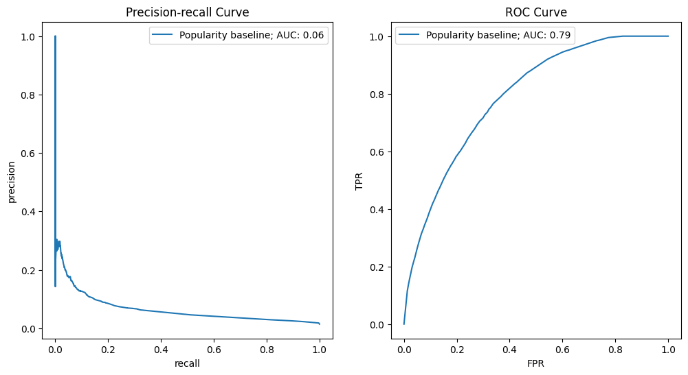
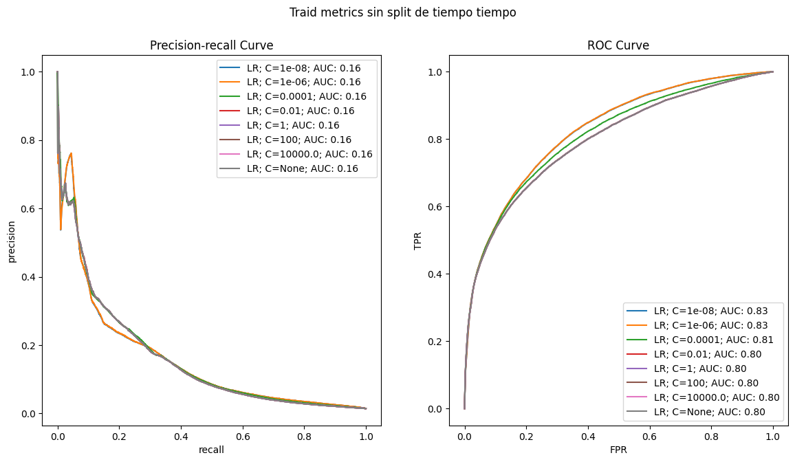
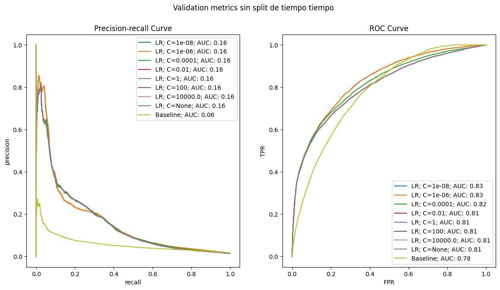
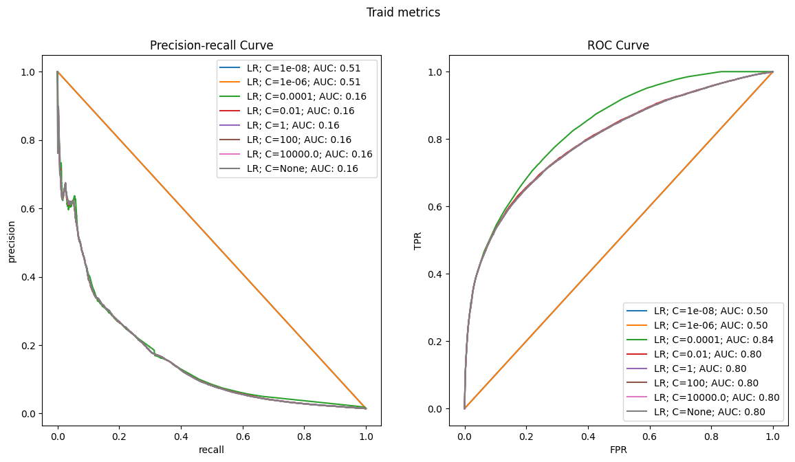
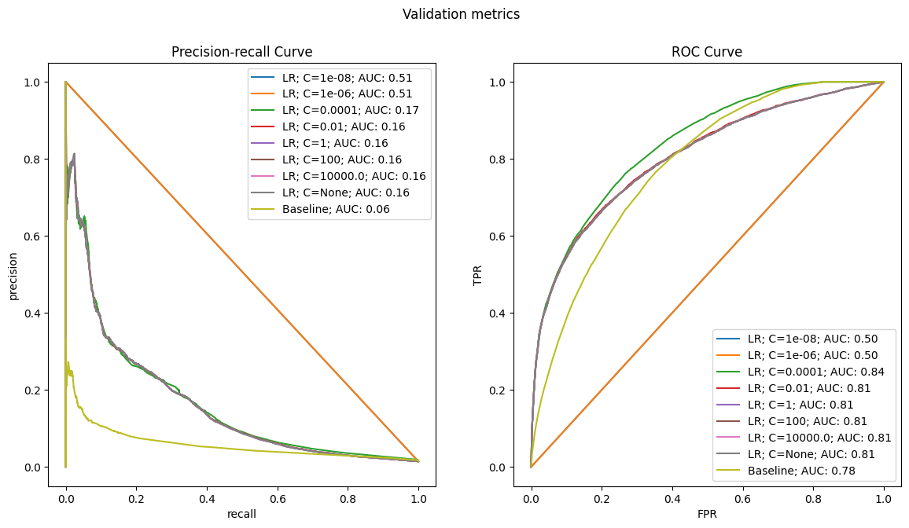
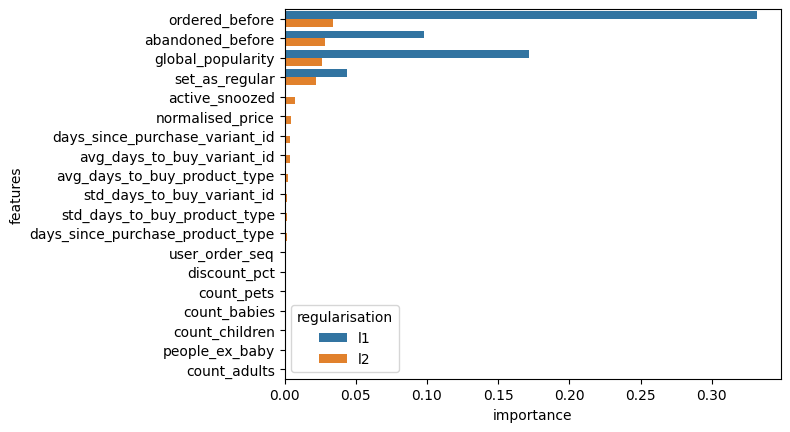
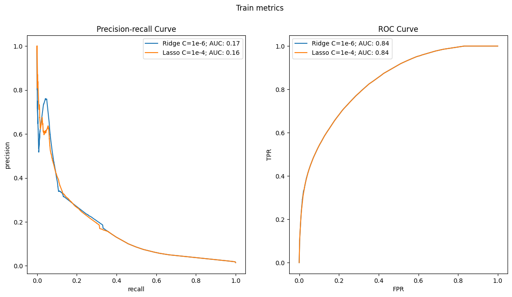
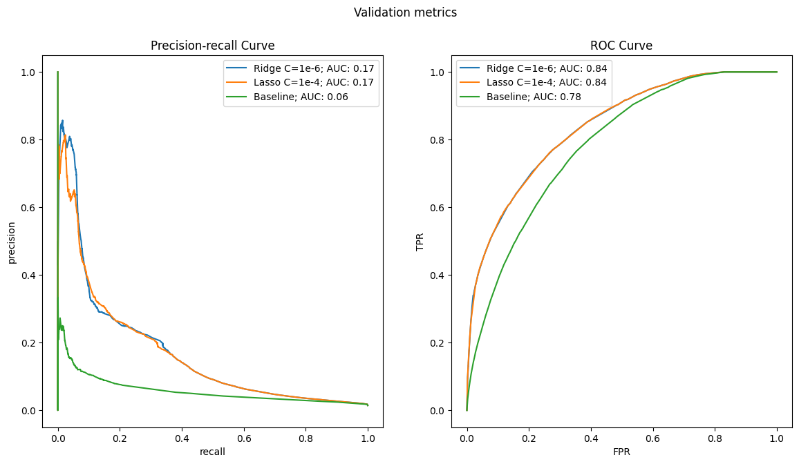
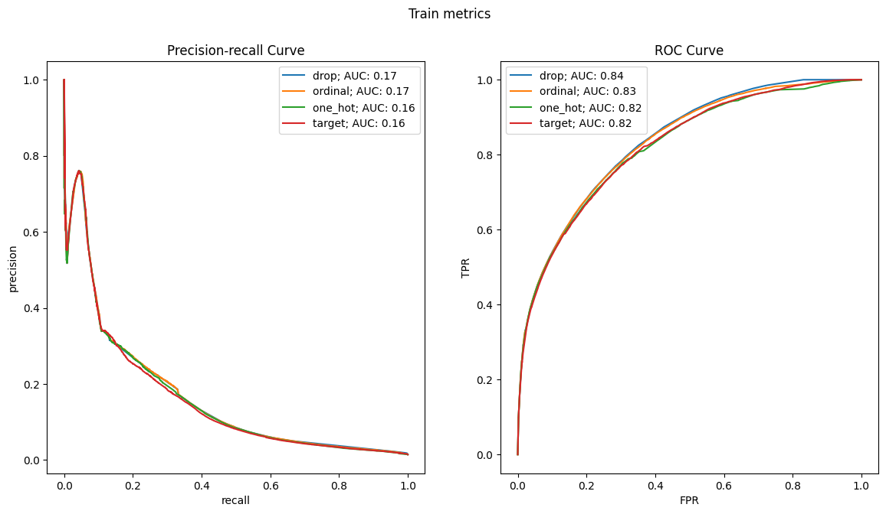
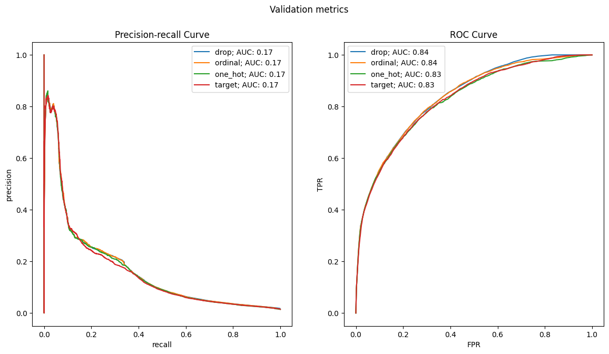

```python
import pandas as pd
import numpy as np
import matplotlib.pyplot as plt
import seaborn as sns
import matplotlib
from typing import Tuple 

from sklearn.linear_model import LogisticRegression
from sklearn.metrics import precision_recall_curve, roc_curve, roc_auc_score, auc
from sklearn.pipeline import make_pipeline, Pipeline
from sklearn.preprocessing import StandardScaler

plt.style.use('fast')
```


```python
data_path = '/home/hasierza/datos_originales/'
df = pd.read_csv(data_path + 'feature_frame.csv')
```


```python
df.head()
```


<div>
<style scoped>
    .dataframe tbody tr th:only-of-type {
        vertical-align: middle;
    }

    .dataframe tbody tr th {
        vertical-align: top;
    }

    .dataframe thead th {
        text-align: right;
    }
</style>
<table border="1" class="dataframe">
  <thead>
    <tr style="text-align: right;">
      <th></th>
      <th>variant_id</th>
      <th>product_type</th>
      <th>order_id</th>
      <th>user_id</th>
      <th>created_at</th>
      <th>order_date</th>
      <th>user_order_seq</th>
      <th>outcome</th>
      <th>ordered_before</th>
      <th>abandoned_before</th>
      <th>...</th>
      <th>count_children</th>
      <th>count_babies</th>
      <th>count_pets</th>
      <th>people_ex_baby</th>
      <th>days_since_purchase_variant_id</th>
      <th>avg_days_to_buy_variant_id</th>
      <th>std_days_to_buy_variant_id</th>
      <th>days_since_purchase_product_type</th>
      <th>avg_days_to_buy_product_type</th>
      <th>std_days_to_buy_product_type</th>
    </tr>
  </thead>
  <tbody>
    <tr>
      <th>0</th>
      <td>33826472919172</td>
      <td>ricepastapulses</td>
      <td>2807985930372</td>
      <td>3482464092292</td>
      <td>2020-10-05 16:46:19</td>
      <td>2020-10-05 00:00:00</td>
      <td>3</td>
      <td>0.0</td>
      <td>0.0</td>
      <td>0.0</td>
      <td>...</td>
      <td>0.0</td>
      <td>0.0</td>
      <td>0.0</td>
      <td>2.0</td>
      <td>33.0</td>
      <td>42.0</td>
      <td>31.134053</td>
      <td>30.0</td>
      <td>30.0</td>
      <td>24.27618</td>
    </tr>
    <tr>
      <th>1</th>
      <td>33826472919172</td>
      <td>ricepastapulses</td>
      <td>2808027644036</td>
      <td>3466586718340</td>
      <td>2020-10-05 17:59:51</td>
      <td>2020-10-05 00:00:00</td>
      <td>2</td>
      <td>0.0</td>
      <td>0.0</td>
      <td>0.0</td>
      <td>...</td>
      <td>0.0</td>
      <td>0.0</td>
      <td>0.0</td>
      <td>2.0</td>
      <td>33.0</td>
      <td>42.0</td>
      <td>31.134053</td>
      <td>30.0</td>
      <td>30.0</td>
      <td>24.27618</td>
    </tr>
    <tr>
      <th>2</th>
      <td>33826472919172</td>
      <td>ricepastapulses</td>
      <td>2808099078276</td>
      <td>3481384026244</td>
      <td>2020-10-05 20:08:53</td>
      <td>2020-10-05 00:00:00</td>
      <td>4</td>
      <td>0.0</td>
      <td>0.0</td>
      <td>0.0</td>
      <td>...</td>
      <td>0.0</td>
      <td>0.0</td>
      <td>0.0</td>
      <td>2.0</td>
      <td>33.0</td>
      <td>42.0</td>
      <td>31.134053</td>
      <td>30.0</td>
      <td>30.0</td>
      <td>24.27618</td>
    </tr>
    <tr>
      <th>3</th>
      <td>33826472919172</td>
      <td>ricepastapulses</td>
      <td>2808393957508</td>
      <td>3291363377284</td>
      <td>2020-10-06 08:57:59</td>
      <td>2020-10-06 00:00:00</td>
      <td>2</td>
      <td>0.0</td>
      <td>0.0</td>
      <td>0.0</td>
      <td>...</td>
      <td>0.0</td>
      <td>0.0</td>
      <td>0.0</td>
      <td>2.0</td>
      <td>33.0</td>
      <td>42.0</td>
      <td>31.134053</td>
      <td>30.0</td>
      <td>30.0</td>
      <td>24.27618</td>
    </tr>
    <tr>
      <th>4</th>
      <td>33826472919172</td>
      <td>ricepastapulses</td>
      <td>2808429314180</td>
      <td>3537167515780</td>
      <td>2020-10-06 10:37:05</td>
      <td>2020-10-06 00:00:00</td>
      <td>3</td>
      <td>0.0</td>
      <td>0.0</td>
      <td>0.0</td>
      <td>...</td>
      <td>0.0</td>
      <td>0.0</td>
      <td>0.0</td>
      <td>2.0</td>
      <td>33.0</td>
      <td>42.0</td>
      <td>31.134053</td>
      <td>30.0</td>
      <td>30.0</td>
      <td>24.27618</td>
    </tr>
  </tbody>
</table>
<p>5 rows × 27 columns</p>
</div>


```python
df.info()
```

    <class 'pandas.core.frame.DataFrame'>
    RangeIndex: 2880549 entries, 0 to 2880548
    Data columns (total 27 columns):
     #   Column                            Dtype  
    ---  ------                            -----  
     0   variant_id                        int64  
     1   product_type                      object 
     2   order_id                          int64  
     3   user_id                           int64  
     4   created_at                        object 
     5   order_date                        object 
     6   user_order_seq                    int64  
     7   outcome                           float64
     8   ordered_before                    float64
     9   abandoned_before                  float64
     10  active_snoozed                    float64
     11  set_as_regular                    float64
     12  normalised_price                  float64
     13  discount_pct                      float64
     14  vendor                            object 
     15  global_popularity                 float64
     16  count_adults                      float64
     17  count_children                    float64
     18  count_babies                      float64
     19  count_pets                        float64
     20  people_ex_baby                    float64
     21  days_since_purchase_variant_id    float64
     22  avg_days_to_buy_variant_id        float64
     23  std_days_to_buy_variant_id        float64
     24  days_since_purchase_product_type  float64
     25  avg_days_to_buy_product_type      float64
     26  std_days_to_buy_product_type      float64
    dtypes: float64(19), int64(4), object(4)
    memory usage: 593.4+ MB


```python
info_cols = ['variant_id', 'order_id', 'user_id', 'created_at', 'order_date'] #columnas de informacion
label_col = 'outcome'
features_cols = [col for col in df.columns if col not in info_cols + [label_col]] #columnas de features, todas menos las de info y label

cateforical_cols = ['product_type', 'vendor'] #columnas categoricas
binary_cols = ['ordered_before', 'abandoned_before', 'active_snoozed', 'set_as_regular'] #columnas binarias
numerical_cols = [col for col in features_cols if col not in cateforical_cols + binary_cols] #columnas numericas, todas menos las de info, label, categoricas y binarias
```


```python
def push_relevant_dataframe(df: pd.DataFrame, min_products: int = 5) -> pd.DataFrame: # solo consideramos  pedidos q al menos min_products , pedidos que son rentables
    """" we will only consider users that have ordered at least min_products times, orders that are profitable """
    order_size = df.groupby('order_id').outcome.sum() #cuantos productos se han comprado
    order_size_min_size = order_size[order_size >= min_products].index #nos quedamos con los orders que han comprado al menos min_products 
    return df.loc[lambda x: x.order_id.isin(order_size_min_size)] #devolvemos el dataframe con los orders que han comprado al menos min_products , hacemos el filtro

df_selected = (
    df
    .pipe(push_relevant_dataframe)#aplicamos la funcion push_relevant_dataframe y nos devuelve el nuevo dataframe
    .assign(created_at = lambda x: pd.to_datetime(x.created_at)) #convertimos la columna created_at a datetime
    .assign(order_date = lambda x: pd.to_datetime(x.order_date).dt.date) # convertimos la columna order_date a datetime y nos quedamos solo con la fecha sin la hora
)
```


```python
df.order_id.nunique() > df_selected.order_id.nunique()#comprobamos que se ha filtrado correctamente
```


    True


```python
# Obtener la lista de usuarios únicos
unique_users = df_selected['user_id'].unique()

# Mezclar aleatoriamente la lista de usuarios únicos
np.random.shuffle(unique_users)

# Calcular el tamaño de los conjuntos de entrenamiento, validación y prueba
total_unique_users = len(unique_users)
train_size_cutoff_prueba = int(total_unique_users * 0.7)
validation_size_prueba = int(total_unique_users * 0.2)
test_size_prueba = total_unique_users - train_size_cutoff_prueba - validation_size_prueba
print(f'Train size: {train_size_cutoff_prueba}, Validation size: {validation_size_prueba}, Test size: {test_size_prueba}, Total size: {total_unique_users}')

# Dividir los usuarios en conjuntos de entrenamiento, validación y prueba
train_users = unique_users[:train_size_cutoff_prueba]
val_users = unique_users[train_size_cutoff_prueba:train_size_cutoff_prueba + validation_size_prueba]
test_users = unique_users[train_size_cutoff_prueba + validation_size_prueba:]

# Filtrar los datos en función de los usuarios seleccionados
train_df = df_selected[df_selected['user_id'].isin(train_users)]
val_df = df_selected[df_selected['user_id'].isin(val_users)]
test_df = df_selected[df_selected['user_id'].isin(test_users)]
```

    Train size: 1061, Validation size: 303, Test size: 153, Total size: 1517


He hecho el split por usuario es decir, un usuario solo puede estar en train en val o en test, pero solo en uno. He visto la solucion propuesta y he visto q hay q tener en cuenta la temporalidad. Creo q el split esta bien hecho.

## Baseline


```python
def plot_metrics (
        model_name:str, y_pred:pd.Series, y_test:pd.Series, target_precision:float=0.85,
        figure: Tuple [matplotlib. figure. Figure, np.array]=None
    ):
    precision_, recall_, _ = precision_recall_curve(
        y_test, y_pred

    )
    pr_auc = auc(recall_, precision_)

    fpr, tpr, _ = roc_curve(y_test, y_pred)
    roc_auc = roc_auc_score(y_test, y_pred)

    if figure is None:
        fig, ax = plt.subplots(1, 2, figsize=(12, 6))
    else:
        fig, ax = figure

    ax[0].plot(recall_, precision_, label=f"{model_name}; AUC: {pr_auc:.2f}")
    ax[0].set_xlabel("recall")
    ax[0].set_ylabel("precision")
    ax[0].set_title(f"Precision-recall Curve")
    ax[0].legend()

    ax[1].plot(fpr, tpr, label=f"{model_name}; AUC: {roc_auc:.2f}")
    ax[1].set_xlabel("FPR")
    ax[1].set_ylabel("TPR")
    ax[1].set_title(f"ROC Curve")
    ax[1].legend()
```


```python
plot_metrics("Popularity baseline", y_pred= val_df["global_popularity"], y_test=val_df[label_col])
```


    

    


Se ha calculado el baseline usando popularity como referencia. Con este baseline ya tenemos una referencia y queremos q nuestros modoles sean mejores q el baseline porque sino, no sale a cuenta entrenar el modelo.

## Model training


```python
def feature_label_split(df: pd.DataFrame, label_col: str) ->Tuple[pd.DataFrame, pd.Series]: #separamos las features del label en x e y.
    return df.drop(label_col, axis=1), df[label_col]

X_train, y_train = feature_label_split(train_df, label_col)
X_val, y_val = feature_label_split(val_df, label_col)
X_test, y_test = feature_label_split(test_df, label_col)
```


```python
train_cols = numerical_cols + binary_cols#columnas que vamos a usar para entrenar el modelo, quitamos las categoricas porque quiero empezar con un modelo simple
```

### Ridge regresion


```python
lr_push_train_aucs = []
lr_push_val_aucs = []
lr_push_train_ce = []
lr_push_val_ce = []

figl, ax1 = plt.subplots(1, 2, figsize=(14, 7))
figl.suptitle("Traid metrics sin split de tiempo tiempo")

fig2, ax2 = plt.subplots(1, 2, figsize=(14, 7))
fig2.suptitle("Validation metrics sin split de tiempo tiempo")

es = [1e-8, 1e-6, 1e-4, 1e-2, 1, 100, 1e4, None]#hiperparametros que vamos a probar el alpha, el parametro de regularizacion
for c in es:
    lr = make_pipeline(#Me permite hacer diferentes pasos en un solo paso. creamos un pipeline para hacer el scaling y el modelo a la vez                                           
        StandardScaler(),#standarizamos las variables, media 0 y desviacion estandar 1. esto nos ayuda a que las variables tengan el mismo peso. para ver la importancia de las diferentes columnas. para poder comparar peras con peras
        #aqui no estamos haciendo para eso. Estamos haciendo para que el modelo converja mas rapido.
        LogisticRegression(penalty="l2" if c else None, C=c if c else 1.0) #penalizacion l2, c es el parametro de regularizacion. si c es 0 no hay regularizacion.#c si es 1e-8 es muy pequeno y hay mucha regularizacion. si es 1e4 es muy grande y hay poca regularizacion.
        

    )
    lr.fit(X_train[train_cols], y_train)#entrenamos el modelo y calculamos las metricas con el train y luego las usando el val. pero en val usamos las standardscales que hemos calculado con el train. porque en produccion no sabemos como van a ser los datos y va ser lo mas parecido a lo que vamos a tener en produccion.
    train_proba = lr.predict_proba(X_train[train_cols])[:, 1]#nos quedamos con la probabilidad de la clase positiva [:, 1] es para que nos devuelva la segunda columna.
    plot_metrics(f"LR; C={c}", y_pred=train_proba, y_test=train_df[label_col], figure=(figl, ax1))

    val_proba = lr.predict_proba(X_val[train_cols])[:, 1]
    plot_metrics(f"LR; C={c}", y_pred=val_proba, y_test=val_df[label_col], figure=(fig2, ax2))

plot_metrics(f"Baseline", y_pred=val_df['global_popularity'], y_test=val_df[label_col], figure=(fig2, ax2))

#queremos estandarizar los datos de validacion  y test con la media y la desviacion estandar que he calculado en train. para que sea lo mas parecido a lo que vamos a tener en produccion.
#es probable q por la componente temporal haya diferencias entre train, val y test.
```


    

    


    

    


1. Se ha conseguido mejorar el baseline.
2. La regularizacion no afecta mucho a las curbas, nos indica q el dataset es lo suficientemente complejo o q nuestro modelo no es tan complejo como para aprender el ruido.
3. Train y val dan curvas muy parecidas, no estamos aprendiendo ruido.
4. El baseline parece q es mejor en algunos puntos de la curva roc, pero empieza a ser mejor apartir del 0.4 y a nosotros ese tramo no no interesa.

### Laso


```python
lr_push_train_aucs = []
lr_push_val_aucs = []
lr_push_train_ce = []
lr_push_val_ce = []

figl, ax1 = plt.subplots(1, 2, figsize=(14, 7))
figl.suptitle("Traid metrics")

fig2, ax2 = plt.subplots(1, 2, figsize=(14, 7))
fig2.suptitle("Validation metrics")

es = [1e-8, 1e-6, 1e-4, 1e-2, 1, 100, 1e4, None]

for c in es:
    lr = make_pipeline(                                        
        StandardScaler(),
        LogisticRegression(penalty="l1" if c else None, C=c if c else 1.0, solver='saga') #solver='saga' es un solver que funciona mejor con regularizacion l1
        #c si es 1e-8 es muy pequeno y hay mucha regularizacion. si es 1e4 es muy grande y hay poca regularizacion. si es None es 1.0
    )
    lr.fit(X_train[train_cols], y_train)
    train_proba = lr.predict_proba(X_train[train_cols])[:, 1]
    plot_metrics(f"LR; C={c}", y_pred=train_proba, y_test=train_df[label_col], figure=(figl, ax1))

    val_proba = lr.predict_proba(X_val[train_cols])[:, 1]
    plot_metrics(f"LR; C={c}", y_pred=val_proba, y_test=val_df[label_col], figure=(fig2, ax2))

plot_metrics(f"Baseline", y_pred=val_df['global_popularity'], y_test=val_df[label_col], figure=(fig2, ax2))
```


    

    


    

    


1. laso tiene un comporamiento parecido a ridge
2. Demasiada regularizacion hace q tenga un comportamineto raro.

### Coeficient weigths


```python
lr = Pipeline([("standard_scaler", StandardScaler()), ("lr", LogisticRegression(penalty="l2", C=1e-6))])

lr.fit(X_train[train_cols], y_train)

lr_coeff_l2 = pd.DataFrame({"features": train_cols, "importance": np.abs(lr.named_steps ["lr"].coef_[0]),  
                            "regularisation": ["l2"] * len(train_cols)})

lr_coeff_l2 = lr_coeff_l2.sort_values('importance', ascending=True)


lr = Pipeline([("standard_scaler", StandardScaler()), ("lr", LogisticRegression(penalty="l1", C=1e-4, solver="saga"))])
lr.fit(X_train[train_cols], y_train)


lr_coeff_l1 = pd.DataFrame({"features": train_cols, "importance": np.abs(lr.named_steps ["lr"].coef_[0]),
                                "regularisation": "l1"})

lr_coeff_l1 = lr_coeff_l1.sort_values('importance', ascending=True)
```


```python
lr_coeff = pd.concat([lr_coeff_l2, lr_coeff_l1])
lr_coeff["features"] = pd.Categorical(lr_coeff["features"])
lr_coeff = lr_coeff.sort_values(by=["importance"])
order_columns = lr_coeff_l2.sort_values(by="importance", ascending=False)["features"]
sns.barplot(data=lr_coeff, x="importance", y="features", hue="regularisation", order=order_columns)
```


    <Axes: xlabel='importance', ylabel='features'>


    

    


se confirma q l1 tiene a tener mas valores a 0 y da importancia 4 features, y en cambio l2 da valores mas pequeños a mas features por lo de norma 1 y norma 2. Lo q se ha estudiado en teoria se cumple.

se van a quitar las variables no importantes. Para simplificar el modelo y ver si hay diferencias.


```python
reduced_cols = ['ordered_before', 'abandoned_before', 'global_popularity','set_as_regular']

fig1, ax1 = plt.subplots(1, 2, figsize=(14, 7))
fig1.suptitle("Train metrics")

fig2, ax2 = plt.subplots(1, 2, figsize=(14, 7))
fig2.suptitle("Validation metrics")

lrs = [
    make_pipeline(
        StandardScaler(), 
        LogisticRegression(penalty="l2", C=1e-6)
    ),
    make_pipeline(
        StandardScaler(), 
        LogisticRegression(penalty="l1", C=1e-4, solver='saga')
    ),
]

names = ['Ridge C=1e-6', 'Lasso C=1e-4']
for name, lr in zip(names, lrs):
    lr.fit(X_train[reduced_cols], y_train)
    train_proba = lr.predict_proba(X_train[reduced_cols])[:, 1]
    plot_metrics(name, y_pred=train_proba, y_test=train_df[label_col], figure=(fig1, ax1))

    val_proba = lr.predict_proba(X_val[reduced_cols])[:, 1]
    plot_metrics(name, y_pred=val_proba, y_test=val_df[label_col], figure=(fig2, ax2))

plot_metrics(f"Baseline", y_pred=val_df['global_popularity'], y_test=val_df[label_col], figure=(fig2, ax2))
```


    

    


    

    


1. Usando menos features se consigue curvas parecidad, con esto se consigue q el calculo se vuelva mas sencillo de mantener porque menos cosas pueden fallar y menos cosas hay q actualizar.
2. Sigue siendo mejor q el baseline. Tenemos un modelo simple q mejora el baseline.

### Categorical encoding


```python
from sklearn.compose import ColumnTransformer
from sklearn.preprocessing import OneHotEncoder, OrdinalEncoder, TargetEncoder

categorical_preprocessor = [
    ("drop", "drop"),
    ("ordinal", OrdinalEncoder(handle_unknown="use_encoded_value", unknown_value=-1)),
    (
        "one_hot",
        OneHotEncoder(handle_unknown="ignore", max_categories=20, sparse_output=False),
    ),
    ("target", TargetEncoder(target_type="continuous"))
]

fig1, ax1 = plt.subplots(1, 2, figsize=(14, 7))
fig1.suptitle("Train metrics")

fig2, ax2 = plt.subplots(1, 2, figsize=(14, 7))
fig2.suptitle("Validation metrics")

extended_cols = reduced_cols + cateforical_cols

for name, categorical_preprocessor in categorical_preprocessor:
    processor= ColumnTransformer(
        [
            ("numerical_cols", "passthrough", reduced_cols),
            ("categorical", categorical_preprocessor, cateforical_cols),
        ]
    )
    lr = make_pipeline(
        processor,
        StandardScaler(),
        LogisticRegression(penalty="l2", C=1e-6)
    )

    lr.fit(X_train[extended_cols], y_train)
    train_proba = lr.predict_proba(X_train[extended_cols])[:, 1]
    plot_metrics(name, y_pred=train_proba, y_test=train_df[label_col], figure=(fig1, ax1))

    val_proba = lr.predict_proba(X_val[extended_cols])[:, 1]
    plot_metrics(name, y_pred=val_proba, y_test=val_df[label_col], figure=(fig2, ax2))
    
```


    

    


    

    


se prueba el categorical encoding intentando mejorar el modelo pero no se consigue gran mejoria.
